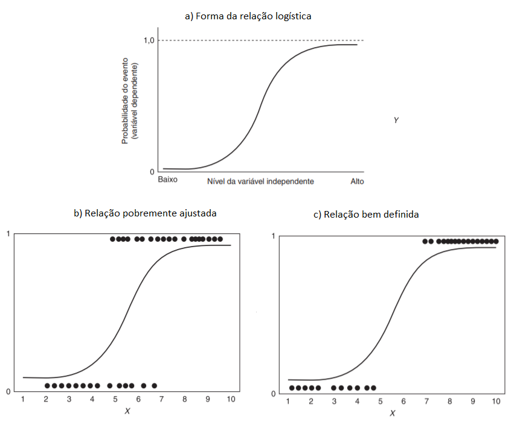

# Regressão Logística

```{r echo=FALSE}
knitr::write_bib(c(
  .packages(), 'bookdown', 'knitr', 'rmarkdown'
), 'packages.bib')
Sys.setenv(RSTUDIO_PDFLATEX = "latexmk")
options(width = 80, digits = 4,
        bookdown.clean_book = TRUE)
knitr::opts_chunk$set(
  tidy = FALSE, 
  fig.align = "center", 
  out.width = '90%',
  comment = NA,
  fig.pos = 'h',
  fig.keep='last'
  )
```

```{r, echo=FALSE}

packages <- c("caret", "pROC", "ResourceSelection", "modEvA", "foreign", "stargazer", "mfx","readr","ggplot2")

if (length(setdiff(packages, rownames(installed.packages()))) > 0) {
    install.packages(setdiff(packages, rownames(installed.packages())))  
}
```

A técnica de regressão logística é uma ferramenta estatística utilizada nas análises preditivas. O interesse em mensurar a probabilidade de um evento ocorrer é extremamente relevante em diversas áreas, como por exemplo em Marketing, Propaganda e Internet, na Aplicação da Lei e Detecção de Fraude, na Assistência Médica, com relação aos Riscos Financeiros e Seguros ou mesmo estudando a Força de Trabalho. É imprescindível elevar o conhecimento sobre quais clientes possuem maior propensão à responder o contato de marketing, quais transações serão fraudulentas, quais e-mails são *spam*, quem efetivamente fará o pagamento de uma obrigação ou mesmo qual criminoso reincidirá ^[Para mais exemplos como estes sobre análises preditivas, ver @Siegel2017.].

## O modelo

O modelo de regressão logística é utilizado quando a variável dependente é binária, categórica ordenada ou mesmo categórica desordenada (quando não há relação hierárquica entre elas). Abaixo exemplificam-se algumas perguntas que podem levar a estes três tipos de variáveis. 

Table: (\#tab:logtip)Tipos de variáveis

||||
|---|---|---|
|**Variável dependente binária:**| Você votou na última eleição?|0 - Não; 1 - Sim|
|**Variável dependente categórica ordenada:**| Você concorda ou desconcorda com o presidente?|1 - Disconcordo; 2 - Neutro; 3 - Concordo|
|**Variável dependente categórica não ordenada:**|Se as eleições fossem hoje, em que partido você votaria? |  1 - Democratas; 2 - Qualquer um; 3 - Republicanos|

Fonte: Adaptado de @Torres-Reyna2014.

Nota-se primeiramente que em sendo somente a variável dependente **binária** (0 e 1), é detectada a presença ou não de determinada característica da variável a ser estudada pelo pesquisador. Outros exemplos abrangem a qualificação dos indivíduos estaudados em sendo do sexo feminino (1) ou do sexo masculino (0), se a empresa analisada está inadimplente (1) ou não (0) no mês de referência, etc. Por outro lado, quando a variável dependente é **categórica ordenada**, há uma hierarquia determinada entre as variáveis resposta (neste caso entre Disconcordo, Neutro e Concordo). No terceiro exemplo, a variável resposta é **categórica não ordenada** não possuindo nenhuma relação de ordem entre elas (Democratas, Qualquer um, Republicanos). 

A regressão logística a ser estudada neste capítulo será com a variável resposta dependente binária, portanto, tratando os grupos de interesse (variável dependente) com valores de 0 e 1. Sua funcionalidade se ocupa de prever a probabilidade de uma observação estar no grupo igual a 1 ("eventos"), em relação ao grupo igual a zero ("não eventos").

A previsão da variável dependente depende dos coeficientes logísticos e das variáveis independentes escolhidas ao modelo, lembrando que os valores sempre estarão entre 0 e 1. Convenciona-se que valores de probabilidade acima de 0,50 sejam classificados como pertencendo ao grupo de "eventos", o que pode distinguir a os resultados preditos e avaliando a precisão preditiva. Utiliza-se a razão de desigualdades - a razão entre as probabilidades dos dois resultados ou eventos: Prob$_{i}/$(1-Prob$_{i}$).

Para a estimação dos coeficientes das variáveis independentes, são utilizados o valor logit ou a razão de desigualdades [@Hair2009]:

$$
Logit_i=ln\left (\frac{prob_{eventos}}{1-prob_{eventos}}  \right )=b_0+b_1X_1+\ldots+b_nX_n
$$

ou

$$
Logit_i=\left (\frac{prob_{eventos}}{1-prob_{eventos}}  \right )=e^{b_0+b_1X_1+\ldots+b_nX_n}
$$

Algumas características importantes da regressão logística: a análise é semelhante à regressão linear simples/múltipla (possui a relação entre a variável dependente e a(s) variável(is) independente(s)); possui testes estatísticos diretos, incorporando variáveis métricas e não-métricas, com efeitos não-lineares; é menos afetada pela não satisfação de normalidade dos dados (pois o termo de erro da variável discreta segue a distribuição binomial) e; foi elaborada para que seja prevista a probabilidade de determinado evento ocorrer [@Hair2009]. 

A regressão logística utiliza a **curva logística** para assim representar a relação entre a variável dependente e as independentes. Os valores previstos portanto permanecem entre 0 e 1, sendo definidos pelos coeficientes estimados. A Figura \@ref(fig:curvalog)a demonstra a relação da curva logistica geral, enquanto a Figura \@ref(fig:curvalog)b mostra uma relação pobremente ajustada dos dados reais e a Figura \@ref(fig:curvalog)c demonstra um bom ajuste na relação entre as variáveis. 


```{r curvalog, echo=FALSE, fig.cap='Curva logística'}

```
Fonte: Adaptado de @Hair2009.

A estimação dos coeficientes da regressão logística, ao contrário da regressão múltipla que utiliza o método dos mínimos quadrados, é efetuada pelo uso da **máxima verossimilhança**. Esta, por sua vez, busca encontrar as estimativas mais prováveis dos coeficientes e maximizar a probabilidade de que um evento ocorra. A qualidade do ajuste do modelo é avaliada pelo "pseudo" R$^2$ e pelo exame da precisão preditiva (matriz de confusão).

O valor de verossimilhança é parecido com o procedimento das somas dos quadrados da regressão múltipla, estimando o quão bem o procedimento de máxima verossimilhança se ajusta ao modelo. O ajuste da estimação do modelo dá-se pelo valor -2 vezes o logaritmo da verossimilhança (-2LL), sendo que quando menor este valor, melhor o modelo [@Hair2009].


Para otimizar o tempo do estudante, é recomendada a instalação prévia dos pacotes no RStudio a serem utilizados neste capítulo. Segue abaixo o comando a ser efetuado no console do RStudio:

`install.packages(c("readr","mfx","caret","pRoc",`

`"ResourceSelection","modEvA","foreign","stargazer"))`

<!--
Mais detalhes sobre o modelo de regressão logística podem ser verificados na seção chamada **O Modelo de Regressão Logística**, bem como em @Hosmer2000 e @Gujarati2011.
-->

## Regressão Logística Simples

Este primeiro exemplo tratará da regressão logística simples, portanto, utilizando somente uma variável independente, neste caso numérica. Os dados são originados do livro de @Hosmer2000, tratando-se de uma amostra com 100 pessoas. A variável dependente é a ocorrência ou não (1 ou 0) de doença coronária cardíaca (CHD), associando-se com a idade (AGE) dos indivíduos, criando assim um modelo de regressão logística.

```{r }
require(readr)
chd <- read_delim("https://goo.gl/uDAAHv", 
    ";", escape_double = FALSE, col_types = cols(CHD = col_factor(levels = c())), 
    trim_ws = TRUE)

summary(chd)

```

Observa-se na figura abaixo a dispersão dos "eventos" e dos "nao-eventos" da CHD relacionando-se com a variável idade (AGE).


```{r dispev, fig.cap="Dispersão de evendos e não-eventos", message=FALSE, warning=FALSE}
require(ggplot2)

ggplot(chd, aes(x=AGE, y=CHD)) + 
  geom_point() + 
  stat_smooth(method="glm", method.args=list(family="binomial"), se=FALSE)
```

Monta-se então o modelo de regressão logística com a variável dependente CHD e a variável independente AGE. Abaixo é demonstrada a descrição da equação utilizando o comando `summary()` para o modelo m1 com a sintaxe básica:

`glm(Y~modelo, family=binomial(link="logit"))` 

Assim é obtida a função de ligação estimada do modelo: 

<!--
$$
\hat g(CHD) = -5,309 +0,1109AGE
$$
-->

$$
ln\left (\frac{prob_{CHD}}{1-prob_{CHD}}  \right ) = - 5,309 + 0,1109AGE
$$


```{r}
m1=glm(CHD~AGE, family = binomial(link="logit"), data = chd)
summary(m1)
```

Se observa o intercepto com o valor de -5,309, sendo que para a análise aqui proposta da relação entre CHD e AGE não obtém-se um significado prático para este resultado. No entanto, a variável de interesse é idade, que no modelo de regressão obteve o coeficiente de 0,1109. Pelo fato de ser positivo informa que quando a idade (AGE) se eleva, elevam-se as chances de ocorrência de CHD. De igual forma, nota-se que há significância estatística a $p=0,001$ na utilização da variável AGE para o modelo, mostrando que possui importância ao modelo de regressão proposto.

Por fim, o modelo é utilizado para construção da predição de todos os valores das idades de todos os indivíduos desta amostra. Para isto, será criada um novo objeto contendo somente a variável dependente do modelo (AGE) e em sequida, é criada nova coluna constando os valores preditos. Assim, pode ser plotado um gráfico completo com todas as probabilidades desta base de dados:


```{r distrpred, message=FALSE, warning=FALSE, fig.cap="Distribuição das probabilidades preditas"}
# Filtrando a idade dos indivíduos
IDADE<-chd[,1]  

# Criando campo de predição para cada idade dos indivíduos 
IDADE$PRED=predict(m1, newdata=IDADE, type="response")

# Plotando a probabilidade predita pelo modelo
require(ggplot2)
ggplot(IDADE, aes(x=AGE, y=PRED)) + 
  geom_point()

```


### Estimando a Razão de Chances

O modelo de regressão logística, porém, traz os resultados dos estimadores na forma logarítma, ou seja, o log das chances da variável idade no modelo é 0,1109. No entanto, para uma interpretação mais enriquecida da relação da idade com o CHD é necessária a transformação deste coeficiente, ou seja, que seja efetuada a exponenciação da(s) variavel(eis) da regressão. Assim, obtém-se a razão das chances (OR - Odds Ratio em inglês) para as variáveis independentes.

Uma maneira prática de se obter a razão de chances no RStudio é utilizando o pacote $mfx$. Novamente o intercepto não nos interessa nesta análise mas sim a variável AGE. Como demonstrado abaixo, o resultado da razão de chances da variável AGE foi de 1,1173, o que pode assim ser interpretado: para cada variação unitária na idade (AGE), as chances de ocorrência de CHD aumentam 1,1173 vezes. Dito de outra forma, para cada variação unitária em AGE, aumentam-se 11,73\% ((1,1173-1)*100) as chances da ocorrência de CHD.


```{r, message=FALSE, warning=FALSE}
require(mfx)
logitor(CHD~AGE,data = chd)
```


### Determinando o Intervalo de Confiança

A determinação do intervalo de confiança do modelo proposto é relevante para que seja analizada a estimativa do intervalo de predição do coeficiente da variável independente, a um nível de confiança de 95\%. Desta forma, em 95\% dos casos, o parâmetro dos coeficientes estará dentro deste intervalo.

De forma prática é possível determinar os intervalos de confiança com o comando `confint()` commo observado abaixo, sendo que o coeficiente AGE toma o valor de 1,1173, podendo variar de 1,0692 a 1,1758.


```{r, message=FALSE, warning=FALSE}
exp(cbind(OR=coef(m1), confint(m1)))
```

### Predição de Probabilidades

A partir dos coeficientes do modelo de regressão logística é possível, portanto, efetuar a predição da variável categórica CHD, ou seja, saber a chance de ocorrer CHD com relação à uma determinada idade (AGE). No exemplo abaixo, primeiramente utilizamos a idade média das observações (44,38 anos), criando assim um novo data.frame chamado media. Para utilizar o valor da idade média na função de regressão obtida ($m1$), utiliza-se a função `predict()`, de acordo com  valor da média encontrada (data.frame media). O resultado mostra que para a idade média da amostra, 44,38 anos, há uma probabilidade de 40,44\% na ocorrência da doença CHD. Esta ferramenta permite também a comparação pelo pesquisador das diferentes probabilidades entre as diversas idades (variável AGE).


```{r, message=FALSE, warning=FALSE}
media = data.frame(AGE=mean(chd$AGE))
media
```


```{r}
media$pred.prob = predict(m1, newdata=media, type="response")
media
```


### Matriz de Confusão


Uma maneira prática de qualificar o ajuste do modelo de regressão logística é pela projeção do modelo na tabela de classificação (ou Matriz de Confusão). Para isto, precisa-se criar uma tabela com o resultado da classificação cruzada da variável resposta, de acordo com uma variável dicotômica em que os valores se derivam das probabilidades logísticas estimadas na regressão [@Hosmer2000]. No entanto, é preciso definir uma regra de predição, que dirá se houve acerto ou não da probabilidade estimada com os valores reais, pois as probabilidades variam de 0 a 1 enquanto os valores reais binários possuem valores fixos de 0 "ou" 1.

É intuitivo supor que se as probabilidades aproximam-se de 1 o indivíduo estimado pode ser classificado como $\hat Y_i=1$, bem como de forma contrária, se o modelo estimar probabilidades perto de 0, classificá-la como $\hat Y_i=0$. Mas qual nível utilizar? Para resolver este problema, é preciso em primeiro lugar determinar um ponto de corte para classificar a estimação como 0 ou 1. Usualmente na literatura se utiliza o valor de 0,5 mas dependendo do estudo proposto pode não ser limitado a este nível [@Hosmer2000]. 

Após determinado o ponto de corte, é importante avaliar o poder de discriminação do modelo, pelo seu desempenho portanto em classificar os "eventos" dos "não eventos". Cria-se a Matriz de Confusão (vide Tabela \@ref(tab:matriz)) com as observações de Verdadeiro Positivo (VP), Falso Positivo (FP), Falso Negativo (FN) e Verdadeiro Negativo (VN)  e em seguida determinam-se alguns parâmetros numéricos, a serem descritos abaixo:

**Precisão**: representa a proporção das predições corretas do modelo sobre o total:

$$
ACC=\frac{VP+VN}{P+N}
$$

onde $P$ representa o total de "eventos" positivos (Y=1) e N é o total de "não eventos" (Y=0, ou negativo).

**Sensibilidade**: representa a proporção de verdadeiros positivos, ou seja, a capacidade do modelo em avaliar o evento como $\hat Y=1$ (estimado) dado que ele é evento real $Y=1$:

$$
SENS=\frac{VP}{FN}
$$

**Especificidade**:  a proporção apresentada dos verdadeiros negativos, ou seja, o poder de predição do modelo em avaliar como "não evento"  $\hat Y=0$ sendo que ele não é evento  $Y=0$:

$$
SENS=\frac{VN}{VN+FP}
$$

**Verdadeiro Preditivo Positivo**: se caracteriza como proporção de verdadeiros positivos com relação ao total de predições positivas, ou seja, se o evento é real $Y=1$ dada a classificação do modelo $\hat Y=1$:

$$
VPP=\frac{VPP}{VN+FP}
$$

**Verdadeiro Preditivo Negativo**: se caracteriza pela proporção de verdadeiros negativos comparando-se com o total de predições negativas, ou seja, o indivíduo não ser evento $Y=0$ dada classificação do modelo como "não evento" $\hat Y=0$:

$$
VPN=\frac{VN}{VN+FN}
$$

Table: (\#tab:matriz)Matriz de confusão.

  --------------------------------------------------------------
                                  **Valor Observado**
  ------------------  ----------  ------------------- ----------
                                  $Y=1$               $Y=0$
  
  **Valor Estimado**  $\hat Y$=1  VP                  FP
  
                      $\hat Y$=0  FN                  VN
  ------------------  ------------------------------------------

Fonte: Adaptado de @Fawcett2006.


<!--

-->


```{r reg}
require(caret)
  pdata <- as.factor(
    ifelse(
      predict(m1, 
              newdata = chd, 
              type = "response")
      >0.5,"1","0"))

confusionMatrix(pdata, chd$CHD, positive="1")


```

A matriz de confusão retoma uma excelente acurácia total do modelo em 74\%, sendo que o modelo consegue acertos de 70,7\% na predição de valores positivos ou dos "eventos" (29/41) e 76,3\% na predição de valores negativos ou os "não eventos" (45/59).


### Curva ROC

A Curva ROC (Receiver Operating Characteristic Curve) associada ao modelo logístico mensura a capacidade de predição do modelo proposto, através das predições da sensibilidade e da especificidade. Segundo @Fawcett2006 esta técnica serve para visualizar, organizar e classificar o modelo com base na performance preditiva. 

A curva ROC é produzida bi-dimensionalmente como mostra a Figura \@ref(fig:curvaroc)a, pela obtenção da relação entre a taxa dos verdadeiros positivos do modelo e da taxa dos falsos positivos preditos. Desta forma, o ponto inferior esquerdo (0,0) significa que não é predita uma classificação positiva; no canto oposto do gráfico (1,1) classifica os resultados incondicionalmente positivos e; o ponto (0,1) representa uma excelente classificação. Quanto mais ao noroeste do gráfico o ponto estiver melhor, assim sendo o ponto B da Figura \@ref(fig:curvaroc)a classifica melhor os resultados que o ponto C.

```{r curvaroc, echo=FALSE, fig.cap='Curva ROC'}
knitr::include_graphics("curvaroc.png")
```
Fonte: Adaptado de @Fawcett2006.

A Figura \@ref(fig:curvaroc)b mostra a formação da curva ROC para um teste com 20 instâncias, uma amostra pequena servindo portanto de exemplificação da sua criação. Para isto, o modelo de regressão logística é rodado randomicamente e a predição resultante é comparada com o valor real da variável dependente. O ponto de corte padrão, como visto anteriormente, é o valor de 0,5: acima deste valor, a predição é classificada como 1 e, abaixo dele 0. Na Figura \@ref(fig:curvaroc)b, a primeira predição foi 0,9 e a segunda 0,8 sendo que como estão mais perto do eixo X do gráfico, representam predições acertadas. Já para predições que não foram acertadas (como no exemplo as predições 0,7 e 0,54 por exemplo) a curva caminha para a direita. A lógica se mantém até o final da elaboração da curva.

Já na Figura \@ref(fig:curvaroc)c é demonstrada a elaboração do conceito da Área sobre a Curva ROC (AUC - Area Under the ROC Curve), que objetiva comparar os classificadores a partir da parformance da curva em um único valor escalar [@Fawcett2006]. Este indicador representa a probabilidade de que o classificador efetue predições randômicas na instância positiva melhor do que na instância negativa.
O indicador AUC sempre terá seu valor entre 0 e 1, sendo que quanto maior, melhor e nunca um classificador realístico deve estar abaixo de 0,5. @Hosmer2000 sugere a utilização de AUC acima de 0,7 como aceitável. Como exemplo, a Figura \@ref(fig:curvaroc)c mostra que a curva ROC B tem uma melhor capacidade preditiva que a curva A.

Seguem os passos para elaboração da curva ROC.

```{r curvaroc2, include=FALSE}
require(pROC)
roc1=plot.roc(chd$CHD,fitted(m1))

```


- Passo 1:


`require(pROC)
roc1=plot.roc(chd$CHD,fitted(m1))`


- Passo 2:

```{r roc, fig.cap="Curva Roc", message=FALSE, warning=FALSE}

plot(roc1,
     print.auc=TRUE, 
     auc.polygon=TRUE, 
     grud=c(0.1,0.2),
     grid.col=c("green","red"), 
     max.auc.polygon=TRUE, 
     auc.polygon.col="lightgreen", 
     print.thres=TRUE)
```


### O teste Hosmer e Lemeshow

O teste de Hosmer e Lemeshow é utilizado para demonstrar a qualidade do ajuste do modelo, ou seja, se o modelo pode explicar os dados observados. Para este teste, os dados são divididos de acordo com as probabilidades previstas em 10 grupos iguais, sendo que os números previstos e os reais são comparados com a estatística do qui-quadrado. @Hair2009 sugerem um tamanho de amostra de pelo menos 50 casos para a realização deste teste.

A hipótese nula H${_0}$ do qui-quadrado (`p=0,05`) deste teste é a de que as proporções observadas e esperadas são as mesmas ao longo da amostra. Abaixo segue a estrutura do teste, sendo que o modelo apresenta dificuldade de ajuste em função de que rejeita a hipótese nula a *p=0,05*.


```{r, message=FALSE, warning=FALSE}
require(ResourceSelection)
hl=hoslem.test(chd$CHD,fitted(m1),g=10)
hl
```


### Pseudo R$^2$

Semelhante ao coeficiente de determinação R${^2}$ da regressão múltipla, a medida de pseudo R${^2}$ representam o ajuste geral do modelo proposto. Sua interpretação, portanto, é semelhante à regressão múltipla. Abaixo segue o cálculo do pseudo R${^2}$:

$$
R{^2}_{LOGIT} = \frac{-2LL_{nulo}-(-2LL_{modelo})}{-2LL_{nulo}}
$$
Lembrando que o valor -2LL representa -2 vezes o logaritmo do valor de verossimilhança, onde a verossimilhança do modelo nulo é comparado com o modelo completo. Abaixo mostra-se o código para calcular os indicadores, sendo que constam as medidas de pseudo R${^2}$ estipuladas por Cox e Snell, Nagelkerke e McFadden.


```{r, message=FALSE}
require(modEvA)
RsqGLM(m1)
```


## Regressão Logística Múltipla


O exemplo abaixo abordado foi extraído de @Torres-Reyna2014, onde observa-se o banco de dados criado chamado `mydata`, possuindo as variáveis`country`,`year`,`y`,`y_bin`,`x1`,`x2`,`x3` e`opinion`. A variável dependente é `y_bin`, da qual foi categorizada entre 0 e 1 conforme a ocorrência de valores negativos em`y`. As variáveis independentes do modelo serão`x1`,`x2`e`x3`.


```{r}

require(foreign)
mydata <- read.dta("http://dss.princeton.edu/training/Panel101.dta") 
summary(mydata)
```


Utiliza-se uma função para Modelos Lineares Generalizados (glm - em inglês Generalized Linear Models), determinando a variável dependente (y_bin), as variáveis independentes `(x1+x2+x3)`, a base de dados a ser utilizada `(data=mydata)` e a família dos modelos `(family = binomial(link="logit"))`.

Abaixo os resultados da estimação do modelo utilizando o comando `summary`. Observa-se que os valores `estimados` mostram os coeficientes em formato logarítmo de chances. Assim, quando x3 eleva-se em 1 (uma) unidade, o log das chances esperado para x3 altera-se em 0,7512. Neste ponto, observa-se que as três variáveis independentes possuem efeitos positivos para determinação das chances do preditor ser igual a 1, caso contrário constariam com sinal negativo. A coluna $Pr(>|z|)$ traz os p-valores das variáveis indicando o teste da hipótese nula. Como resultado a variável x3 revelou significância estatística a 10\% ($<$0,10), no entanto o valor usual para considerá-la estatísticamente significante é 5\% (0,05). Para fins de explanação do modelo, neste trabalho, serão efetuadas as demais análises do modelo de forma explicativa.


```{r, message=FALSE, warning=FALSE}
logit=glm(y_bin~x1+x2+x3, data=mydata, family = binomial(link="logit"))
summary(logit)

```


<!--
%Uma forma eficiente para construção da tabela com os resultados do modelo é a utilização do pacote \textbf{stargazer}, sendo que após instalado (install.packages("stargazer")),  utiliza-se o comando \textbf{stargazer(logit, title="seu título")} ou \textbf{stargazer(logit, title="seu título", type="text")} (plotando assim os resultados diretamente no console do RStudio) para plotagem dos resultados, como segue:
-->

```{r, message=FALSE, warning=FALSE}
require(stargazer)
stargazer(logit, title="Resultados",type = "text")
```


A razão de chances (OR - odds ratio em inglês) estimada no modelo terá de ser transformada por estar apresentada na forma logarítma conforme o modelo de regressão logística o estima. Assim, utiliza-se o pacote `mfx` para efetuar esta transformação para todo o modelo de forma automatizada `(logitor(y_bin~x1+x2+x3,data=mydata))`:


```{r, message=FALSE, warning=FALSE}
require(mfx)
logitor(y_bin~x1+x2+x3,data=mydata)
```

O resultado acima evidencia que para uma alteração em 1 (uma) unidade em x3, a chance de que y seja igual a 1 aumenta em 112\% ((2,12-1)*100). Dito de outra forma, a chance de y=1 é 2,12 vezes maior quando x3 aumenta em uma unidade (sendo que aqui mantêm-se as demais variáveis independentes constantes).

Como visto, para cada variação unitária em x3 o log das chances varia 0,7512. É possível estimar, portanto, a alteração das chances em função das médias dos valores de cada variável x1 e x2, e utilizar como exemplo os valores de 1, 2 e 3  para x3, para assim alcançar os preditores do log das chances nesta simulação, como segue abaixo:


Para facilitar a interpretação do modelo, se torna mais fácil depois de transformado a sua exponenciação dos coeficientes logísticos utilizando o comando `exp(coef(logit))`. Desta forma, para cada incremento unitário em x2 e mantendo as demais variáveis constantes, conclui-se que é 1,443 vezes provável que y seja igual a 1 em oposição a não ser (igual a zero), ou seja, as chances aumentam em 44,30\%.

```{r, message=FALSE, warning=FALSE}
exp(coef(logit))

```


O **intervalo de confiança** do modelo pode ser exposto utilizando o comando `confint` para os coeficientes estimados, como segue abaixo:


```{r, message=FALSE, warning=FALSE}
exp(cbind(OR=coef(logit), confint(logit)))
```


A partir do modelo logístico, podemos realizar **predições das probabilidades** de se encontrar o resultado y=1 conforme visto acima. Para isto, como exercício utilizaremos as médias das observações de cada variável independente do modelo. Em primeiro lugar deve ser criado um data.frame com os valores médios, como segue:

```{r, message=FALSE, warning=FALSE}
allmean = data.frame(x1=mean(mydata$x1),
                     x2=mean(mydata$x2),
                     x3=mean(mydata$x3))
allmean
```

Utiliza-se o comando `predict()` para predição do modelo, como segue abaixo, informando o objeto criado com a equação do modelo (logit), a base de dados com as condições dos valores médios (allmean) e o tipo de teste requerido ("response") para predizer as probabilidades. Como resultado, o modelo informa que constando os valores médios das variáveis independentes, obtêm-se a probabilidade de 83\% em y se constituir igual a 1.

```{r, message=FALSE, warning=FALSE}
allmean$pred.prob = predict(logit, newdata=allmean, type="response")
allmean
```


### Método Stepwise

O método Stepwise auxilia o pesquisador em selecionar as variáveis importantes ao modelo, sendo que podem ser utilizadas nas direções "both", "backward", "forward". Este método, por sua vez, utiliza o Critério de Informação de Akaike (AIC - Akaike Information Criterion) na combinação das variáveis dos diversos modelos simulados para selecionar o modelo mais ajustado. Quanto menor o AIC, melhor o ajuste do modelo. O AIC é calculado da seguitne forma:

$$
AIC = -2log(L_{p})+2[(p+1)+1]
$$
onde $L_{p}$ é a função de máxima verossimilhança e $p$ é o número de variáveis explicativas do modelo. Segue o código para execução no console:

```{r, message=FALSE, warning=FALSE}
step(logit, direction = 'both')
```

### VIF - Variance Inflation Factor

Os problemas de multicolinearedade nos modelos de regressão, ou seja, as relações entre as variáveis do modelo, podem prejudicar a capacidade preditiva do mesmo. Nas palavras de @Hair2009 [p. 191], "multicolinearidade cria variância “compartilhada” entre variáveis, diminuindo assim a capacidade de prever a medida dependente, bem como averiguar os papéis relativos de cada variável independente".
Para resolver esta questão, utiliza-se o teste do fator de inflação da variância (VIF - Variance Inflation Factor), índice o qual não deve ficar abaixo de 10 para representar baixo problema de multicolinearidade segundo @Rawlings1998.


```{r, message=FALSE}
require(faraway)
vif(logit)
```


## Regressão Logística Múltipla com variável categórica


Agora segue um exemplo de regressão logística utilizando uma variável dependente categórica juntamente com variáveis numéricas. Trata-se de uma base de dados em que o interesse é descobrir a probabilidade de um aluno ser admitido no vestibular com base no ranqueamento de escola em que estudou no ensino médio, bem como nas notas do aluno nas provas do Gpa (Grade Point Average - uma nota de performance dos alunos nos Estados Unidos) e do Gre (Graduate Record Examinations - exame padrão que qualifica o estudante para o ensino superior nos Estados Unidos). Seguem as variáveis.


- **admin**: Variável dependente = 0 (não admitido) e 1 (admitido)
- **Rank**: Variável independente = ranking da escola de proveniência do candidato
- **Gre**: Variável independente = exames prévios do candidato.
- **Gpa**: Variável independente = exames prévios do candidato.

Abaixo seguem os resultados do modelo, partindo-se do carregamento dos dados. É observado que as variáveis **gre** e **gpa** obtiveram significância estatística em 10\%, bem como rank2, já rank3 e rank4 obtiveram `p=0,001`. A variância do modelo nulo
ficou em 499,98 e com a inclusão das variáveis ao modelo baixou para 458,52, o que mostra que contribuíram para explicação da variável dependente.

```{r, message=FALSE, warning=FALSE}
# Carregando o arquivo
require(readr)
binary <- read.csv("http://www.karlin.mff.cuni.cz/~pesta/prednasky/NMFM404/Data/binary.csv")

# Transformando a variável rank em categórica
binary$rank <- factor(binary$rank)

# Determinando a regressão
mylogit <- glm(admit ~ gre + gpa + rank, data = binary, 
               family = binomial(link="logit"))

# Resultado
summary(mylogit)

```

Utilizando o teste de análise de variância `anova` pode-se observar a variância com o modelo nulo (500) e à medida que as variáveis explicativas foram sendo incluídas, estas reduziram a variância do modelo para 459, contribuindo para o modelo.


```{r}
anova(mylogit, test = "Chisq")
```

Caso seja interessante comparar diversos modelos de regressão com variáveis explicativas distintas, estes podem ser comparados no teste de variância `anova`. Utilizando a função `update` pode ser criada uma nova regressão com base na regressão anterior (`mylogit`) e é excluído do modelo a variável `gre` para exemplificar. Após, é efetuado novamente o teste `anova`, agora comparando os dois modelos, como segue abaixo. Evidencia-se que a exclusão da variável `gre` causou elevaçãod a variância do modelo para 463, piorando portanto a capacidade do modelo pois espera-se sempre reduções na sua variância.

```{r}
# Criação de novo modelo com base no anterior
mylogit2=update(mylogit,~. - gre)
# 
anova(mylogit,mylogit2, test = "Chisq")
```


Voltando ao modelo determinado anteriormente (`mylogit`), observa-se que os parâmetros da regressão logística proposta utilizando todas as variáveis foram assim determinados:


$$
ln\left (\frac{prob_{admit}}{1-prob_{admit}}  \right ) = 
-3,98998 + 0.00226gre + 0,80404gpa -0,67544rank2 -1,34020rank3 -1,55146rank4
$$


Determinam-se os coeficientes exponenciados (as razões de chance) para cada variável do modelo, bem como seus intervalos de confiança:

```{r, message=FALSE, warning=FALSE}
exp(cbind(OR = coef(mylogit), confint(mylogit)))
```

A leitura dos resultados, para as variáveis numéricas continua sendo a mesma. Com relação ao resultado para a variável **gre**, para cada aumento unitário nesta variável, mantendo-se as demais constantes, elevam-se em 0,23\% ((1,0023-1)\*100) as chances de que o aluno seja aprovado no vestibular. Já para a cada variação unitária na variável **gpa**, aumentam em 123,45\% ((2,2345-1)*100). 
Dito de outra forma, para cada elevação em **gpa** aumentam 2,2345 vezes as chances em ser aprovado no vestibular. Tais resultados vão de encontro ao conceito teórico de que quanto melhor a nota do aluno em exame prévios maiores as chances de este aluno passar no vestibular.

Outra questão é sobre o *ranking* das escolas que os alunos estudaram. Será que aqueles que estudaram em escolas melhores ranqueadas possuem mais chances de passar no vestibular? A variável **rank** traz esta análise, sendo que como é uma variável categórica (pois retoma as categorias de 1 a 4), as comparações das chances de que o aluno passe no vestibular são comparadas com a escola de *ranking* 1. 

Desta forma, em sendo o aluno proveniente de uma escola de *ranking* 2, diminuem-se as chances em 49,11\% ((0,5089-1)$*$100) de que o aluno passe no vestibular. Já para os alunos que estudaramem uma escola de *ranking* 3 tem 73,82\% ((0,2618-1)\*100) menos chances de passar no vestibular. 
Pioram ainda mais as chances de passar no vestibular daqueles alunos que estudaram em uma escola de *ranking* 4: diminuem-se em 78,81\% as chances de que estes aluno passe no vestibular, mantidas as demais veriáveis.


**Predição das probabilidades**: a partir da equação de regressão logística auferida neste exemplo, qual é a probabilidade de que um aluno que tirou nota no **gre** de 700, no **gpa** de 3,67 e estudou em uma escola de *ranking* 1 passe no vestibular?
Nota-se que a probabilidade de que este aluno passe no vestibular é de 63,32\%. Segue a predição para estas variáveis:

```{r}
pred=data.frame(gre=700,
                gpa=3.67,
                rank=factor(1)
                )
pred$prob=predict(mylogit, newdata=pred, type="response")
pred

```

Comparando com um aluno que tirou as mesmas notas no **gre** e **gpa**, mas que estudou em uma escola *ranking* 4:

```{r}
pred=data.frame(gre=700,
                gpa=3.67,
                rank=factor(4)
                )
pred$prob=predict(mylogit, newdata=pred, type="response")
pred

```


Agora será efetuada a predição comparando-se os *rankings* das escolas. No exemplo abaixo, é criada uma base de dados com as notas médias dos alunos nas variáveis **gre** e **gpa**, intercalando com todos os *rankings* das escolas onde estudaram. Após criar a tabela, esta é unida com as colunas de predição dos valores da equação. São renomeadas as variáveis de *fit* para *prob* e *se.fit* para *se.prob*, no primeiro caso pois obteiveram-se as probabilidades de cada caso e no segundo caso incluiu-se o erro padrão (*se: standart error*) desta probabilidade. Com este erro padrão calculou-se os limites inferior (*LL: low level*) e superior (*UL: upper level *) no intervalo de confiança de 95\%.


```{r}
# Criação da tabela
novosdados=with(binary,
                data.frame(gre=mean(gre),
                           gpa=mean(gpa),
                           rank=factor(1:4)))

# Incluindo a predição dos valores
novosdados=cbind(novosdados,predict(mylogit, 
                                    newdata=novosdados,
                                    type="response",
                                    se.fit=TRUE))
# Renomeando as variáveis
names(novosdados)[names(novosdados)=='fit']="prob"
names(novosdados)[names(novosdados)=='se.fit']="se.prob"

# Estimando os intervalos de confiança

novosdados$LL=novosdados$prob-1.96*novosdados$se.prob
novosdados$UL=novosdados$prob+1.96*novosdados$se.prob

# Vizualização dos dados
novosdados
```


```{r}
require(ggplot2)
ggplot(novosdados, aes(x=rank,y=prob))+
  geom_errorbar(aes(ymin=LL, ymax=UL), width=0.2,lty=1,lwd=1,col="red")+
  geom_point(shape=18, size=5, fill="black")+
  scale_x_discrete(limits=c("1","2","3","4"))+
  labs(title="Probabilidades preditas", x="Ranking",y="Pr(y=1)")
```


<!--
\printbibliography[segment=\therefsegment,heading=subbibliography]
-->
<!--
## Exemplos de trabalhos que utilizaram regressão logística

- **Uso da regressão logística na estimação da probabilidade de reincidência de jovens infratoras**. <http://bdm.unb.br/bitstream/10483/13133/1/2015_FelipeGomesRibeiro.pdf>

- **Técnicas de Regressão Logística aplicada à Análise Ambiental**
<http://www.uel.br/revistas/uel/index.php/geografia/article/download/6878/9676>

- **Reincidência penal: uma análise a partir da e"conomia do crime" para subsidiar decisões judiciais.** <http://177.101.17.124/index.php/sociais/article/download/6029/4134>
-->

## Exercícios
<!--

reinc=sample(x = c(1, 0), size = 500, replace = TRUE)
raca=sample(x = c("branca", "outro"), size = 500, replace = TRUE)
idade=sample(x = 18:80, size = 500, replace = TRUE)
sexo=sample(x = c("M", "F"), size = 500, replace = TRUE)
crime=sample(x = c("transito", "drogas","roubo","outros"), size = 500, replace = TRUE)
temporeclusao=sample(x = 1:10, size = 500, replace = TRUE)
condicionalcrime=data.frame(reinc,raca,idade,sexo,crime,temporeclusao)
View(condicionalcrime)
summary(condicionalcrime)
glm(reinc~., data=condicionalcrime)
summary(glm(reinc~., data=condicionalcrime))
step(glm(reinc~., data=condicionalcrime),direction = 'both')
-->

**1.** O Titanic foi um famoso navio britânico construído a partir de março de 1909 e lançado ao mar em maio de 1911. Em sua viagem inaugural em 10 de abril de 1912, cujo objetivo era partir de Southampton para Nova Iorque passando pela França e Irlanda, colidiu com um iceberg às 23h40min do dia 14 de abril. Baixe os dados do acidente em 
<https://vincentarelbundock.github.io/Rdatasets/csv/COUNT/titanic.csv>. Esta base de dados possui as seguintes informações:

- **survived**: informa se o tripulante sobreviveu ou não ("yes", "no");
- **class**: representa a classe em que viajavam os tripulantes ("1st class", "2nd class" e "3rd class").
- **age**: variável que separa entre as crianças ("child") e adultos ("adults")
- **sex**: fator com o sexo do tripulante ("women", "man")

**1.1.** Importe os dados para um objeto denominado *titanic* (lembre-se de determinar que as variávei sejam fatores). 

**1.2** Crie uma nova a variável *sobreviveu* a partir de *survived* com fatores binários 0 e 1 (1 para os sobreviventes).

**1.3**  Crie um modelo de regressão logística para descobrir a probabilidade de sobrevivência dos tripulantes (variável dependente `sobreviveu`) em relação às variáveis `class`, `age`, `sex`. Utilize o comando `summary` com o modelo. Declare a significância estatística das variáveis.

**1.4** Com base na resposta anterior, disserte sobre a direção do sinal do *log* da probabilidade de sobrevivência com relação à cada variável independente do modelo. Quem estava na primeira classe tinha maiores chances de sobrevivência, ou na terceira? Adultos ou crianças tinham melhores chances de sobreviver, homens ou mulheres?

**1.5** Transforme os coeficientes encontrados em Razão de Chances (OR - Odds Ratio), bem como verifique os intervalos de confiança.


**1.6** Com base na resposta anterior, disserte sobre a razão das chances (OR) de cada variável independente do modelo.

**1.7** Efetue a predição da probabilidade de sobrevivência de uma tripulante do sexo feminino, adulta e que viajava na primeira classe do navio.


**1.8** Efetue a predição da probabilidade de sobrevivência de um tripulante do sexo masculino, adulto e que viajava na terceira classe do navio.


**1.9** Crie a matriz de confusão e a Curva ROC para o modelo, avaliando seus dados.

**1.10** Efetue o teste de Hosmer e Lemeschow para o modelo.

**1.11** Encontre as medidas de pseudo R$^2$.

**1.12** Utilize o método **Stepwise** (*direction='both'*) no modelo completo e avalie se as variáveis devem permanecer no modelo ou alguma deve sair.


