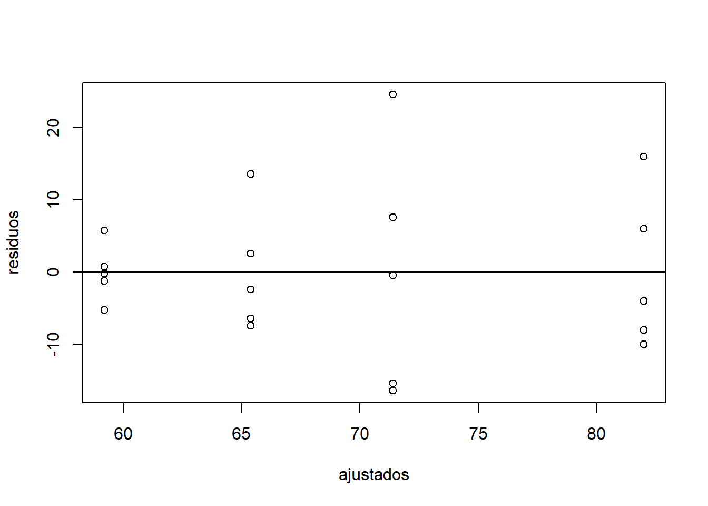

# Delineamentos Experimentais

A experimentação é uma parte da estatística probabilística que estuda o planejamento, execução, coleta de dados, análise de dados e interpretação dos resultados provenientes de um experimento.

Um experimento é um procedimento planejado com base em uma hipótese, que tem por objetivo provocar fenômenos (tratamentos) de forma controlada, analisando e interpretando os
resultados obtidos.

O tratamento é o método, elemento ou material cujo efeito desejamos avaliar em um experimento. Por exemplo: formas de preparo de solo, diferentes cultivares, doses de adubação, controle de insetos e outras pragas, controle de uma doença. Num experimento, somente o tratamento variade uma unidade experimental para outra, as demais condições são mantidas constantes, salvo erros não controláveis.

E alguns experimentos, utiliza-se a testemunha (nas ciências agrárias e ambientais) ou placebo (na saúde), que são as unidades experimentais que não recebem tratamento.

A unidade experimental é a unidade que recebe o tratamento uma vez e, normalmente são chamadas de parcelas. A escolha da unidade experimental depende dos tipos de tratamentos que serão avaliados. Podem ser: uma área de campo, um vaso com solo, um animal, uma placa de Petri, uma planta. Em áreas de campo, normalmente utiliza-se a bordadura. Num experimento, recomenda-se, no mínimo, a utilização de 20 UEs. 

Em um experimento, a variável a ser avaliada chamamos de variável resposta. Por exemplo, núumero de grãos por planta, número de folhas por planta, altura das plantas.

## Princípios básicos da Experimentação


### Repetição

A repetição consiste na aplicação do mesmo tratamento sobre duas ou mais unidades experimentais. Permite estimar o erro experimental e avaliar de forma mais precisa o efeito de
cada tratamento.

O erro experimental é caracterizado pela variância entre as unidades experimentais que receberam o mesmo tratamento.

### Casualização

A casualização consiste na aplicação dos tratamentos aleatoriamente (sorteio) sobre as unidades experimentais. A casualização é usada para obter a independência dos erros, ou seja, evitar que determinados tratamentos sejam favorecidos.

### Controle local

Quando tiver heterogeneidade no material experimental: plantas de diferentes alturas, animais de diferentes idades, solo com declividade, deve-se separar o material em grupos homogêneos
e aplicar o tratamento uma vez dentro de cada grupo (blocos).
A homogeneidade ou não do material dá origem aos tipos de delineamentos:

- Delineamento Inteiramente Casualizado (DIC): material experimental homogêneo;

- Delineamento Blocos Casualizados (DBC): material experimental com uma fonte de heterogeneidade;

- Delineamento Quadrado Latino (DQL): material experimental com duas fontes de heterogeneidade.

## Análise de Variância

Para saber se existe diferença significativa entre as médias resultados dos efeitos de tratamentos, realiza-se a Análise de Variância (ANOVA).


|**Fonte de Variação**|**Graus de Liberdade (GL)**|**Soma de Quadrados (SQ)**|**Quadrado Médio (QM)**|**Falc**|**P**|
|:---:|:---:|:---:|:---:|:---:|:---:|
|Tratamento|I-1|SQtrat|QMat|QMatr/QMerro|P|
|Erro|GLerro|SQerro|QMerro| | |
|Total|IJ-1|SQtotal|  | | |
Table: Nome da Tabela

## Hipóteses estatísticas

- H0: Não existe diferença entre as médias dos tratamentos

- H1: Existe, pelo menos, uma diferença entre as médias dos tratamentos

## Delineamento Inteiramente Causalizado (DIC)

É utilizado quando as unidades experimentais são homogêneas. É o mais simples dos delineamentos e os tratamentos são designados às unidades experimentais de forma casualizada, por meio de um único sorteio. Usado principalmente em pequenos animais, casas de vegetação e em
laboratórios.


*Exemplo*: Um produtor deseja avaliar 4 variedades de pera (A, B, C e D). Para tanto, instalou um experimento no delineamento inteiramente casualizado, utilizando 5 repetições por variedade. Os resultados, peso médio do fruto, estão apresentados a seguir:


Existe diferença significativa entre as variedades de pera, considerando o peso médio dos frutos de cada variedade?

Para responder esta pergunta, utilizamos a Análise de Variância (ANOVA).

No software RStudio:

Criar o arquivo acima em planilha eletrônica. Nomear como DIC e salvar em formato .xls.

Importar no RStudio:


```r
require(readxl)
url <- "https://github.com/Smolski/softwarelivrer/raw/master/avancado/dic.xls"
destfile <- "dic.xls"
curl::curl_download(url, destfile)
DIC <- read_excel(destfile)
attach(DIC)
```

O comando que gera a análise de variância é o `aov()` e o comando que exibe o quadro da ANOVA é o `anova`. Então, podemos gerar o quadro da análise de uma são vez associando os dois comandos.


```r
anova=aov(Peso~Variedade)
summary(anova)
```

```
##             Df Sum Sq Mean Sq F value Pr(>F)  
## Variedade    3   1414   471.3   3.775 0.0319 *
## Residuals   16   1997   124.8                 
## ---
## Signif. codes:  0 '***' 0.001 '**' 0.01 '*' 0.05 '.' 0.1 ' ' 1
```


Hipóteses estatísticas:

- H0: ti $=$ 0 (as médias dos tratamentos nãao diferem entre si)
- H1: ti $\neq$ 0 (existe, no mínimo, uma diferença entre as médias dos tratamentos)

Como p = 0,0319 (0,01 $\leq$ p "menor ou igual a" 0,05), rejeita-se H0 com nível de significância de 5\% e conclui-se que existe diferença significativa entre as médias dos tratamentos.

Para saber quais as médias que diferem, utilizamos o teste de Tukey.


```r
attach(DIC)
```

```
## The following objects are masked from DIC (pos = 3):
## 
##     Peso, Repeticao, Variedade
```

```r
TukeyHSD(anova,as.factor("Variedade"),ordered=TRUE)
```

```
##   Tukey multiple comparisons of means
##     95% family-wise confidence level
##     factor levels have been ordered
## 
## Fit: aov(formula = Peso ~ Variedade)
## 
## $Variedade
##     diff        lwr     upr     p adj
## C-D  6.2 -14.016299 26.4163 0.8163995
## B-D 12.2  -8.016299 32.4163 0.3429223
## A-D 22.8   2.583701 43.0163 0.0244592
## B-C  6.0 -14.216299 26.2163 0.8303280
## A-C 16.6  -3.616299 36.8163 0.1281553
## A-B 10.6  -9.616299 30.8163 0.4602137
```


Para que o RStudio apresente uma tabela com as médias e letras indicando quais as médias que diferiram, devemos instalar o pacote `agricolae`.


```r
library(agricolae)
HSD.test(anova,as.factor("Variedade"),console=TRUE)
```

```
## 
## Study: anova ~ as.factor("Variedade")
## 
## HSD Test for Peso 
## 
## Mean Square Error:  124.825 
## 
## Variedade,  means
## 
##   Peso       std r Min Max
## A 82.0 10.862780 5  72  98
## B 71.4 17.096783 5  55  96
## C 65.4  8.561542 5  58  79
## D 59.2  3.962323 5  54  65
## 
## Alpha: 0.05 ; DF Error: 16 
## Critical Value of Studentized Range: 4.046093 
## 
## Minimun Significant Difference: 20.2163 
## 
## Treatments with the same letter are not significantly different.
## 
##   Peso groups
## A 82.0      a
## B 71.4     ab
## C 65.4     ab
## D 59.2      b
```


*Médias dos tratamentos não seguidas por mesma letra diferem pelo teste de Tukey, ao nível de 5\% de significância.

Conclusão: A variedade de pera A apresentou o maior peso médio dos frutos, que não diferiu significativamente do peso médio das variedades B e C. A variedade de pera D apresentou o menor peso médio dos frutos, que não diferiu significativamente do peso médio das variedades B e C. As variedades B e C apresentaram peso médio dos frutos intermediário.


```r
attach(DIC)
```

```
## The following objects are masked from DIC (pos = 4):
## 
##     Peso, Repeticao, Variedade
```

```
## The following objects are masked from DIC (pos = 5):
## 
##     Peso, Repeticao, Variedade
```

```r
boxplot(Peso~Variedade)
```


```r
boxplot(Peso~Variedade,xlab="Variedade",ylab="Peso")
```


```r
tapply(Peso,Variedade,mean)
```

```
##    A    B    C    D 
## 82.0 71.4 65.4 59.2
```

```r
tapply(Peso,Variedade,sd)
```

```
##         A         B         C         D 
## 10.862780 17.096783  8.561542  3.962323
```


```r
residuos=residuals(anova)
ajustados=fitted(anova)
plot(ajustados,residuos)
abline(h=0)
```




```r
qqnorm(residuos)
qqline(residuos)
```


## Delineamento Blocos Casualizados (DBC)

É utilizado quando as unidades experimentais são heterogêneas. Os tratamentos são designados às unidades experimentais de forma casualizada, por meio de sorteio por blocos. Na área agrícola, é usado principalmente em áreas de campo e grandes animais.


*Exemplo*: Uma Nutricionista elaborou 4 dietas e quer aplicá-las em 20 pessoas a fim detestar suas eficiências quanto à perda de peso. Porém ela notou que entre essas 20 pessoas existem 5 grupos de faixas iniciais de peso. Então, para aumentar a eficácia do teste ela separou os 20 indivíduos em 5 grupos de faixas de peso.


Criar o arquivo acima em planilha eletrônica. Nomear como DBC e salvar em formato .xls.

Importar no RStudio:


```r
require(readxl)
url <- "https://github.com/Smolski/softwarelivrer/raw/master/avancado/dbc.xls"
destfile <- "dbc.xls"
curl::curl_download(url, destfile)
DBC  <- read_excel(destfile)

attach(DBC)
anova=aov(Perda~Tratamentos+Blocos)
summary(anova)
```

```
##             Df Sum Sq Mean Sq F value  Pr(>F)   
## Tratamentos  3   25.2     8.4   6.000 0.00973 **
## Blocos       4    3.2     0.8   0.571 0.68854   
## Residuals   12   16.8     1.4                   
## ---
## Signif. codes:  0 '***' 0.001 '**' 0.01 '*' 0.05 '.' 0.1 ' ' 1
```


Hipóteses estatísticas:

- H0: ti $=$ 0 (as médias dos tratamentos não diferem entre si)
- H1: ti $\neq$ 0 (existe, no mínimo, uma diferença entre as médias dos tratamentos)

Como p = 0,00973 (p $\leq$ 0,01), rejeita-se H0 com nível de significância de 1\% e conclui-se que existe diferença significativa entre as médias dos tratamentos.


- H0: $\sigma$^2^ blocos $=$ 0
- H1: $\sigma$^2^ blocos $\leq$ 0


Como p $=$ 0,68854 (p $\leq$ 0,05), não rejeita-se H0 e conclui-se que a variância entre os blocos não é significativa.


```r
attach(DBC)
HSD.test(anova,as.factor("Tratamentos"),console=TRUE)
```

```
## 
## Study: anova ~ as.factor("Tratamentos")
## 
## HSD Test for Perda 
## 
## Mean Square Error:  1.4 
## 
## Tratamentos,  means
## 
##         Perda       std r Min Max
## Dieta 1   2.6 0.8944272 5   2   4
## Dieta 2   5.6 0.8944272 5   5   7
## Dieta 3   3.2 1.6431677 5   1   5
## Dieta 4   3.8 0.8366600 5   3   5
## 
## Alpha: 0.05 ; DF Error: 12 
## Critical Value of Studentized Range: 4.19866 
## 
## Minimun Significant Difference: 2.221722 
## 
## Treatments with the same letter are not significantly different.
## 
##         Perda groups
## Dieta 2   5.6      a
## Dieta 4   3.8     ab
## Dieta 3   3.2      b
## Dieta 1   2.6      b
```


Médias dos tratamentos não seguidas por mesma letra diferem pelo teste de Tukey, ao nível de 5\% de significância.


Conclusão: A dieta que resultou na maior perda de peso foi a dieta 2, que não diferiu da dieta 4. A dieta que resultou na menor perda de peso foi a dieta 1, que não diferiu das dietas 3 e 4.

Medidas descritivas com a variável resposta:


```r
boxplot(Perda~Tratamentos)
```


```r
boxplot(Perda~Tratamentos,xlab="Tratamentos",ylab="Perda")
```


```r
tapply(Perda,Tratamentos,mean)
```

```
## Dieta 1 Dieta 2 Dieta 3 Dieta 4 
##     2.6     5.6     3.2     3.8
```

```r
tapply(Perda,Tratamentos,sd)
```

```
##   Dieta 1   Dieta 2   Dieta 3   Dieta 4 
## 0.8944272 0.8944272 1.6431677 0.8366600
```


```r
residuo=residuals(anova)
ajustado=fitted(anova)
plot(ajustado,residuo)
abline(h=0)
```


```r
qqnorm(residuo)
qqline(residuo)
```


\printbibliography[segment=\therefsegment,heading=subbibliography]

