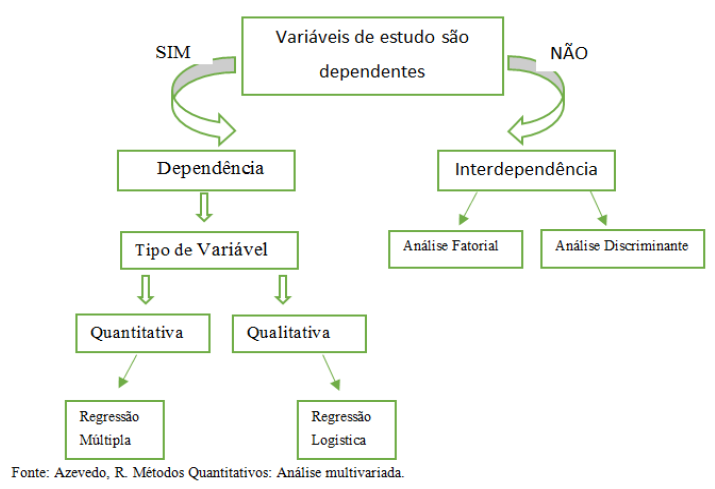
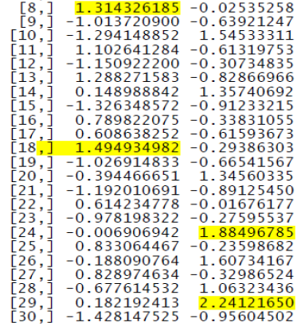

# Análise Fatorial

A análise fatorial é um método estatístico utilizado para descrever a variabilidade entre variáveis observadas e possivelmente correlacionadas em termos de um número potencialmente menor de variáveis não observadas chamadas fatores.

Assim, é possível que as variaçõess de três ou quatro variáveis observadas possam ser explicadas por somente um fator, o que evidencia a utilidade da análise fatorial para descrever um conjunto de dados utilizando para isso apenas alguns fatores.

Diferentemente da análise de variância, regressão e análise discriminante, onde uma das variáveis é identificada como a variável dependente, examina-se todo o conjunto de relações interdependentes entre variáveis.





A análise fatorial aborda o problema de analisar a estrutura das inter-relações (correlações) entre um grande número de variáveis (escores de testes, itens de testes, respostas de questionários), definindo um conjunto de dimensões latentes comuns, chamados fatores. Então, a análise fatorial, permite primeiro identificar as dimensões separadas da estrutura e então determinar o grau em que cada variável é explicada por cada dimensão. Uma vez que essas dimensões e a explicação da cada variável estejam determinadas, os dois principais usos da análise fatorial podem ser conseguidos:

- **Resumo**: ao resumir os dados, a análise fatorial obtém dimensões latentes que, quando interpretadas e compreendidas, descrevem os dados em um núumero muito menor de conceitos do que as variáveis individuais originais.

- **Redução de dados**: pode ser obtida calculando escores para cada dimensão latente e substituindo as variáveis originais pelos mesmos.

As técnicas analíticas fatoriais podem ser classificadas quanto aos seus objetivos como **exploratória** ou **confirmatória**. Exploratória, útil na busca da estrutura em um conjunto de variáveis ou como um método de redução de dados. Sob esta perspectiva, as técnicas analíticas fatoriais "consideram o que os dados oferecem"e não estabelecem restriçoes *a priori* sobre o número de componentes a serem extraídos. O uso da análise fatorial em situações, que se deseja testar hipóteses envolvendo questões sobre, quais variáveis deveriam ser agrupadasem fator ou número exato de fatores, por exemplo, a análise fatorial desempenha um papel confirmatório, ou seja, avalia o grau em que os dados satisfazem a estrutura esperada.

Exemplo: em maketing, fatores associados às características do produto, clientes e até mesmo da organização.

Em estudos visando analisar o inter-relacionamento e o agrupamento de indivíduos, cidade ou regiões em grupos homogêneos em relação à mobilidade, preferências pessoais, condições de desenvolvimento, entre outras variáveis.


## Pressupostos


A análise fatorial clássica exige que alguns pressupostos sejam satisfeitos, quais sejam (MALHOTRA, 2001):

a. Normalidade dos dados: apesar deste pressuposto não ser crítico quando a estimação é realizada por mínimos quadrados ordinários, a  exigência de normalidade auxilia na análise, evitando possíveis assimetrias e a presença de *outliers*.

b. Variáveis quantitativas medidas em escala Intervalar ou de Razão. Esse pressuposto é crítico, pois a análise deve ser realizada com variáveis quantitatias e, frequentemente, alguns estudos são realizados utilizando variáveis ordinais (as quaiss são qualitativas) na análise fatorial clássica (o que é errado de muitas maneiras).

c. Como diretriz inicial deve haver ao menos quatro a cinco vezes mais observações do que variáveis.


## Estatísticas Associadas a Análise Fatorial


Em geral, as estatísticas utilizadas no processo de análise fatorial são (AAKER-KUMARDAY, 2001):


- Teste de esfericidade de Bartlett: estatística de teste usada para examinar a hipótese de que as variáveis não sejam correlacionadas na população, ou seja, a matriz de correlação da população é uma matriz identidade onde cada variável se correlaciona perfeitamente com ela própria (r=1), mas não apresenta correlação com as outras variáveis (r=0).

- Matriz de correlação: o triângulo inferior da matriz exibe as correlações simples, r, entre todos os pares possíveis de variáveis incluídas na análise, enquanto os elementos da diagonal, que são todos iguais a 1, em geral são omitidos.

- Comunalidade: porção da variância que uma variável compartilha com todas as outras variáveis consideradas, sendo também a proporção de variância explicada pelos fatores comuns.

- Autovalor: representa a variância total explicada por cada fator.

- Cargas fatoriais: correlação simples entre as variáveis e os fatores.

- Gráfico das cargas dos fatores: gráfico das variáveis originais utilizando as cargas fatoriais como ordenadas.

- Matriz de fatores ou matriz principal: contém as cargas fatoriais de todos as variáveis em todos os fatores extraídos.

- Escores fatoriais: escores compostos estimados para cada entrevistado nos fatores derivados.

-  Medida de adequacidade da amostra de Kaiser-Meyer-Olkin (KMO): é o índice usado para avaliar a adequacidade da análise fatorial. Valores altos (entre 0,5 e 1,0) indicam que a análise fatorial é apropriada. Valores abaixo de 0,5 indicam que a análise fatorial pode ser inadequada.

-  Percentagem de variância: percentagem da variância total atribuída a cada fator.

-  Resíduos: diferenças entre as correlações observadas, dadas na matriz de correlação de entrada (input) e as correlações reproduzidas, conforme estimadas pela matriz de fatores.

- Scree plot: gráfico dos autovalores versus número de fatores por ordem de extração.


Exemplo 1:

(MALHOTRA, 2001) Suponhamos que um pesquisador queira avaliar os benefícios que os consumidores esperam de um dentifrício. Foi entrevistada uma amostra de 30 pessoas em um supermercado, para que indicassem seu grau de concordância com as seguintes afirmações, utilizando uma escala de 7 pontos (1= discordância total, 7 =concordância total).

- V1: É importante comprar um creme dental que evite cáries.
- V2: Gosto de um creme dental que clareie os dentes.
- V3: Um creme dental deve fortificar as gengivas.
- V4: Prefiro um creme dental que refresque o hálito.
- V5: Manter os dentes sadios não é uma vantagem importante de um creme dental.
- V6: O aspecto mais importante na compra de um creme dental é tornar os dentes atraentes.


Inicialmente podemos explorar algumas estatísticas descritivas relacionadas às variáveis pesquisadas, utilizando a função `summary`:


```r
require(readxl)
```

```
## Carregando pacotes exigidos: readxl
```

```r
url <- "https://github.com/Smolski/softwarelivrer/raw/master/avancado/creme_dental_exemplo1.xlsx"
destfile <- "creme_dental_exemplo1.xlsx"
curl::curl_download(url, destfile)
creme_dental_exemplo1 <- read_excel(destfile)

attach(creme_dental_exemplo1)
summary(creme_dental_exemplo1)
```

```
##        v1              v2            v3            v4            v5     
##  Min.   :1.000   Min.   :2.0   Min.   :1.0   Min.   :2.0   Min.   :1.0  
##  1st Qu.:2.000   1st Qu.:3.0   1st Qu.:2.0   1st Qu.:3.0   1st Qu.:2.0  
##  Median :4.000   Median :4.0   Median :4.0   Median :4.0   Median :3.5  
##  Mean   :3.933   Mean   :3.9   Mean   :4.1   Mean   :4.1   Mean   :3.5  
##  3rd Qu.:6.000   3rd Qu.:5.0   3rd Qu.:6.0   3rd Qu.:5.0   3rd Qu.:5.0  
##  Max.   :7.000   Max.   :7.0   Max.   :7.0   Max.   :7.0   Max.   :7.0  
##        v6       
##  Min.   :2.000  
##  1st Qu.:3.000  
##  Median :4.000  
##  Mean   :4.167  
##  3rd Qu.:4.750  
##  Max.   :7.000
```


## Passos da Análise Fatorial

Basicamente, os seguintes passos conduzem a análise fatorial: entrada de dados, cálculo das correlações entre as variáveis, extração inicial dos fatores e a rotação da matriz.

### Construção da Matriz de Correlação

Entrada de Dados (BASE): os dados de entrada da análise fatorial geralmente tomam a forma de um conjunto de valores de variáveis para cada objeto ou indivíduo na amostra. Toda matriz, cujos componentes ofereçam uma medida de similaridade entre variáveis, pode ser passível de análise fatorial. A medida de similaridade não precisa ser uma correlação, embora, geralmente, ou seja:

Para que a análise fatorial seja adequada, as variáveis devem ser correlacionadas. Espera-se também que as variáveis altamente correlacionadas umas com as outras se correlacionem também com o(s) mesmo(s) fatore(s).

Note que existem correlações amostrais positivas e negativas relativamente elevadas entre V1 (prevenção de cáries), V3 (gengivas fortes) e V5 (dentes sadios). Espera-se que essas variáveis se relacionem com o mesmo conjunto de fatores. Verificam-se também correlações relativamente elevadas entre V2 (clareie os dentes), V4 (hálito puro) e V6 (dentes atraentes). Essas variáveis também devem correlacionar-se com os mesmos fatores.


```r
matcor <- cor(creme_dental_exemplo1)
print(matcor, digits = 2)
```

```
##         v1     v2     v3      v4      v5      v6
## v1  1.0000 -0.053  0.873 -0.0862 -0.8576  0.0042
## v2 -0.0532  1.000 -0.155  0.5722  0.0197  0.6405
## v3  0.8731 -0.155  1.000 -0.2478 -0.7778 -0.0181
## v4 -0.0862  0.572 -0.248  1.0000 -0.0066  0.6405
## v5 -0.8576  0.020 -0.778 -0.0066  1.0000 -0.1364
## v6  0.0042  0.640 -0.018  0.6405 -0.1364  1.0000
```


```r
require(corrplot)
```

```
## Carregando pacotes exigidos: corrplot
```

```
## corrplot 0.84 loaded
```

```r
corrplot(matcor, method="circle")
```

<!-- -->

Na figura acima, as correlações estão em cor azul porque são positivas, com tons mais fortes para as correlações mais altas. 
<!--
Para estas, o ângulo (sentido horário) no gráfico de setores do painel
superior `(upper.panel = panel.pie)` é maior.
-->

Para testar a conveniência do modelo fatorial pode-se aplicar o teste de esfericidade de Bartlett para testar a hipótese nula, de que as variáveis não sejam correlacionadas na população.
Um valor elevado da estatística de teste favorece a rejeição da hipótese nula.

Também, a medida de adequacidade da amostra de Kaiser-Meyer-Olkin (KMO) compara as magnitudes dos coeficientes de correlação observados com as magnitudes dos coeficientes de
correlação parcial. Pequenos valores de KMO indicam que as correlações entre os pares de variáveis não podem ser explicadas por outras variáveis, indicando que a análise fatorial não é adequada.

Hipóteses:

Ho: A matriz de correlação da população é uma matriz identidade, ou seja as variáveis não são correlacionadas na população.


H1: A matriz de correlação da população não é uma matriz identidade, ou seja as variáveis são correlacionadas na população.


```r
#install.packages("psych")
require(psych)
```

```
## Carregando pacotes exigidos: psych
```

```r
cortest.bartlett(creme_dental_exemplo1)
```

```
## R was not square, finding R from data
```

```
## $chisq
## [1] 111.3138
## 
## $p.value
## [1] 9.017094e-17
## 
## $df
## [1] 15
```

Veja que a hipótese nula de que a matriz de correlação da população seja uma matriz identidade é rejeitada pelo teste de esfericidade de Bartlett. A estatística qui-quadrado aproximada
é 111,314, com 15 graus de liberdade, significativa ao nível de 0,05.


```r
KMO(creme_dental_exemplo1)
```

```
## Kaiser-Meyer-Olkin factor adequacy
## Call: KMO(r = creme_dental_exemplo1)
## Overall MSA =  0.66
## MSA for each item = 
##   v1   v2   v3   v4   v5   v6 
## 0.62 0.70 0.68 0.64 0.77 0.56
```

A estatística KMO maior que 0,5 também concorda quanto ao fato de que a análise fatorial pode ser considerada uma técnica apropriada para analisar a matriz de correlação.


### Método de Análise Fatorial

As duas abordagens básicas são a análise de componentes principais (ACP) e a análise fatorial (AFC) comum ou análise fatorial exploratória (AFE), embora existam diferentes métodos
de extração de fatores da matriz de correlações, que de forma geral, são métodos numericamente complexos. Na análise de componentes principais, o objetivo da extração de fatores é encontrar um conjunto de fatores que formem uma combinação linear das variáveis originais ou da matriz de correlações. Assim, se as variáveis X1 , X2 , X3 , ... , Xn são altamente correlacionadas entre si, elas serão combinadas para formar um fator, e assim, sucessivamente, com todas as demais variáveis
da matriz de correlação.


A análise fatorial exploratória pode trazer informações importantes sobre a estrutura multivariada de um instrumento de mensuração, identificando os construtos teóricos.

O segundo objetivo da analise fatorial exploratória está relacionado à redução de dados e descoberta de ponderações ótimas para as variáveis mensuradas, de forma que um grande conjunto de variáveis possa ser reduzido a um conjunto menor de índices sumários que tenham máxima variabilidade e fidedignidade. A redução de dados é especialmente possível pela aplicação da Análise dos Componentes Principais (ACP) e não pelo uso da analise fatorial comum (AFC), havendo uma diferença fundamental entre os dois métodos: a ACP trabalha com a variância total observada, enquanto a AFC trabalha somente com a variância partilhada dos itens (variância erro e variância única são excluídas) (LAROS, 2012).


Na AFC, os fatores são estimados para explicar as covariâncias entre as variáveis observadas, portanto os fatores são considerados como as causas das variáveis observadas. Já na ACP, os componentes são estimados para representar a variância das variáveis observadas de uma maneira tão econômica quanto possível. Os componentes principais são somas otimamente ponderadas das variáveis observadas, neste sentido, as variáveis observadas são consideradas as causas dos componentes principais (LAROS, 2012).

Assim, recomenda-se a ACP, quando o objetivo é determinar o número mínimo de fatores que respondem pela máxima variância nos dados, sendo os fatores chamados componentes principais (MALHOTRA, 2001).


Obs.:

cor = TRUE: as componentes principais serão geradas a partir da matriz de correlação.

cor = FALSE: as componentes principais serão geradas a partir da matriz de covariância.


```r
fit<-princomp(creme_dental_exemplo1,cor=TRUE)
fit
```

```
## Call:
## princomp(x = creme_dental_exemplo1, cor = TRUE)
## 
## Standard deviations:
##    Comp.1    Comp.2    Comp.3    Comp.4    Comp.5    Comp.6 
## 1.6526307 1.4893352 0.6645283 0.5841726 0.4273502 0.2919051 
## 
##  6  variables and  30 observations.
```

```r
summary(fit)
```

```
## Importance of components:
##                           Comp.1    Comp.2     Comp.3     Comp.4
## Standard deviation     1.6526307 1.4893352 0.66452834 0.58417262
## Proportion of Variance 0.4551981 0.3696865 0.07359965 0.05687627
## Cumulative Proportion  0.4551981 0.8248846 0.89848425 0.95536053
##                            Comp.5     Comp.6
## Standard deviation     0.42735024 0.29190514
## Proportion of Variance 0.03043804 0.01420144
## Cumulative Proportion  0.98579856 1.00000000
```


A função `summary(fit)` mostra a aplicação da análise de componentes principais. O fator 1
responde por 45,52\% da variância total. Da mesma forma, o segundo fator responde por 36,97\% da
variância total, sendo que os dois primeiros fatores respondem por 82,49\% da variância total. Várias
considerações devem integrar a análise do núumero de fatores que devem ser usados na análise.

### Determinação do núumero de fatores 


A fim de reduzir as informações presentes nas variáveis originais, deve-se reduzir o número de fatores. Na literatura, diversos processos são sugeridos: determinação a priori, observação dos autovalores, representação gráfica (**scree plot**), testes de significância entre outros.

#### Determinação a priori

Quando o pesquisador, com base na experiência que apresentação em relação ao assunto,
decide quantos fatores deseja utilizar.

#### Autovalores


Como o autovalor representa a quantidade de variância associada ao fator, incluem-se
apenas os fatores com variância maior que 1.


#### Gráfico de declive (**scree plot**)


Trata-se de uma representação gráfica dos autovalores associada ao número de fatores na
ordem de extração. O ponto em que a inclinação suaviza indica o número de fatores a ser usados,
que em geral é superior ao revelado pelos autovalores.


#### Percentagem da variância

Determina que o núumero de fatores extraídos seja de no mínimo 60\% da variância.

#### Teste de significância

É possível reter apenas os fatores estatisticamente significativos com base na significância estatística dos autovalores separados.


Abaixo vamos apresentar o `scree-plot`, em formato do gráfico de barras para o nosso exemplo


```r
screeplot(fit)
```

<!-- -->


Note que as duas primeiras componentes, aparecem em destaque, ocorrendo uma ligeira suavização das alturas nas demais colunas.


```r
plot(fit,type="lines")
```

<!-- -->


### Análise de Componentes Principais

Rodando a Análise de Componentes Principais no R, temos:


```r
PCAdente<-principal(creme_dental_exemplo1, nfactors=2,
                n.obs=30,rotate="none", scores=TRUE)
PCAdente
```

```
## Principal Components Analysis
## Call: principal(r = creme_dental_exemplo1, nfactors = 2, rotate = "none", 
##     n.obs = 30, scores = TRUE)
## Standardized loadings (pattern matrix) based upon correlation matrix
##      PC1   PC2   h2    u2 com
## v1  0.93  0.25 0.93 0.074 1.1
## v2 -0.30  0.80 0.72 0.277 1.3
## v3  0.94  0.13 0.89 0.106 1.0
## v4 -0.34  0.79 0.74 0.261 1.4
## v5 -0.87 -0.35 0.88 0.122 1.3
## v6 -0.18  0.87 0.79 0.210 1.1
## 
##                        PC1  PC2
## SS loadings           2.73 2.22
## Proportion Var        0.46 0.37
## Cumulative Var        0.46 0.82
## Proportion Explained  0.55 0.45
## Cumulative Proportion 0.55 1.00
## 
## Mean item complexity =  1.2
## Test of the hypothesis that 2 components are sufficient.
## 
## The root mean square of the residuals (RMSR) is  0.07 
##  with the empirical chi square  3.94  with prob <  0.41 
## 
## Fit based upon off diagonal values = 0.98
```


A matriz de fatores acima, resultante da análise de componentes principais, é composta pelos coeficientes (cargas fatoriais) que expressam as variáveis padronizadas em termos dos fatores.
Valores altos das cargas fatoriais, representam boa relação entre a variável e o fator. Essa matriz não rotada, apresenta dificuldades para ser interpretada pelo fato de que, em geral os fatores são correlacionados com muitas variáveis.

Com o processo da rotação, a matriz de fatores resulta numa matriz mais simples, sendo que a rotação não afeta as comunalidades e a porcentagem da variância explicada. No entanto, a percentagem da variância explicada por cada fator varia, sendo redistribuída por rotação (MALHOTRA, 2001).

Obs. comunalidades (*communalities*) são quantidades das variâncias (correlações) de cada variável explicada pelos fatores.


### Matriz Rotada do Fator

Com o objetivo de possibilitar uma melhor interpretação dos fatores, é prática comum fazer uma rotação ou uma transformação dos fatores.

O conjunto de cargas fatoriais, obtidas por qualquer método de solução fatorial, quando o número de fatores comuns é maior do que um, não é único, pois outros conjuntos equivalentes podem ser encontrados, por transformações ortogonais de cargas.

Na rotação ortogonal, os eixos são mantidos em ângulo reto, sendo o método mais utilizado o processo varimax. Esse método ortogonal de rotação minimiza o número de variáveis com altas cargas sobre um fator afim de permitir a interpretaçã dos fatores. A rotação ortogonal resulta em fatores nãocorrelacionados ao passo que a rotação oblíqua não mantém os eixos em ângulo reto e os fatores são correlacionados (MALHOTRA, 2001).


```r
PCAdentevarimax<-principal(creme_dental_exemplo1, nfactors=2,
            n.obs=30,rotate="varimax",scores=TRUE)
PCAdentevarimax
```

```
## Principal Components Analysis
## Call: principal(r = creme_dental_exemplo1, nfactors = 2, rotate = "varimax", 
##     n.obs = 30, scores = TRUE)
## Standardized loadings (pattern matrix) based upon correlation matrix
##      RC1   RC2   h2    u2 com
## v1  0.96 -0.03 0.93 0.074 1.0
## v2 -0.05  0.85 0.72 0.277 1.0
## v3  0.93 -0.15 0.89 0.106 1.1
## v4 -0.09  0.85 0.74 0.261 1.0
## v5 -0.93 -0.08 0.88 0.122 1.0
## v6  0.09  0.88 0.79 0.210 1.0
## 
##                        RC1  RC2
## SS loadings           2.69 2.26
## Proportion Var        0.45 0.38
## Cumulative Var        0.45 0.82
## Proportion Explained  0.54 0.46
## Cumulative Proportion 0.54 1.00
## 
## Mean item complexity =  1
## Test of the hypothesis that 2 components are sufficient.
## 
## The root mean square of the residuals (RMSR) is  0.07 
##  with the empirical chi square  3.94  with prob <  0.41 
## 
## Fit based upon off diagonal values = 0.98
```

Veja que na matriz rotada, o Fator 1 apresenta altos coeficientes para as variáveis V1 (prevenção de cáries), V3 (gengivas fortes) e coeficiente negativo para V5 (dentes sadios não é importante). O Fator 2 apresenta forte relação com V2 (clareie os dentes), V4 (hálito puro) e V6 (dentes atraentes).

Rotulando:

Nesta fase é usual tentar dar nomes aos fatores. Em muitos casos, isto requer um certo grau de imaginação:

**Fator 1**: Fator de benefício para a saúde.

**Fator 2**: Fator de benefício social.

Com os dois fatores acima, podemos concluir sobre o que o consumidor espera de um creme dental.


### Autovalores

Para acessar os eingenvalues (autovalores):


```r
PCAdentevarimax$values
```

```
## [1] 2.73118833 2.21811927 0.44159791 0.34125765 0.18262823 0.08520861
```


Confirmando, temos autovalores acima de 1, nos dois primeiros casos.

Para visualizar melhor a contribuição de cada variável (peso):


```r
PCAdentevarimax$loadings
```

```
## 
## Loadings:
##    RC1    RC2   
## v1  0.962       
## v2         0.848
## v3  0.933 -0.151
## v4         0.855
## v5 -0.934       
## v6         0.885
## 
##                  RC1   RC2
## SS loadings    2.687 2.263
## Proportion Var 0.448 0.377
## Cumulative Var 0.448 0.825
```


Recurso importante na interpretação dos fatores, o gráfico das variáveis, apresenta ao final do eixo, as variáveis que com cargas mais altas sobre aquele fator. Quanto mais próximas da origem menores as cargas destas variáveis sobre aquele fator. Variáveis distantes dos dois eixos, estão relacionadas a ambos
os fatores.


```r
biplot(PCAdentevarimax)
```

<!-- -->


Os valores dos fatores obtidos para os 30 entrevistados encontram-se na matriz de coeficiente de escore do componente mostrada abaixo. Esta ajuda a entender como cada variável se relaciona aos escores dos componentes calculados para cada participante. Para melhor compreensão da análise dos escores dos entrevistados é importante especificar e comentar o significado de cada fator:

**Fator 1**: Fator de benefício para a saúde.

**Fator 2**: Fator de benefício social.

Analisando os escores fatoriais dos entrevistados, destacamos a seguir alguns entrevistados e seus respectivos resultados:

Entrevistado 18: 1.494934982

Este entrevistado se destacou como o primeiro colocado no ranqueamento, obtendo o maior escore ponderado, demonstrando ser bastante atento à prevenção de cáries, gengivas fortes e dentes sadios.

Entrevistado 29: 2.24121650

Este entrevistado se destacou em primeiro no segundo fator, apresentando preocupação quanto ao beneffício social da dentição: boa aparência dos dentes, hálito puro e boa aparência dos dentes.


<!--
factor.scores(creme_dental_exemplo1,PCAdentevarimax, Phi = NULL, method = c("Thurstone", "tenB
-->

Destacando-se os entrevistados de interesse, verifica-se:





<!--
\printbibliography[segment=\therefsegment,heading=subbibliography]
-->

