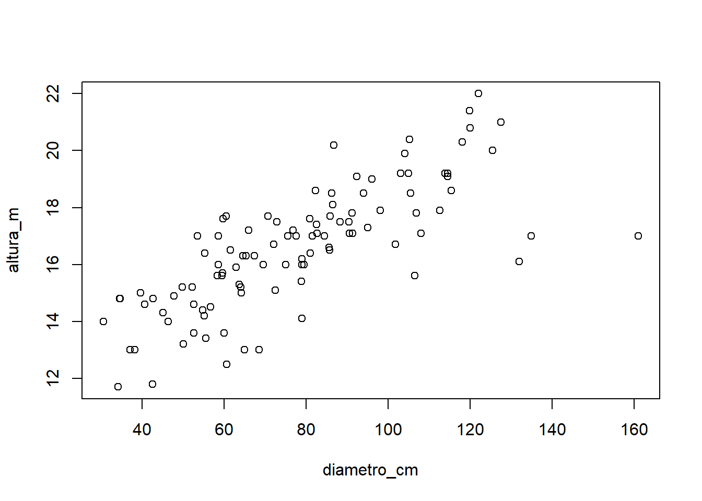
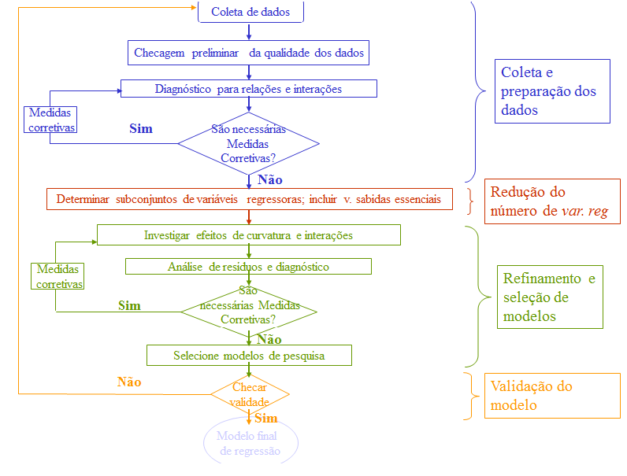

# Regressão Múltipla

## Modelo geral

Um modelo de regressão múltipla é expresso como:

$$ 
y_{i} = \beta_0+\ \beta_1x_{1i}+\beta_2x_{2i}+\dots+\beta_kx_{ki}+\varepsilon_i\ 
$$
\noindent
em que:

- $y_{i}$: valores da variável resposta, $i = 1, 2,..., n$ observações;

- $x$: valores das variáveis explicativas, $k = 1, 2,..., K$ variáveis;

- $\beta_k$: parâmetros do modelo;

- $\varepsilon_i$: erro aleatório.


A equação estimada para este modelo é definida como:

$$ 
y_{i} = b_0+\ b_1x_{1i}+b_2x_{2i}+\dots+b_kx_{ki} 
$$
em que:

- $b_k$: coeficientes estimados.


## Variável dummy

Em algumas situações é necessário introduzir, como variável preditora (independente), uma variável categórica no
modelo de regressão linear simples ou múltiplo, como por exemplo, local (urbano ou rural), área (preservada ou degradada), etc, podendo ter mais que duas categorias. Essa variável terá que ser codificada, utilizando somente códigos 0 e 1, assim chamada variável dummy.

O número de variáveis dummy no modelo será sempre igual ao número de categorias da variável preditora original
menos 1. Por exemplo:

- Para a variável preditora "local" que assume valores - urbano ou rural, então têm-se a variável dummy
local_dummy assumindo 0 para rural e 1 para urbano; também, poderia ser utilizado 1 para rural e 0 para
urbano. Uma indicação é que a categoria que assume o valor 0 seja a categoria de referência.

- Para a variável preditora "grau de escolaridade"" que assume valores – ensino fundamental, ensino médio,
ensino superior, então têm-se as variáveis dummy: escola1 e escola2, assim definido:

a. escola1=0 e escola2=0 para ensino fundamental;
b. escola1=1 e escola2=0 para ensino médio;
c. escola1=0 e escola2=1 para ensino superior.

**Exercício**:

1) Utilizando o banco de dados `ARVORE2`, ajuste um modelo de regressão linear simples para predizer a altura das árvores
em função do diâmetro. Veja essa relação no diagrama de dispersão. Interprete os resultados.


Relembrando Modelos de Regressão Linear Simples – Curso Básico do Software R:

- 1.1 Ajustar a equação de regressão. Interpretá-la.
- 1.2 Encontrar e interpretar a significância da equação.
- 1.3 Encontrar e interpretar o coeficiente de determinação.
- 1.4 Analisar graficamente os resíduos.
- 1.5 Testar a normalidade dos resíduos.


Adicionalmente - Curso Avançado do Software R:

- 1.6 Analisar pontos *outliers* nos resíduos.

Para análise dos valores *outliers* nos resíduos (*residuals standard* e *residuals studentized*), utilizam-se os seguintes comandos:

`rstudent(regressao)`

`rstandard(regressao)`

E o gráfico para verificar valores outliers nos resíduos:

`plot(rstudent(regressao))`

`plot(rstandard(regressao))`

Aqueles valores maiores que |2| são possíveis outliers. Incluir uma linha y =2 e y=-2, para facilitar a visualização de outliers.

- 1.7 Analisar pontos influentes nos resíduos.

Para análise dos valores influentes, utiliza-se:

`dffits(regressao)`

Aqueles valores maiores que `2*(p/n)^(1/2)` são possíveis pontos influentes. Em que, p = número de parâmetros do modelo e n = tamanho da amostra. O gráfico para detectar pontos influentes pode ser elaborado pelo comando:

`plot(dffits(regressao))`

Aqueles valores maiores, em módulo, são possíveis influentes. Incluir linhas para facilitar a visualização de pontos influentes.

Ainda, pode-se utilizar o comando `plot(regressao)` elabora diferentes gráficos para o diagnóstico do modelo.


2) Ajuste um segundo modelo de regressão linear simples para predizer a altura das árvores em função da espécie. Veja essa relação no diagrama de dispersão. Interprete os resultados.

3) Ajuste um terceiro modelo de regressão múltipla para predizer a altura das árvores em função do diâmetro e da espécie. Interprete os resultados.


```r
library(readxl)
url <- "https://github.com/Smolski/softwarelivrer/raw/master/avancado/arvore2.xlsx"
destfile <- "arvore2.xlsx"
curl::curl_download(url, destfile)
arvore2 <- read_excel(destfile)
attach(arvore2)
head(arvore2)
```

```
## # A tibble: 6 x 4
##   Nomecientifico            diametro_cm altura_m especie
##   <chr>                           <dbl>    <dbl>   <dbl>
## 1 Sebastiania commersoniana        52.2     15.2       0
## 2 Sebastiania commersoniana        95       17.3       0
## 3 Sebastiania commersoniana        67.3     16.3       0
## 4 Sebastiania commersoniana        46.3     14         0
## 5 Sebastiania commersoniana        64.1     15         0
## 6 Sebastiania commersoniana       122       22         0
```


```r
modelom=lm(altura_m~diametro_cm+especie) 
modelom
```

```
## 
## Call:
## lm(formula = altura_m ~ diametro_cm + especie)
## 
## Coefficients:
## (Intercept)  diametro_cm      especie  
##    12.69592      0.05713     -1.62517
```

Modelo:
$$
Y = 12,328 + 0,0576 x_1 – 1,423 x_2
$$
Ou

$$
\text{Altura} = 12,328 + 0,0576\text{diâmetro} – 1,423\text{espécie}
$$

Verificando a significância de cada coeficiente do modelo de regressão múltipla:


```r
summary(modelom)
```

```
## 
## Call:
## lm(formula = altura_m ~ diametro_cm + especie)
## 
## Residuals:
##     Min      1Q  Median      3Q     Max 
## -3.2688 -0.7663 -0.1236  0.8132  2.8727 
## 
## Coefficients:
##             Estimate Std. Error t value Pr(>|t|)    
## (Intercept) 12.69592    0.38639  32.857  < 2e-16 ***
## diametro_cm  0.05713    0.00445  12.837  < 2e-16 ***
## especie     -1.62517    0.24459  -6.644 1.52e-09 ***
## ---
## Signif. codes:  0 '***' 0.001 '**' 0.01 '*' 0.05 '.' 0.1 ' ' 1
## 
## Residual standard error: 1.185 on 102 degrees of freedom
## Multiple R-squared:  0.6995,	Adjusted R-squared:  0.6937 
## F-statistic: 118.7 on 2 and 102 DF,  p-value: < 2.2e-16
```


Verificar a significância do modelo completo.

Verificar o coeficiente de determinação do modelo.

Realizar análise dos resíduos.

- gráfico dos resíduos com cada variável preditora
- resíduos padronizados para verificar outlier
- verificar pontos infuentes


A interpretação dos termos de regressão é um pouco mais complicada. Em geral, um modelo com múltiplos preditores indica a diferença média na variável desfecho quando mudamos o valor de uma variável e mantemos a outra constante.

Nesse caso, entre árvores de mesmo diâmetro ($x_1$), a diferença média esperada da altura (y) para a espécie *Syphoneugena reitzii* em relação a espécie *Sebastiania* commersoniana é de cerca de 1,42m a menos (pois $b_3$=-1,42).

Da mesma forma, árvores da mesma espécie têm, em média, 0,05758m (pois $b_2$=0,05758) a mais a cada 1 cm de diâmetro.

Como envolvem mais variáveis, não é possível resolver o modelo inteiro num único gráfico. Como alternativa, pode-se plotar a reta para cada espécie (variável categórica).

Primeiro, os pontos são plotados. O argumento `type='n'` indica que não é para acrescentar nenhum ponto ao gráfico.
Em seguida, os pontos são acrescentados separadamente, com a função points, a qual acrescenta pontos ao gráfico, sendo que o colchetes `[espécie==0]` seleciona somente os casos desejados.

Por fim, acrescentamos as retas de regressão para cada resposta a variável independente espécie. Usamos a função `coef` para extrair os coeficientes de interesse.


```r
plot(diametro_cm,altura_m)
```



```r
# Gera o gráfico sem pontos
plot(diametro_cm,altura_m,type='n') 
# Acrescenta os pontos
points(diametro_cm[especie==0],altura_m[especie==0],col='blue')
points(diametro_cm[especie==1],altura_m[especie==1],col='red')
# Acrescenta as linhas
abline(coef(modelom)[1], coef(modelom)[2], col='blue')
abline(coef(modelom)[1]+coef(modelom)[3], coef(modelom)[2], col='red')
```


## Métodos seleção de variáveis na regressão múltipla

### Full model – Modelo completo

Sintaxe no software R para um modelo de regressão múltipla com três variáveis preditivas:

`regressao=lm(y~x1+x2+x3)`


`summary(regressao)`


Existem três métodos de seleção de variáveis para modelos de regressão múltipla: *backward*, *forward* e *stepwise*.


`regressao=step(lm(y~x1+x2+x3),direction = 'método')`


### Procedimento backward

Considera todas as variáveis inicialmente, testando posteriormente, a permanência de cada uma no modelo. Se p $\leq$ 15%, permanece no modelo (saiu do modelo não entra mais) (Riboldi, 2005).

Passo 1) Ajustar o modelo completo de m variáveis e obter $SQR^{c}_{eg}$ e $\sigma^{2}$;

Passo 2) Para cada uma das m variáveis do modelo completo do passo 1, considerar o modelo reduzido – retirando esta variável
– e calcular $SQR^{r}_{eg}$ para obter o valor da estatística (slide 24);

Passo 3) Achar o mínimo dos m valores da estatística obtidos no passo 2, denotado por F~min~;

Passo 4) Seja F~out~ o valor da distribuição F com 1 e (n-m-1) gl;

- Se F~min~ > F~out~: interromper o processo e optar pelo modelo completo desta etapa;

- Se F~min~ < F~out~:  voltar ao passo 1, iniciando nova etapa em que o modelo completo tem (m-1) variáveis – dada a
eliminação da variável cuja estatística é igual a F~min~.

### Procedimento forward

Inclui uma variável de cada vez, se p $\leq$ 20%, entra no modelo. Este método não testa a permanência da variável (entrou no
modelo não sai mais) (Riboldi, 2005).

Passo 1) Ajustar o modelo reduzido de m variáveis e obter $SQR^{c}_{eg}$;

Passo 2) Para cada variável não pertencente ao modelo do passo 1, considerar o modelo completo com adição desta variável
extra e calcular $SQR^{r}_{eg}$ e $\sigma^{2}$ para obter o valor da estatística (slide 26);

Passo 3) Achar o máximo dos valores da estatística obtidos no passo 2, denotado por F~max~;

Passo 4) Seja F~in~ o valor da distribuição F com 1 e (n-m) gl;

- Se F~max~ > F~in~: voltar ao passo 1, iniciando nova etapa em que o modelo reduzido tem (m+1) variáveis – dada a inclusão
da variável cuja estatística é igual a F~max~.

- Se F~max~ < F~in~: interromper o processo e optar pelo modelo reduzido desta etapa;

### Procedimento stepwise

Inclui as variáveis passo-a-passo e testa a permanência (as variáveis podem entrar e sair do modelo) (Riboldi, 2005).

Passo 1) Ajustar o modelo reduzido de m variáveis e obter $SQR^{r}_{eg}$;

Passo 2) Para cada variável não pertencente ao modelo do passo 1, considerar o modelo completo - com adição desta variável
extra - e calcular $SQR^{c}_{eg}$ e $\sigma^{2}$ para obter o valor da estatística (slide 26);

Passo 3) Achar o máximo dos valores da estatística obtidos no passo 2, denotado por F~max~;

Passo 4) Seja Fin o valor da distribuição F com 1 e (n-m) gl;

- Se Fmax > Fin -> passar ao passo 5, com modelo completo composto por (m+1) variáveis – as m variáveis do modelo do
passo 1 e a variável cuja estatística é igual a Fmax.

- Se Fmax < Fin -> passar ao passo 5, com modelo completo igual ao modelo do passo 1 ou encerrar o processo se no passo
8 da etapa anterior, nenhuma variável tiver sido eliminada;

Passo 5) Ajustar o modelo completo de k variáveis – sendo k igual a m ou (m+1), e obter $SQR^{c}_{eg}$ e $\sigma^{2}$;

Passo 6) Para cada uma das k variáveis do modelo completo do passo 5, considerar o modelo reduzido – retirando esta variável – e calcular $SQR^{r}_{eg}$ para obter o valor da estatística;

Passo 7) Achar o mínimo dos k valores da estatística obtidos no passo 6, denotado por F~min~;

Passo 8) Seja F~out~ o valor da distribuição F com 1 e (n-k-1) gl;

- Se F~min~ > F~out~: não eliminar nenhuma variável e voltar ao passo 1, iniciando nova etapa com modelo reduzido com k
variáveis ou encerrar o processo de no passo 4 nenhuma variável tiver sido anexada;

- Se Fmin < Fout: eliminar a variável cuja estatística é igual a Fmin e voltar ao passo 1 iniciando nova etapa com modelo
reduzido com (k-1) variáveis.





\printbibliography[segment=\therefsegment,heading=subbibliography]
