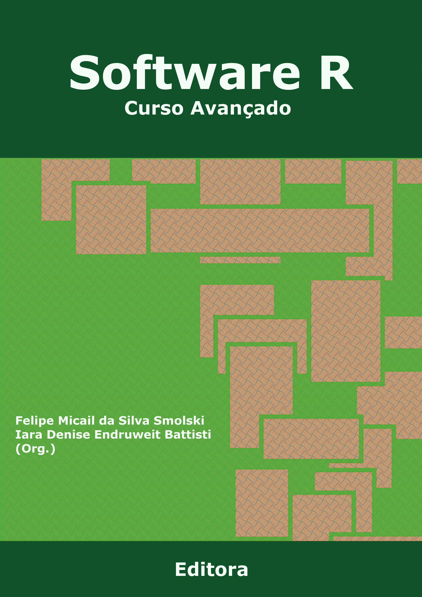

--- 
title: "Software R: curso avançado"
author: 
- Felipe Micail da Silva Smolski
- Iara Denise Endruweit Battisti
date: "2018-09-19"
site: bookdown::bookdown_site
documentclass: book
bibliography: [book.bib, packages.bib]
biblio-style: authoryear
link-citations: yes
github-repo: rstub/bookdown-chapterbib
url: 'http\://rstub.github.io/bookdown-chapterbib/'
description: "Curso avançado de análise estatística com R da UFFS Cerro Largo - RS"
fontsize: 12pt
lang: pt-Br
always_allow_html: yes
classoption: oneside
---

# Prefácio {-}

Esta é a estrutura provisória de capítulos do **Curso Avançado em Estatística com R da UFFS**:

- Delineamentos Experimentais
- Análise Fatorial
- Regressão Múltipla
- Regressão Logística

<!--
Algumas sugestões a incluir:

- Produção de Mapas
- Análise de Clusters
- Manipulação de bases de dados
- Análise de redes
- O que mais?

-->

