--- 
title: 'Software R: curso avançado'
author:
- Iara Denise Endruweit Battisti
- Felipe Micail da Silva Smolski
date: "2019-08-27"
bibliography: library.bib
classoption: oneside
biblio-style: authoryear
description: Curso avançado de análise estatística com R da UFFS Cerro Largo - RS
documentclass: book
fontsize: 12pt
github-repo: rstub/bookdown-chapterbib
lang: pt-Br
link-citations: yes
site: bookdown::bookdown_site
always_allow_html: yes
url: http\://rstub.github.io/bookdown-chapterbib/
---


<!--
# Apresentação {-}
\frenchspacing 

Esta é a estrutura provisória de capítulos do **Curso Avançado em Estatística com R da UFFS**


- Delineamentos Experimentais
- Análise Fatorial
- Análise de Cluster
- Análise de Componentes Principais (em construção...)
- Regressão Múltipla
- Regressão com Dados em Painel
- Regressão Logística
- Regressão de Poisson
- Classificação (em construção...)
- Séries Temporais (em construção...)
- Produção de Mapas 


Algumas sugestões a incluir:

- Produção de Mapas
- Análise de Clusters
- Manipulação de bases de dados
- Análise de redes
- O que mais?


-->

# Introdução {-}

Esta é a estrutura dos capítulos do **Curso Avançado em Estatística com R da UFFS**:

- [Delineamentos Experimentais](#delin)

- [Regressão Logística](#reglog)

- [Ajuste de Parâmetros em Funções não Lineares]()

- [RMarkdown](https://smolski.github.io/livror/rmark.html)

- [Metodologia de Superfície Resposta]()

- [Análise Fatorial](#analisf)

<!--
# Amostragem

*Iara Denise Endruweit Battisti*

*Felipe Micail da Silva Smolski*

\begin{flushright}
\emph{}
\end{flushright}


As amostras são utilizadas diariamente, por exemplo, quando se prova uma comida para ver se o tempero está bom ou quando assiste-se uma parte de um programa da televisão para ver se interessa.

Quando e porque amostragem?

- Menor tempo
- Menor custo
- Maior precisão dos dados
- Material experimental é raro
- Teste destrói o material experimental

Sempre que se optar por uma amostra é necessário fazer um plano de amostragem (ou delineamento amostral), para isto, deve estar bem definido o(s) objetivo(s) da pesquisa, a população de interesse, os parâmetros a serem estimados. O plano de amostragem engloba:


- Definição da unidade amostral
- Fforma de seleção das unidades amostrais
- Cálculo do tamanho da amostra
- Sorteio da amostra

Exemplos:

- 1. Verificar a prevalência de obesidade em escolares no município de Cerro Largo em 2016.
- 2. Verificar a opinião dos consumidores de chocolate referente a um novo produto, com edição limitada.
- 3. Pesquisa para verificar os impactos sócio-ambientais da instalação de uma usina hidrelétrica numa região.
- 4. Verificar a contaminação dos rios de uma sub-bacia hidrográfica.


## Amostragem Probabilística

A amostragem probabilística permite a estimação do erro amostral (diferença entre o valor da estimativa e do parâmetro), possibilitando a utilização das técnicas de inferência estatística, as quais permitem a generalização dos resultados para a população.

Como as técnicas de inferência estatística não controlam o erro não-amostral (erro de coleta de dados), o pesquisador deve tentar minimizá-los, por exemplo: utilizar amostra não-tendenciosa, calibrar o instrumento de mensuração, questões bem formuladas, correta digitação, treinamento dos entrevistadores, etc.

### Amostra Aleatória (probabilística)

Amostra aleatória é aquela que sofreu algum mecanismo de sorteio no processo de coleta. A
amostra deve ser representativa, ou seja, deve reproduzir as mesmas propriedades da população. Os tipos
de amostras aleatórias são apresentadas a seguir.


#### Amostragem Aleatória Simples (AAS)

É a mais simples, nesta todos os elementos da população tem a mesma probabilidade de ser
sorteados. Assim, se a população for finita com N elementos, cada elemento terá a probabilidade de 1/N de
ser sorteado. A amostragem pode ser feita com ou sem reposição do elemento sorteado.

- Se a AAS for feita com reposição em uma população finita com N elementos, então o
número total de amostras possíveis é dado por $N^n$;

- Se for feita sem reposição, então o número de amostras possíveis é dadopor $C_{N,n}$.

Quando a população for infinita, não é possível identificar seus infinitos elementos com um número.
Nesse caso, pode-se fazer o sorteio com aqueles que estejam disponíveis.

Existem diferentes maneiras para fazer o sorteio de uma amostra aleatória simples. Primeiramente
deve-se atribuir um número a cada elemento da população, após faz-se o sorteio.

*Exemplo no R:* utilizando o comando `sample()` pode ser efetuada a amostragem, sendo que o comando `set.seed()` serve para repetir o exercício da forma com que ele foi concebido e com os mesmos resultados. No exemplo abaixo, busca-se o retorno de um valor entre 0 e 1 (`c(0,1)`), para uma população de 32 itens, com reposição (`replace=TRUE`, sendo que o padrão é `FALSE`) e com a probabilidade de 50\% para cada item (`prob=c(0.5,0.5)`):


```r
set.seed(123)
amostra = sample(c(0,1),32, replace=TRUE, prob=c(0.5,0.5))
amostra
```

```
 [1] 1 0 1 0 0 1 0 0 0 1 0 1 0 0 1 0 1 1 1 0 0 0 0 0 0 0 0 0 1 1 0 0
```

```r
table(amostra)
```

```
amostra
 0  1 
21 11 
```

Abaixo um exemplo de amostragem, retomando uma amostra de 10 números entre os números 1 a 32, com e sem reposição:


```r
set.seed(123)
sample(1:32, 10, replace=TRUE) # Com reposição
```

```
 [1] 10 26 14 29 31  2 17 29 18 15
```

```r
sample(1:32, 10, replace=FALSE) # Sem reposição
```

```
 [1] 31 15 21 17  3 25  7  2  8 22
```

Utilizando o índice de uma base de dados, como exemplo a base `mtcars`, buscamos uma amostra aleatória com reposição de 10 itens (observa-se que o modelo Ford Pantera L foi repetido nas amostragens):


```r
set.seed(123)
indice=sample(1:nrow(mtcars),10, replace=TRUE)
mtcars[indice,]
```

```
                    mpg cyl  disp  hp drat    wt  qsec vs am gear carb
Merc 280           19.2   6 167.6 123 3.92 3.440 18.30  1  0    4    4
Fiat X1-9          27.3   4  79.0  66 4.08 1.935 18.90  1  1    4    1
Merc 450SLC        15.2   8 275.8 180 3.07 3.780 18.00  0  0    3    3
Ford Pantera L     15.8   8 351.0 264 4.22 3.170 14.50  0  1    5    4
Maserati Bora      15.0   8 301.0 335 3.54 3.570 14.60  0  1    5    8
Mazda RX4 Wag      21.0   6 160.0 110 3.90 2.875 17.02  0  1    4    4
Chrysler Imperial  14.7   8 440.0 230 3.23 5.345 17.42  0  0    3    4
Ford Pantera L.1   15.8   8 351.0 264 4.22 3.170 14.50  0  1    5    4
Fiat 128           32.4   4  78.7  66 4.08 2.200 19.47  1  1    4    1
Cadillac Fleetwood 10.4   8 472.0 205 2.93 5.250 17.98  0  0    3    4
```

E agora o mesmo exemplo para a amostra aleatória simples sem reposição:


```r
set.seed(123)
indice=sample(1:nrow(mtcars),10, replace=FALSE)
mtcars[indice,]
```

```
                  mpg cyl  disp  hp drat    wt  qsec vs am gear carb
Merc 280         19.2   6 167.6 123 3.92 3.440 18.30  1  0    4    4
Pontiac Firebird 19.2   8 400.0 175 3.08 3.845 17.05  0  0    3    2
Merc 450SL       17.3   8 275.8 180 3.07 3.730 17.60  0  0    3    3
Fiat X1-9        27.3   4  79.0  66 4.08 1.935 18.90  1  1    4    1
Porsche 914-2    26.0   4 120.3  91 4.43 2.140 16.70  0  1    5    2
Mazda RX4 Wag    21.0   6 160.0 110 3.90 2.875 17.02  0  1    4    4
Merc 450SLC      15.2   8 275.8 180 3.07 3.780 18.00  0  0    3    3
AMC Javelin      15.2   8 304.0 150 3.15 3.435 17.30  0  0    3    2
Ford Pantera L   15.8   8 351.0 264 4.22 3.170 14.50  0  1    5    4
Merc 280C        17.8   6 167.6 123 3.92 3.440 18.90  1  0    4    4
```

#### Amostragem Aleatória Estratificada (AAE)

É utilizada quando a população se caracteriza por subdivisões com características distintas, as
quais podem interferir na característica em estudo, gerando maior variabilidade. Primeiramente, divide-se a
população em subgrupos (estratos), sendo estes mais homogêneos dentro de si.


```r
head(InsectSprays)
```

```
  count spray
1    10     A
2     7     A
3    20     A
4    14     A
5    14     A
6    12     A
```

```r
summary(as.factor(InsectSprays$spray))
```

```
 A  B  C  D  E  F 
12 12 12 12 12 12 
```


```r
library(sampling)
a=strata(InsectSprays, c("spray"), size=c(3,3,3,3,3,3), method="srswor")
summary(a)
```

```
 spray    ID_unit          Prob         Stratum   
 A:3   Min.   : 5.0   Min.   :0.25   Min.   :1.0  
 B:3   1st Qu.:19.5   1st Qu.:0.25   1st Qu.:2.0  
 C:3   Median :35.5   Median :0.25   Median :3.5  
 D:3   Mean   :37.3   Mean   :0.25   Mean   :3.5  
 E:3   3rd Qu.:55.8   3rd Qu.:0.25   3rd Qu.:5.0  
 F:3   Max.   :71.0   Max.   :0.25   Max.   :6.0  
```


```r
a
```

```
   spray ID_unit Prob Stratum
5      A       5 0.25       1
7      A       7 0.25       1
12     A      12 0.25       1
14     B      14 0.25       2
19     B      19 0.25       2
21     B      21 0.25       2
25     C      25 0.25       3
27     C      27 0.25       3
28     C      28 0.25       3
43     D      43 0.25       4
46     D      46 0.25       4
48     D      48 0.25       4
55     E      55 0.25       5
56     E      56 0.25       5
59     E      59 0.25       5
66     F      66 0.25       6
69     F      69 0.25       6
71     F      71 0.25       6
```


#### Amostragem Sistemática (AS)

Utiliza-se quando os elementos da população estão dispostos em uma lista, como por exemplo, um
fichário, uma fila de espera. Inicialmente, determina-se o passo de amostragem, ou seja, o número k de
elementos entre cada coleta. O processo inicia pelo sorteio do primeiro elemento entre os k primeiros, em
seguida, salta-se k elementos para então coletar o segundo elemento e assim sucessivamente até a coleta
do último elemento da amostra. Determina-se k da seguinte forma:

$$ 
k=\frac{N}{n}
$$

É importante o sorteio do primeiro elemento para que todos tenham a mesma probabilidade de
serem sorteados.

Neste tipo de amostra deve-se ter cuidado para que os elementos sorteados não tenham alguma
relação entre si, devido ao fato de serem coletados sistematicamente.


Amostragem Aleatória por Conglomerados (AAC)

Na amostra aleatória por conglomerados divide-se a população em grupos (conglomerados) de mesmas características, com o objetivo de facilitar o processo de coleta dos elementos da amostra. É utilizada quando a pesquisa envolve uma grande área geográfica.

*Exemplo*: suponha o estudo das despesas familiares na cidade de Cerro Largo. Opta-se por fazer uma amostragem por conglomerados, dividindo-se a área total em diversas áreas menores (quarteirões). Então, selecionam-se aleatoriamente alguns quarteirões, com a amostra final englobando todas as famílias desses quarteirões ou uma amostra delas.


## Amostragem Não-Probabilística

A amostra não probabilística é utilizada por simplicidade ou pela impossibilidade de obter uma amostra probabilística, neste caso não é possível estimar o erro amostral. Os tipos mais utilizados de amostra não-probabilística são:

- Amostragem por Julgamento: escolhem-se casos julgados como típicos da população de interesse.
- Amostragem por Quotas: procura-se obter uma amostra que seja similar à população, sob alguns aspectos.
Exemplo: controlar as características sexo e faixa etária na amostra de acordo com sua proporção na população.
- Amostragem por Conveniência: é o tipo de amostragem menos confiável. São utilizadas para pesquisas exploratórias e não são recomendadas para pesquisas conclusivas. Exemplo: durante um programa de televisão ao vivo, solicitar aos telespectadores que liguem para opinarem sobre algum assunto.


*Estudo de Caso*: o estudo de caso é caracterizado pelo estudo profundo e exaustivo de um ou poucos objetos, de maneira que permita o seu amplo e detalhado conhecimento, tarefa praticamente impossível mediante os outros delineamentos considerados.

## Tamanho da Amostra

Quando deseja-se dimensionar o tamanho da amostra, o procedimento desenvolve-se em três etapas distintas:

- 1. Avaliar o instrumento de coleta de dados e julgar a variável mais importante do questionário ou o grupo de variáveis mais significativas;
- 2. Analisar se é qualitativa ou quantitativa;
- 3. Verificar se a população é finita ou infinita.

No cálculo do tamanho da amostra é necessário considerar:

- variabilidade
-  precisão
- confiabilidade

Ainda, na definição do tamanho da amostra deve-se considerar o *tipo de amostragem*.


### Cálculo do tamanho da amostra para estimar a média, considerandno uma população infinita, com $\mu$ 

-->


# Delineamentos Experimentais{#delin}

*Tatiane Chassot*

\begin{flushright}
\emph{}
\end{flushright}


A experimentação é uma parte da estatística probabilística que estuda o planejamento, execução, coleta de dados, análise de dados e interpretação dos resultados provenientes de um experimento.

Um experimento é um procedimento planejado com base em uma hipótese, que tem por objetivo provocar fenômenos (tratamentos) de forma controlada, analisando e interpretando os
resultados obtidos.

O tratamento é o método, elemento ou material cujo efeito desejamos avaliar em um experimento. Por exemplo: formas de preparo de solo, diferentes cultivares, doses de adubação, controle de insetos e outras pragas, controle de uma doença. Num experimento, somente o tratamento variade uma unidade experimental para outra, as demais condições são mantidas constantes, salvo erros não controláveis.

E alguns experimentos, utiliza-se a testemunha (nas ciências agrárias e ambientais) ou placebo (na saúde), que são as unidades experimentais que não recebem tratamento.

A unidade experimental é a unidade que recebe o tratamento uma vez e, normalmente são chamadas de parcelas. A escolha da unidade experimental depende dos tipos de tratamentos que serão avaliados. Podem ser: uma área de campo, um vaso com solo, um animal, uma placa de Petri, uma planta. Em áreas de campo, normalmente utiliza-se a bordadura. Num experimento, recomenda-se, no mínimo, a utilização de 20 UEs. 

Em um experimento, a variável a ser avaliada chamamos de variável resposta. Por exemplo, número de grãos por planta, número de folhas por planta, altura das plantas.

## Princípios básicos da Experimentação


### Repetição

A repetição consiste na aplicação do mesmo tratamento sobre duas ou mais unidades experimentais. Permite estimar o erro experimental e avaliar de forma mais precisa o efeito de
cada tratamento.

O erro experimental é caracterizado pela variância entre as unidades experimentais que receberam o mesmo tratamento.

### Casualização

A casualização consiste na aplicação dos tratamentos aleatoriamente (sorteio) sobre as unidades experimentais. A casualização é usada para obter a independência dos erros, ou seja, evitar que determinados tratamentos sejam favorecidos.

### Controle local

Quando tiver heterogeneidade no material experimental: plantas de diferentes alturas, animais de diferentes idades, solo com declividade, deve-se separar o material em grupos homogêneos
e aplicar o tratamento uma vez dentro de cada grupo (blocos).
A homogeneidade ou não do material dá origem aos tipos de delineamentos:

- Delineamento Inteiramente Casualizado (DIC): material experimental homogêneo;

- Delineamento Blocos Casualizados (DBC): material experimental com uma fonte de heterogeneidade;

- Delineamento Quadrado Latino (DQL): material experimental com duas fontes de heterogeneidade.

## Análise de Variância

Para saber se existe diferença significativa entre as médias resultados dos efeitos de tratamentos, realiza-se a Análise de Variância (ANOVA).


|**Fonte de Variação**|**Graus de Liberdade (GL)**|**Soma de Quadrados (SQ)**|**Quadrado Médio (QM)**|**Falc**|**P**|
|:---:|:---:|:---:|:---:|:---:|:---:|
|Tratamento|I-1|SQtrat|QMat|QMatr/QMerro|P|
|Erro|GLerro|SQerro|QMerro| | |
|Total|IJ-1|SQtotal|  | | |
Table: Nome da Tabela

## Hipóteses estatísticas

- H$_0$: Não existe diferença entre as médias dos tratamentos

- H$_1$: Existe, pelo menos, uma diferença entre as médias dos tratamentos

## Delineamento Inteiramente Causalizado (DIC)

É utilizado quando as unidades experimentais são homogêneas. É o mais simples dos delineamentos e os tratamentos são designados às unidades experimentais de forma casualizada, por meio de um único sorteio. Usado principalmente em pequenos animais, casas de vegetação e em
laboratórios.


*Exemplo*: Um produtor deseja avaliar 4 variedades de pera (A, B, C e D). Para tanto, instalou um experimento no delineamento inteiramente casualizado, utilizando 5 repetições por variedade. Os resultados, peso médio do fruto, estão apresentados a seguir:

<div class="figure" style="text-align: center">
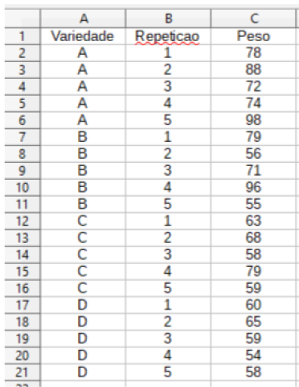
<p class="caption">(\#fig:unnamed-chunk-9)Variedades de pera separadas por grupos em faixas de peso e repetição</p>
</div>


Existe diferença significativa entre as variedades de pera, considerando o peso médio dos frutos de cada variedade?

Para responder esta pergunta, utilizamos a Análise de Variância (ANOVA).

No software RStudio:

Criar o arquivo acima em planilha eletrônica. Nomear como DIC e salvar em formato .xls.

Importar no RStudio:


```r
library(readxl)
url <- "https://github.com/Smolski/livroavancado/raw/master/dic.xls"
destfile <- "dic.xls"
curl::curl_download(url, destfile)
DIC <- read_excel(destfile)
attach(DIC)
```

O comando que gera a análise de variância é o `aov()` e o comando que exibe o quadro da ANOVA é o `anova`. Então, podemos gerar o quadro da análise de uma são vez associando os dois comandos.


```r
anova=aov(Peso~Variedade)
summary(anova)
```

```
            Df Sum Sq Mean Sq F value Pr(>F)  
Variedade    3   1414     471    3.78  0.032 *
Residuals   16   1997     125                 
---
Signif. codes:  0 '***' 0.001 '**' 0.01 '*' 0.05 '.' 0.1 ' ' 1
```


Hipóteses estatísticas:

- H$_0$: ti $=$ 0 (as médias dos tratamentos nãao diferem entre si)
- H$_1$: ti $\neq$ 0 (existe, no mínimo, uma diferença entre as médias dos tratamentos)

Como p = 0,0319 (0,01 $\leq$ p "menor ou igual a" 0,05), rejeita-se H$_0$ com nível de significância de 5\% e conclui-se que existe diferença significativa entre as médias dos tratamentos.

Para saber quais as médias que diferem, utilizamos o teste de Tukey.


```r
attach(DIC)
```

```
The following objects are masked from DIC (pos = 3):

    Peso, Repeticao, Variedade
```

```r
TukeyHSD(anova,as.factor("Variedade"),ordered=TRUE)
```

```
  Tukey multiple comparisons of means
    95% family-wise confidence level
    factor levels have been ordered

Fit: aov(formula = Peso ~ Variedade)

$Variedade
    diff     lwr   upr  p adj
C-D  6.2 -14.016 26.42 0.8164
B-D 12.2  -8.016 32.42 0.3429
A-D 22.8   2.584 43.02 0.0245
B-C  6.0 -14.216 26.22 0.8303
A-C 16.6  -3.616 36.82 0.1282
A-B 10.6  -9.616 30.82 0.4602
```


Para que o RStudio apresente uma tabela com as médias e letras indicando quais as médias que diferiram, devemos instalar o pacote `agricolae`.


```r
library(agricolae)
library(gtools)
HSD.test(anova,as.factor("Variedade"),console=TRUE)
```

```

Study: anova ~ as.factor("Variedade")

HSD Test for Peso 

Mean Square Error:  124.8 

Variedade,  means

  Peso    std r Min Max
A 82.0 10.863 5  72  98
B 71.4 17.097 5  55  96
C 65.4  8.562 5  58  79
D 59.2  3.962 5  54  65

Alpha: 0.05 ; DF Error: 16 
Critical Value of Studentized Range: 4.046 

Minimun Significant Difference: 20.22 

Treatments with the same letter are not significantly different.

  Peso groups
A 82.0      a
B 71.4     ab
C 65.4     ab
D 59.2      b
```


*Médias dos tratamentos não seguidas por mesma letra diferem pelo teste de Tukey, ao nível de 5\% de significância.

Conclusão: A variedade de pera A apresentou o maior peso médio dos frutos, que não diferiu significativamente do peso médio das variedades B e C. A variedade de pera D apresentou o menor peso médio dos frutos, que não diferiu significativamente do peso médio das variedades B e C. As variedades B e C apresentaram peso médio dos frutos intermediário.


```r
attach(DIC)
```

```
The following objects are masked from DIC (pos = 5):

    Peso, Repeticao, Variedade
```

```
The following objects are masked from DIC (pos = 6):

    Peso, Repeticao, Variedade
```

```r
boxplot(Peso~Variedade)
```


```r
boxplot(Peso~Variedade,xlab="Variedade",ylab="Peso")
```

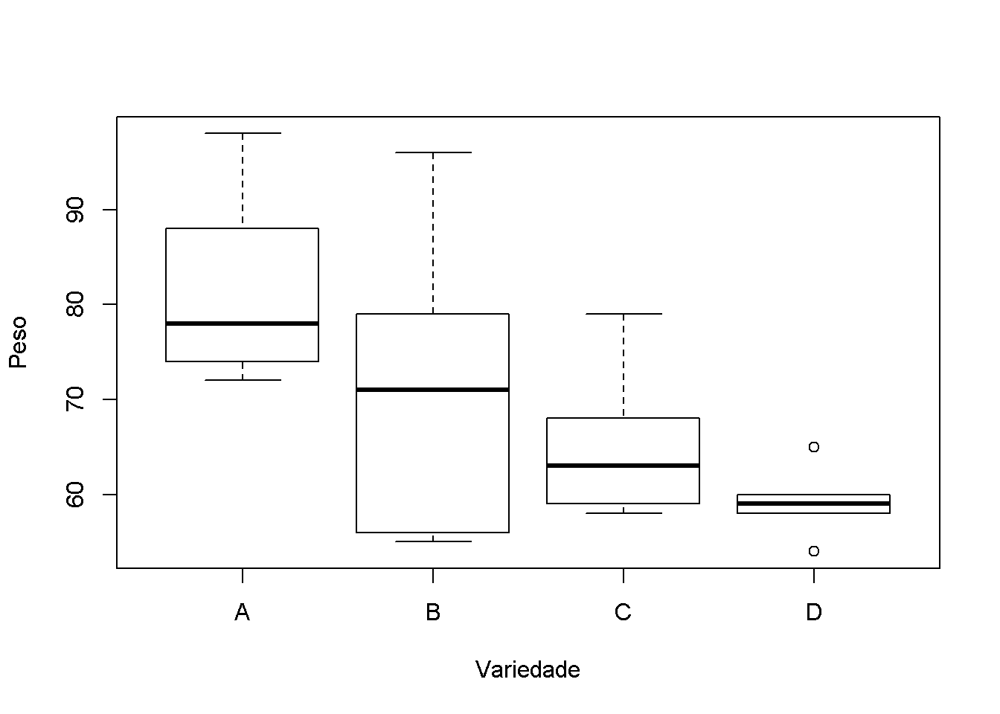


```r
tapply(Peso,Variedade,mean)
```

```
   A    B    C    D 
82.0 71.4 65.4 59.2 
```

```r
tapply(Peso,Variedade,sd)
```

```
     A      B      C      D 
10.863 17.097  8.562  3.962 
```


```r
residuos=residuals(anova)
ajustados=fitted(anova)
plot(ajustados,residuos)
abline(h=0)
```

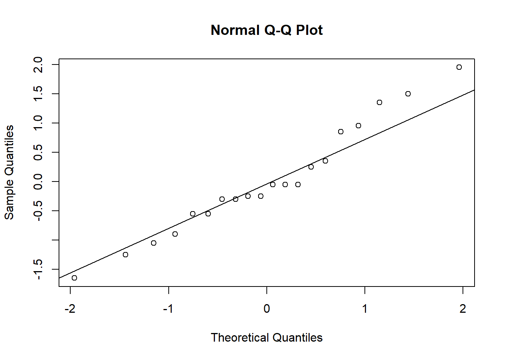


```r
qqnorm(residuos)
qqline(residuos)
```


## Delineamento Blocos Casualizados (DBC)

É utilizado quando as unidades experimentais são heterogêneas. Os tratamentos são designados às unidades experimentais de forma casualizada, por meio de sorteio por blocos. Na área agrícola, é usado principalmente em áreas de campo e grandes animais.


*Exemplo*: Uma Nutricionista elaborou 4 dietas e quer aplicá-las em 20 pessoas a fim detestar suas eficiências quanto à perda de peso. Porém ela notou que entre essas 20 pessoas existem 5 grupos de faixas iniciais de peso. Então, para aumentar a eficácia do teste ela separou os 20 indivíduos em 5 grupos de faixas de peso.

<div class="figure" style="text-align: center">

<p class="caption">(\#fig:unnamed-chunk-18)Indivíduos separados por grupos em faixas de peso</p>
</div>


Criar o arquivo acima em planilha eletrônica. Nomear como DBC e salvar em formato .xls.

Importar no RStudio:


```r
require(readxl)
url <- "https://github.com/Smolski/livroavancado/raw/master/dbc.xls"
destfile <- "dbc.xls"
curl::curl_download(url, destfile)
DBC  <- read_excel(destfile)

attach(DBC)
anova=aov(Perda~Tratamentos+Blocos)
summary(anova)
```

```
            Df Sum Sq Mean Sq F value Pr(>F)   
Tratamentos  3   25.2     8.4    6.00 0.0097 **
Blocos       4    3.2     0.8    0.57 0.6885   
Residuals   12   16.8     1.4                  
---
Signif. codes:  0 '***' 0.001 '**' 0.01 '*' 0.05 '.' 0.1 ' ' 1
```


Hipóteses estatísticas:

- H$_0$: ti $=$ 0 (as médias dos tratamentos não diferem entre si)
- H$_1$: ti $\neq$ 0 (existe, no mínimo, uma diferença entre as médias dos tratamentos)

Como p = 0,00973 (p $\leq$ 0,01), rejeita-se H$_0$ com nível de significância de 1\% e conclui-se que existe diferença significativa entre as médias dos tratamentos.


- H$_0$: $\sigma$^2^ blocos $=$ 0
- H$_1$: $\sigma$^2^ blocos $\leq$ 0


Como p $=$ 0,68854 (p $\leq$ 0,05), não rejeita-se H$_0$ e conclui-se que a variância entre os blocos não é significativa.


```r
attach(DBC)
HSD.test(anova,as.factor("Tratamentos"),console=TRUE)
```

```

Study: anova ~ as.factor("Tratamentos")

HSD Test for Perda 

Mean Square Error:  1.4 

Tratamentos,  means

        Perda    std r Min Max
Dieta 1   2.6 0.8944 5   2   4
Dieta 2   5.6 0.8944 5   5   7
Dieta 3   3.2 1.6432 5   1   5
Dieta 4   3.8 0.8367 5   3   5

Alpha: 0.05 ; DF Error: 12 
Critical Value of Studentized Range: 4.199 

Minimun Significant Difference: 2.222 

Treatments with the same letter are not significantly different.

        Perda groups
Dieta 2   5.6      a
Dieta 4   3.8     ab
Dieta 3   3.2      b
Dieta 1   2.6      b
```


Médias dos tratamentos não seguidas por mesma letra diferem pelo teste de Tukey, ao nível de 5\% de significância.


Conclusão: A dieta que resultou na maior perda de peso foi a dieta 2, que não diferiu da dieta 4. A dieta que resultou na menor perda de peso foi a dieta 1, que não diferiu das dietas 3 e 4.

Medidas descritivas com a variável resposta:


```r
boxplot(Perda~Tratamentos)
```

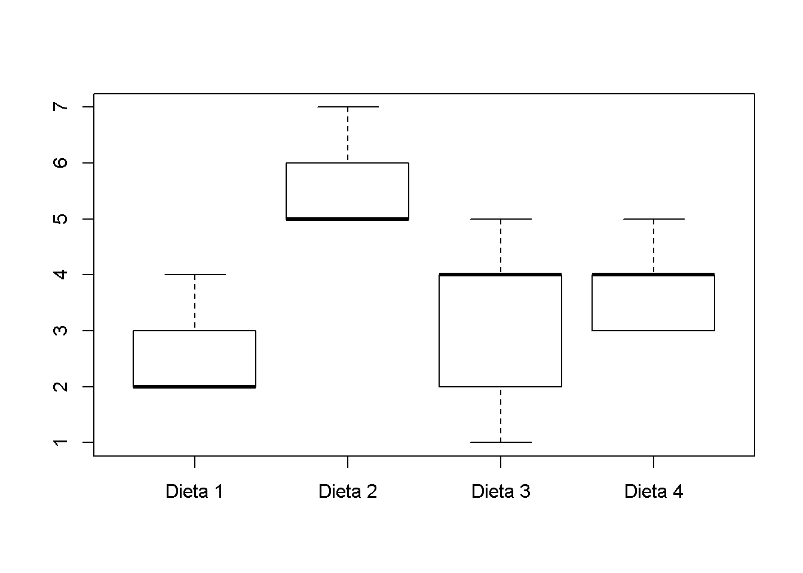


```r
boxplot(Perda~Tratamentos,xlab="Tratamentos",ylab="Perda")
```


```r
tapply(Perda,Tratamentos,mean)
```

```
Dieta 1 Dieta 2 Dieta 3 Dieta 4 
    2.6     5.6     3.2     3.8 
```

```r
tapply(Perda,Tratamentos,sd)
```

```
Dieta 1 Dieta 2 Dieta 3 Dieta 4 
 0.8944  0.8944  1.6432  0.8367 
```


```r
residuo=residuals(anova)
ajustado=fitted(anova)
plot(ajustado,residuo)
abline(h=0)
```


```r
qqnorm(residuo)
qqline(residuo)
```

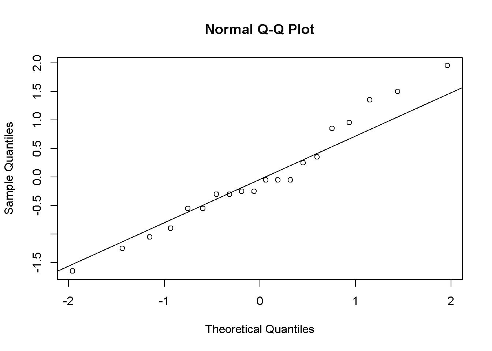

## Exercícios

**1.**	Com o objetivo de avaliar 5 rações (A, B, C, D e E) no ganho de peso animal, um pesquisador instalou um experimento, no delineamento inteiramente casualizado, pois os animais apresentavam características uniformes, utilizando 4 animais (repetições) por tratamento. Os resultados obtidos estão apresentados abaixo.

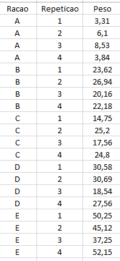

**1.1** Foi observada diferença significativa entre as rações avaliadas?

**1.2** Por meio do teste de Tukey, qual foi a ração que resultou no maior ganho de peso? De qual não diferiu? Qual foi a ração que resultou no menor ganho de peso? De qual não diferiu? 

**1.3** Faça a análise descritiva dos resultados obtidos.

**1.4** Faça o gráfico de resíduos da anova.

**2.**	Um experimento foi conduzido no delineamento em blocos casualizados, com cinco blocos, para estudar diferentes métodos de controle de plantas daninhas sobre a produção de grãos de milho, cujo plantio foi realizado em lavoura com diferentes declividades do solo. Os tratamentos e valores de produção de grãos (t/ha) estão apresentados abaixo.

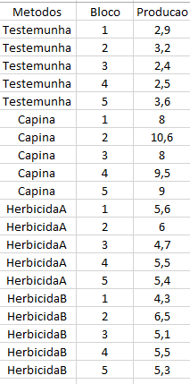

**2.1** Foi observada diferença significativa entre os métodos de controle avaliados?


**2.2** Por meio do teste de Tukey, qual foi o método de controle que resultou na maior produção? De qual não diferiu? Qual foi o método de controle que resultou na menor produção? De qual não diferiu? 

**2.3** Faça a análise descritiva dos resultados obtidos.

**2.4** Faça o gráfico de resíduos da anova.

**3.**	Objetivando avaliar o rendimento de 4 variedades de macieira (A, B, C e D), instalou-se um experimento sob o delineamento experimental inteiramente casualizado, sendo as parcelas de 8x7m e a lavoura de macieira com 12 anos de idade na época de instalação do experimento. Os dados experimentais a seguir se referem ao peso médio em gramas, de 250 frutos por parcela.

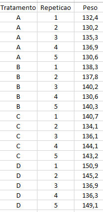

**3.1** Foi observada diferença significativa entre as variedades de macieira?


**3.2** Por meio do teste de Tukey, qual foi a variedade de macieira que apresentou a maior produção? De qual não diferiu? Qual foi a variedade de macieira que apresentou a menor produção? De qual não diferiu? 

**3.3** Faça a análise descritiva dos resultados obtidos.

**3.4** Faça o gráfico de resíduos da anova.

**4.** Sejam os resultados do rendimento de grãos (sacos/ha) de um experimento conduzido no delineamento blocos ao acaso com a cultura da soja. Os tratamentos foram 5 (formas) formas de preparo do solo organizados em 5 (cinco) blocos, em função da declividade do terreno.

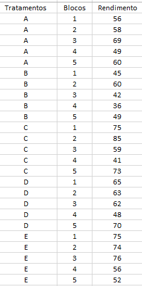

**4.1** Foi observada diferença significativa entre as formas de preparo de solo?


**4.2** Por meio do teste de Tukey, qual forma de preparo de solo apresentou o maior rendimento? De qual não diferiu? Qual forma de preparo de solo apresentou o menor rendimento? De qual não diferiu? 

**4.3** Faça a análise descritiva dos resultados obtidos.

**4.4** Faça o gráfico de resíduos da anova.


# Análise Fatorial{#analisf}

*Denize Ivete Reis*

\begin{flushright}
\emph{}
\end{flushright}


A análise fatorial é um método estatístico utilizado para descrever a variabilidade entre variáveis observadas e possivelmente correlacionadas em termos de um número potencialmente menor de variáveis não observadas chamadas fatores.


<div class="figure" style="text-align: center">

<p class="caption">(\#fig:unnamed-chunk-30)Processo de análise de variáveis</p>
</div>

Assim, é possível que as variações de três ou quatro variáveis observadas possam ser explicadas por somente um fator, o que evidencia a utilidade da análise fatorial para descrever um conjunto de dados utilizando para isso apenas alguns fatores.

Diferentemente da análise de variância, regressão e análise discriminante, onde uma das variáveis é identificada como a variável dependente, examina-se todo o conjunto de relações interdependentes entre variáveis.

A análise fatorial aborda o problema de analisar a estrutura das inter-relações (correlações) entre um grande número de variáveis (escores de testes, itens de testes, respostas de questionários), definindo um conjunto de dimensões latentes comuns, chamados fatores. Então, a análise fatorial, permite primeiro identificar as dimensões separadas da estrutura e então determinar o grau em que cada variável é explicada por cada dimensão. Uma vez que essas dimensões e a explicação da cada variável estejam determinadas, os dois principais usos da análise fatorial podem ser conseguidos:

- **Resumo**: ao resumir os dados, a análise fatorial obtém dimensões latentes que, quando interpretadas e compreendidas, descrevem os dados em um número muito menor de conceitos do que as variáveis individuais originais.

- **Redução de dados**: pode ser obtida calculando escores para cada dimensão latente e substituindo as variáveis originais pelos mesmos.

As técnicas analíticas fatoriais podem ser classificadas quanto aos seus objetivos como **exploratória** ou **confirmatória**. Exploratória, útil na busca da estrutura em um conjunto de variáveis ou como um método de redução de dados. Sob esta perspectiva, as técnicas analíticas fatoriais "consideram o que os dados oferecem"e não estabelecem restriçoes *a priori* sobre o número de componentes a serem extraídos. O uso da análise fatorial em situações, que se deseja testar hipóteses envolvendo questões sobre, quais variáveis deveriam ser agrupadasem fator ou número exato de fatores, por exemplo, a análise fatorial desempenha um papel confirmatório, ou seja, avalia o grau em que os dados satisfazem a estrutura esperada.

Exemplo: em maketing, fatores associados às características do produto, clientes e até mesmo da organização.

Em estudos visando analisar o inter-relacionamento e o agrupamento de indivíduos, cidade ou regiões em grupos homogêneos em relação à mobilidade, preferências pessoais, condições de desenvolvimento, entre outras variáveis.


## Pressupostos


A análise fatorial clássica exige que alguns pressupostos sejam satisfeitos, quais sejam (MALHOTRA, 2001):

a. Normalidade dos dados: apesar deste pressuposto não ser crítico quando a estimação é realizada por mínimos quadrados ordinários, a  exigência de normalidade auxilia na análise, evitando possíveis assimetrias e a presença de *outliers*.

b. Variáveis quantitativas medidas em escala Intervalar ou de Razão. Esse pressuposto é crítico, pois a análise deve ser realizada com variáveis quantitatias e, frequentemente, alguns estudos são realizados utilizando variáveis ordinais (as quaiss são qualitativas) na análise fatorial clássica (o que é errado de muitas maneiras).

c. Como diretriz inicial deve haver ao menos quatro a cinco vezes mais observações do que variáveis.


## Estatísticas Associadas a Análise Fatorial


Em geral, as estatísticas utilizadas no processo de análise fatorial são (AAKER-KUMARDAY, 2001):


- Teste de esfericidade de Bartlett: estatística de teste usada para examinar a hipótese de que as variáveis não sejam correlacionadas na população, ou seja, a matriz de correlação da população é uma matriz identidade onde cada variável se correlaciona perfeitamente com ela própria (r=1), mas não apresenta correlação com as outras variáveis (r=0).

- Matriz de correlação: o triângulo inferior da matriz exibe as correlações simples, r, entre todos os pares possíveis de variáveis incluídas na análise, enquanto os elementos da diagonal, que são todos iguais a 1, em geral são omitidos.

- Comunalidade: porção da variância que uma variável compartilha com todas as outras variáveis consideradas, sendo também a proporção de variância explicada pelos fatores comuns.

- Autovalor: representa a variância total explicada por cada fator.

- Cargas fatoriais: correlação simples entre as variáveis e os fatores.

- Gráfico das cargas dos fatores: gráfico das variáveis originais utilizando as cargas fatoriais como ordenadas.

- Matriz de fatores ou matriz principal: contém as cargas fatoriais de todos as variáveis em todos os fatores extraídos.

- Escores fatoriais: escores compostos estimados para cada entrevistado nos fatores derivados.

-  Medida de adequacidade da amostra de Kaiser-Meyer-Olkin (KMO): é o índice usado para avaliar a adequacidade da análise fatorial. Valores altos (entre 0,5 e 1,0) indicam que a análise fatorial é apropriada. Valores abaixo de 0,5 indicam que a análise fatorial pode ser inadequada.

-  Percentagem de variância: percentagem da variância total atribuída a cada fator.

-  Resíduos: diferenças entre as correlações observadas, dadas na matriz de correlação de entrada (input) e as correlações reproduzidas, conforme estimadas pela matriz de fatores.

- Scree plot: gráfico dos autovalores versus número de fatores por ordem de extração.


Exemplo 1:

(MALHOTRA, 2001) Suponhamos que um pesquisador queira avaliar os benefícios que os consumidores esperam de um dentifrício. Foi entrevistada uma amostra de 30 pessoas em um supermercado, para que indicassem seu grau de concordância com as seguintes afirmações, utilizando uma escala de 7 pontos (1= discordância total, 7 =concordância total).

- V1: É importante comprar um creme dental que evite cáries.
- V2: Gosto de um creme dental que clareie os dentes.
- V3: Um creme dental deve fortificar as gengivas.
- V4: Prefiro um creme dental que refresque o hálito.
- V5: Manter os dentes sadios não é uma vantagem importante de um creme dental.
- V6: O aspecto mais importante na compra de um creme dental é tornar os dentes atraentes.


Inicialmente podemos explorar algumas estatísticas descritivas relacionadas às variáveis pesquisadas, utilizando a função `summary`:


```r
require(readxl)

url <- "https://github.com/Smolski/livroavancado/raw/master/creme_dental_exemplo1.xlsx"
destfile <- "creme_dental_exemplo1.xlsx"
curl::curl_download(url, destfile)
creme_dental_exemplo1 <- read_excel(destfile)

attach(creme_dental_exemplo1)
summary(creme_dental_exemplo1)
```

```
       v1             v2            v3            v4            v5     
 Min.   :1.00   Min.   :2.0   Min.   :1.0   Min.   :2.0   Min.   :1.0  
 1st Qu.:2.00   1st Qu.:3.0   1st Qu.:2.0   1st Qu.:3.0   1st Qu.:2.0  
 Median :4.00   Median :4.0   Median :4.0   Median :4.0   Median :3.5  
 Mean   :3.93   Mean   :3.9   Mean   :4.1   Mean   :4.1   Mean   :3.5  
 3rd Qu.:6.00   3rd Qu.:5.0   3rd Qu.:6.0   3rd Qu.:5.0   3rd Qu.:5.0  
 Max.   :7.00   Max.   :7.0   Max.   :7.0   Max.   :7.0   Max.   :7.0  
       v6      
 Min.   :2.00  
 1st Qu.:3.00  
 Median :4.00  
 Mean   :4.17  
 3rd Qu.:4.75  
 Max.   :7.00  
```


## Passos da Análise Fatorial

Basicamente, os seguintes passos conduzem a análise fatorial: entrada de dados, cálculo das correlações entre as variáveis, extração inicial dos fatores e a rotação da matriz.

### Construção da Matriz de Correlação

Entrada de Dados (BASE): os dados de entrada da análise fatorial geralmente tomam a forma de um conjunto de valores de variáveis para cada objeto ou indivíduo na amostra. Toda matriz, cujos componentes ofereçam uma medida de similaridade entre variáveis, pode ser passível de análise fatorial. A medida de similaridade não precisa ser uma correlação, embora, geralmente, ou seja:

Para que a análise fatorial seja adequada, as variáveis devem ser correlacionadas. Espera-se também que as variáveis altamente correlacionadas umas com as outras se correlacionem também com o(s) mesmo(s) fatore(s).

Note que existem correlações amostrais positivas e negativas relativamente elevadas entre V1 (prevenção de cáries), V3 (gengivas fortes) e V5 (dentes sadios). Espera-se que essas variáveis se relacionem com o mesmo conjunto de fatores. Verificam-se também correlações relativamente elevadas entre V2 (clareie os dentes), V4 (hálito puro) e V6 (dentes atraentes). Essas variáveis também devem correlacionar-se com os mesmos fatores.


```r
matcor <- cor(creme_dental_exemplo1)
print(matcor, digits = 2)
```

```
        v1     v2     v3      v4      v5      v6
v1  1.0000 -0.053  0.873 -0.0862 -0.8576  0.0042
v2 -0.0532  1.000 -0.155  0.5722  0.0197  0.6405
v3  0.8731 -0.155  1.000 -0.2478 -0.7778 -0.0181
v4 -0.0862  0.572 -0.248  1.0000 -0.0066  0.6405
v5 -0.8576  0.020 -0.778 -0.0066  1.0000 -0.1364
v6  0.0042  0.640 -0.018  0.6405 -0.1364  1.0000
```


```r
require(corrplot)
```

```
Carregando pacotes exigidos: corrplot
```

```
corrplot 0.84 loaded
```

```r
corrplot(matcor, method="circle")
```


Na figura acima, as correlações estão em cor azul porque são positivas, com tons mais fortes para as correlações mais altas. 
<!--
Para estas, o ângulo (sentido horário) no gráfico de setores do painel
superior `(upper.panel = panel.pie)` é maior.
-->

Para testar a conveniência do modelo fatorial pode-se aplicar o teste de esfericidade de Bartlett para testar a hipótese nula, de que as variáveis não sejam correlacionadas na população.
Um valor elevado da estatística de teste favorece a rejeição da hipótese nula.

Também, a medida de adequacidade da amostra de Kaiser-Meyer-Olkin (KMO) compara as magnitudes dos coeficientes de correlação observados com as magnitudes dos coeficientes de
correlação parcial. Pequenos valores de KMO indicam que as correlações entre os pares de variáveis não podem ser explicadas por outras variáveis, indicando que a análise fatorial não é adequada.

Hipóteses:

Ho: A matriz de correlação da população é uma matriz identidade, ou seja as variáveis não são correlacionadas na população.


H$_1$: A matriz de correlação da população não é uma matriz identidade, ou seja as variáveis são correlacionadas na população.


```r
#install.packages("psych")
require(psych)
```

```
Carregando pacotes exigidos: psych
```

```

Attaching package: 'psych'
```

```
The following object is masked from 'package:gtools':

    logit
```

```r
cortest.bartlett(creme_dental_exemplo1)
```

```
R was not square, finding R from data
```

```
$chisq
[1] 111.3

$p.value
[1] 9.017e-17

$df
[1] 15
```

Veja que a hipótese nula de que a matriz de correlação da população seja uma matriz identidade é rejeitada pelo teste de esfericidade de Bartlett. A estatística qui-quadrado aproximada
é 111,314, com 15 graus de liberdade, significativa ao nível de 0,05.


```r
KMO(creme_dental_exemplo1)
```

```
Kaiser-Meyer-Olkin factor adequacy
Call: KMO(r = creme_dental_exemplo1)
Overall MSA =  0.66
MSA for each item = 
  v1   v2   v3   v4   v5   v6 
0.62 0.70 0.68 0.64 0.77 0.56 
```

A estatística KMO maior que 0,5 também concorda quanto ao fato de que a análise fatorial pode ser considerada uma técnica apropriada para analisar a matriz de correlação.


### Método de Análise Fatorial

As duas abordagens básicas são a análise de componentes principais (ACP) e a análise fatorial (AFC) comum ou análise fatorial exploratória (AFE), embora existam diferentes métodos
de extração de fatores da matriz de correlações, que de forma geral, são métodos numericamente complexos. Na análise de componentes principais, o objetivo da extração de fatores é encontrar um conjunto de fatores que formem uma combinação linear das variáveis originais ou da matriz de correlações. Assim, se as variáveis X1 , X2 , X3 , ... , Xn são altamente correlacionadas entre si, elas serão combinadas para formar um fator, e assim, sucessivamente, com todas as demais variáveis
da matriz de correlação.


A análise fatorial exploratória pode trazer informações importantes sobre a estrutura multivariada de um instrumento de mensuração, identificando os construtos teóricos.

O segundo objetivo da analise fatorial exploratória está relacionado à redução de dados e descoberta de ponderações ótimas para as variáveis mensuradas, de forma que um grande conjunto de variáveis possa ser reduzido a um conjunto menor de índices sumários que tenham máxima variabilidade e fidedignidade. A redução de dados é especialmente possível pela aplicação da Análise dos Componentes Principais (ACP) e não pelo uso da analise fatorial comum (AFC), havendo uma diferença fundamental entre os dois métodos: a ACP trabalha com a variância total observada, enquanto a AFC trabalha somente com a variância partilhada dos itens (variância erro e variância única são excluídas) (LAROS, 2012).


Na AFC, os fatores são estimados para explicar as covariâncias entre as variáveis observadas, portanto os fatores são considerados como as causas das variáveis observadas. Já na ACP, os componentes são estimados para representar a variância das variáveis observadas de uma maneira tão econômica quanto possível. Os componentes principais são somas otimamente ponderadas das variáveis observadas, neste sentido, as variáveis observadas são consideradas as causas dos componentes principais (LAROS, 2012).

Assim, recomenda-se a ACP, quando o objetivo é determinar o número mínimo de fatores que respondem pela máxima variância nos dados, sendo os fatores chamados componentes principais (MALHOTRA, 2001).


Obs.:

cor = TRUE: as componentes principais serão geradas a partir da matriz de correlação.

cor = FALSE: as componentes principais serão geradas a partir da matriz de covariância.


```r
fit<-princomp(creme_dental_exemplo1,cor=TRUE)
fit
```

```
Call:
princomp(x = creme_dental_exemplo1, cor = TRUE)

Standard deviations:
Comp.1 Comp.2 Comp.3 Comp.4 Comp.5 Comp.6 
1.6526 1.4893 0.6645 0.5842 0.4274 0.2919 

 6  variables and  30 observations.
```

```r
summary(fit)
```

```
Importance of components:
                       Comp.1 Comp.2 Comp.3  Comp.4  Comp.5 Comp.6
Standard deviation     1.6526 1.4893 0.6645 0.58417 0.42735 0.2919
Proportion of Variance 0.4552 0.3697 0.0736 0.05688 0.03044 0.0142
Cumulative Proportion  0.4552 0.8249 0.8985 0.95536 0.98580 1.0000
```


A função `summary(fit)` mostra a aplicação da análise de componentes principais. O fator 1
responde por 45,52\% da variância total. Da mesma forma, o segundo fator responde por 36,97\% da
variância total, sendo que os dois primeiros fatores respondem por 82,49\% da variância total. Várias
considerações devem integrar a análise do número de fatores que devem ser usados na análise.

### Determinação do número de fatores 


A fim de reduzir as informações presentes nas variáveis originais, deve-se reduzir o número de fatores. Na literatura, diversos processos são sugeridos: determinação a priori, observação dos autovalores, representação gráfica (**scree plot**), testes de significância entre outros.

#### Determinação a priori

Quando o pesquisador, com base na experiência que apresentação em relação ao assunto,
decide quantos fatores deseja utilizar.

#### Autovalores


Como o autovalor representa a quantidade de variância associada ao fator, incluem-se
apenas os fatores com variância maior que 1.


#### Gráfico de declive (**scree plot**)


Trata-se de uma representação gráfica dos autovalores associada ao número de fatores na
ordem de extração. O ponto em que a inclinação suaviza indica o número de fatores a ser usados,
que em geral é superior ao revelado pelos autovalores.


#### Percentagem da variância

Determina que o núumero de fatores extraídos seja de no mínimo 60\% da variância.

#### Teste de significância

É possível reter apenas os fatores estatisticamente significativos com base na significância estatística dos autovalores separados.


Abaixo vamos apresentar o `scree-plot`, em formato do gráfico de barras para o nosso exemplo


```r
screeplot(fit)
```


Note que as duas primeiras componentes, aparecem em destaque, ocorrendo uma ligeira suavização das alturas nas demais colunas.


```r
plot(fit,type="lines")
```

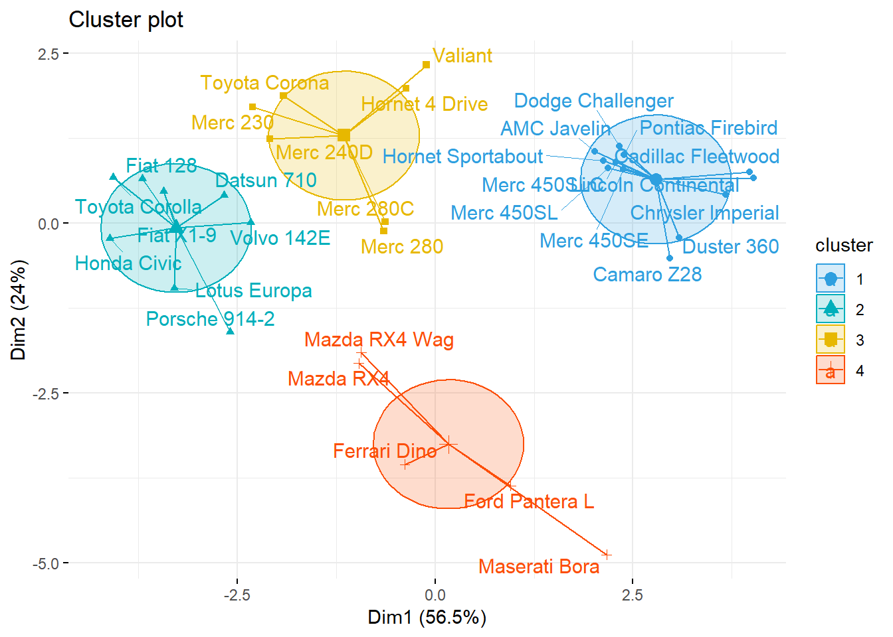


### Análise de Componentes Principais

Rodando a Análise de Componentes Principais no R, temos:


```r
PCAdente<-principal(creme_dental_exemplo1, nfactors=2,
                n.obs=30,rotate="none", scores=TRUE)
PCAdente
```

```
Principal Components Analysis
Call: principal(r = creme_dental_exemplo1, nfactors = 2, rotate = "none", 
    n.obs = 30, scores = TRUE)
Standardized loadings (pattern matrix) based upon correlation matrix
     PC1   PC2   h2    u2 com
v1  0.93  0.25 0.93 0.074 1.1
v2 -0.30  0.80 0.72 0.277 1.3
v3  0.94  0.13 0.89 0.106 1.0
v4 -0.34  0.79 0.74 0.261 1.4
v5 -0.87 -0.35 0.88 0.122 1.3
v6 -0.18  0.87 0.79 0.210 1.1

                       PC1  PC2
SS loadings           2.73 2.22
Proportion Var        0.46 0.37
Cumulative Var        0.46 0.82
Proportion Explained  0.55 0.45
Cumulative Proportion 0.55 1.00

Mean item complexity =  1.2
Test of the hypothesis that 2 components are sufficient.

The root mean square of the residuals (RMSR) is  0.07 
 with the empirical chi square  3.94  with prob <  0.41 

Fit based upon off diagonal values = 0.98
```


A matriz de fatores acima, resultante da análise de componentes principais, é composta pelos coeficientes (cargas fatoriais) que expressam as variáveis padronizadas em termos dos fatores.
Valores altos das cargas fatoriais, representam boa relação entre a variável e o fator. Essa matriz não rotada, apresenta dificuldades para ser interpretada pelo fato de que, em geral os fatores são correlacionados com muitas variáveis.

Com o processo da rotação, a matriz de fatores resulta numa matriz mais simples, sendo que a rotação não afeta as comunalidades e a porcentagem da variância explicada. No entanto, a percentagem da variância explicada por cada fator varia, sendo redistribuída por rotação (MALHOTRA, 2001).

Obs. comunalidades (*communalities*) são quantidades das variâncias (correlações) de cada variável explicada pelos fatores.


### Matriz Rotada do Fator

Com o objetivo de possibilitar uma melhor interpretação dos fatores, é prática comum fazer uma rotação ou uma transformação dos fatores.

O conjunto de cargas fatoriais, obtidas por qualquer método de solução fatorial, quando o número de fatores comuns é maior do que um, não é único, pois outros conjuntos equivalentes podem ser encontrados, por transformações ortogonais de cargas.

Na rotação ortogonal, os eixos são mantidos em ângulo reto, sendo o método mais utilizado o processo varimax. Esse método ortogonal de rotação minimiza o número de variáveis com altas cargas sobre um fator afim de permitir a interpretaçã dos fatores. A rotação ortogonal resulta em fatores nãocorrelacionados ao passo que a rotação oblíqua não mantém os eixos em ângulo reto e os fatores são correlacionados (MALHOTRA, 2001).


```r
PCAdentevarimax<-principal(creme_dental_exemplo1, nfactors=2,
            n.obs=30,rotate="varimax",scores=TRUE)
PCAdentevarimax
```

```
Principal Components Analysis
Call: principal(r = creme_dental_exemplo1, nfactors = 2, rotate = "varimax", 
    n.obs = 30, scores = TRUE)
Standardized loadings (pattern matrix) based upon correlation matrix
     RC1   RC2   h2    u2 com
v1  0.96 -0.03 0.93 0.074 1.0
v2 -0.05  0.85 0.72 0.277 1.0
v3  0.93 -0.15 0.89 0.106 1.1
v4 -0.09  0.85 0.74 0.261 1.0
v5 -0.93 -0.08 0.88 0.122 1.0
v6  0.09  0.88 0.79 0.210 1.0

                       RC1  RC2
SS loadings           2.69 2.26
Proportion Var        0.45 0.38
Cumulative Var        0.45 0.82
Proportion Explained  0.54 0.46
Cumulative Proportion 0.54 1.00

Mean item complexity =  1
Test of the hypothesis that 2 components are sufficient.

The root mean square of the residuals (RMSR) is  0.07 
 with the empirical chi square  3.94  with prob <  0.41 

Fit based upon off diagonal values = 0.98
```

Veja que na matriz rotada, o Fator 1 apresenta altos coeficientes para as variáveis V1 (prevenção de cáries), V3 (gengivas fortes) e coeficiente negativo para V5 (dentes sadios não é importante). O Fator 2 apresenta forte relação com V2 (clareie os dentes), V4 (hálito puro) e V6 (dentes atraentes).

Rotulando:

Nesta fase é usual tentar dar nomes aos fatores. Em muitos casos, isto requer um certo grau de imaginação:

**Fator 1**: Fator de benefício para a saúde.

**Fator 2**: Fator de benefício social.

Com os dois fatores acima, podemos concluir sobre o que o consumidor espera de um creme dental.


### Autovalores

Para acessar os eingenvalues (autovalores):


```r
PCAdentevarimax$values
```

```
[1] 2.73119 2.21812 0.44160 0.34126 0.18263 0.08521
```


Confirmando, temos autovalores acima de 1, nos dois primeiros casos.

Para visualizar melhor a contribuição de cada variável (peso):


```r
PCAdentevarimax$loadings
```

```

Loadings:
   RC1    RC2   
v1  0.962       
v2         0.848
v3  0.933 -0.151
v4         0.855
v5 -0.934       
v6         0.885

                 RC1   RC2
SS loadings    2.687 2.263
Proportion Var 0.448 0.377
Cumulative Var 0.448 0.825
```


Recurso importante na interpretação dos fatores, o gráfico das variáveis, apresenta ao final do eixo, as variáveis que com cargas mais altas sobre aquele fator. Quanto mais próximas da origem menores as cargas destas variáveis sobre aquele fator. Variáveis distantes dos dois eixos, estão relacionadas a ambos
os fatores.


```r
biplot(PCAdentevarimax)
```

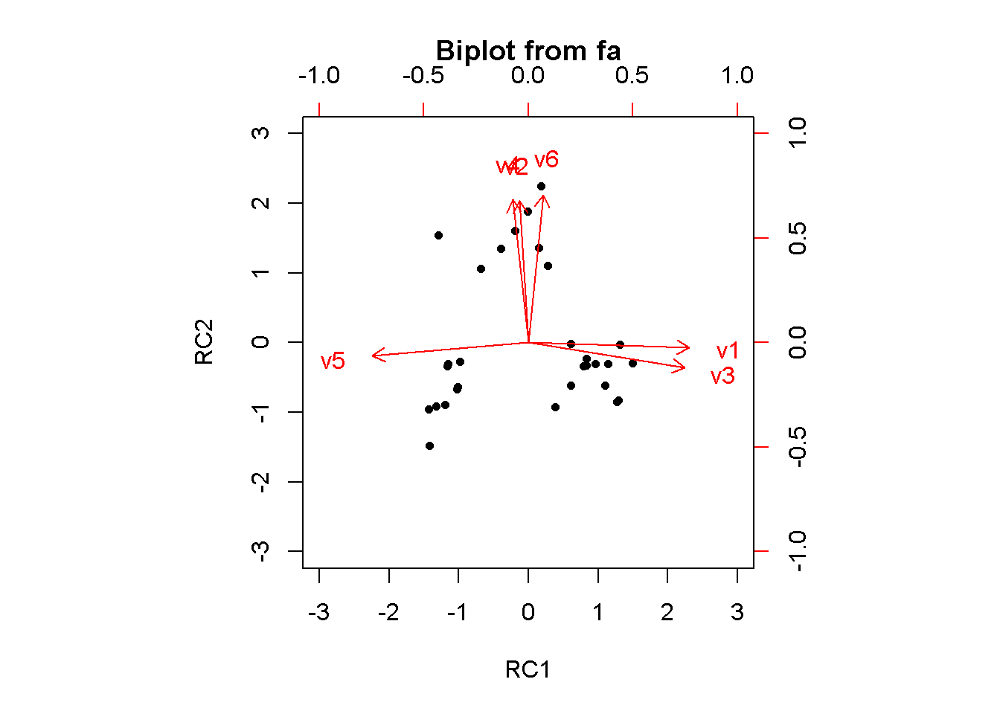


Os valores dos fatores obtidos para os 30 entrevistados encontram-se na matriz de coeficiente de escore do componente mostrada abaixo. Esta ajuda a entender como cada variável se relaciona aos escores dos componentes calculados para cada participante. Para melhor compreensão da análise dos escores dos entrevistados é importante especificar e comentar o significado de cada fator:

**Fator 1**: Fator de benefício para a saúde.

**Fator 2**: Fator de benefício social.

Analisando os escores fatoriais dos entrevistados, destacamos a seguir alguns entrevistados e seus respectivos resultados:

Entrevistado 18: 1.494934982

Este entrevistado se destacou como o primeiro colocado no ranqueamento, obtendo o maior escore ponderado, demonstrando ser bastante atento à prevenção de cáries, gengivas fortes e dentes sadios.

Entrevistado 29: 2.24121650

Este entrevistado se destacou em primeiro no segundo fator, apresentando preocupação quanto ao beneffício social da dentição: boa aparência dos dentes, hálito puro e boa aparência dos dentes.


```r
factor.scores(creme_dental_exemplo1,PCAdentevarimax, 
              Phi = NULL, 
              method = c("Thurstone", "tenBerge", "Anderson",
                         "Bartlett", "Harman","components"),
              rho=NULL)
```

```
$scores
            RC1      RC2
 [1,]  1.143442 -0.30236
 [2,] -1.164116 -0.33355
 [3,]  1.275078 -0.85487
 [4,]  0.283039  1.10542
 [5,] -1.414762 -1.47785
 [6,]  0.962546 -0.30692
 [7,]  0.386174 -0.92946
 [8,]  1.314326 -0.02535
 [9,] -1.013721 -0.63921
[10,] -1.294149  1.54533
[11,]  1.102641 -0.61320
[12,] -1.150922 -0.30735
[13,]  1.288272 -0.82867
[14,]  0.148989  1.35741
[15,] -1.326349 -0.91233
[16,]  0.789822 -0.33831
[17,]  0.608638 -0.61594
[18,]  1.494935 -0.29386
[19,] -1.026915 -0.66542
[20,] -0.394467  1.34560
[21,] -1.192011 -0.89125
[22,]  0.614235 -0.01676
[23,] -0.978198 -0.27596
[24,] -0.006907  1.88497
[25,]  0.833064 -0.23599
[26,] -0.188091  1.60734
[27,]  0.828975 -0.32987
[28,] -0.677615  1.06323
[29,]  0.182192  2.24122
[30,] -1.428148 -0.95605

$weights
          RC1       RC2
v1  0.3584504  0.009032
v2  0.0003949  0.375030
v3  0.3449550 -0.044523
v4 -0.0148037  0.376748
v5 -0.3505500 -0.057491
v6  0.0538213  0.394380

$r.scores
          RC1       RC2
RC1 1.000e+00 4.649e-16
RC2 4.441e-16 1.000e+00

$missing
 [1] 0 0 0 0 0 0 0 0 0 0 0 0 0 0 0 0 0 0 0 0 0 0 0 0 0 0 0 0 0 0

$R2
[1] NA  1
```

<!--
factor.scores(creme_dental_exemplo1,PCAdentevarimax, Phi = NULL, method = c("Thurstone", "tenB
-->

Destacando-se os entrevistados de interesse, verifica-se:

<div class="figure" style="text-align: center">

<p class="caption">(\#fig:unnamed-chunk-45)Principais resultados</p>
</div>


<!--
\printbibliography[segment=\therefsegment,heading=subbibliography]
-->


# Análise de Componentes Principais

*Felipe Micail da Silva Smolski*

\begin{flushright}
\emph{}
\end{flushright}


A técnica de Componentes Principais retoma informações de uma base de dados multivariada, transformando estes dados em variáveis de número igual ou inferior à amostra inicial e denominados "componentes principais". Estes por sua vez, correspondem à combinação dos dados originais, sendo que representam uma redução de dimensionalidade dos dados originais em dois ou três componentes, identificando as direções pelas quais a variação dos dados são máximas, apresentando graficamente os resultados conforme @Kassambara2017b. Ainda segundo este autor, são propósitos resumidos da anáise dae componentes principais:

- Identificação de padrões ocultos dos dados;
- Redução de dimensionalidade, pela diminuição da redundância nos dados;
- Identificar variáveis correlacionadas.


## Preparação dos dados

```r
library(factoextra)
```

```
Carregando pacotes exigidos: ggplot2
```

```

Attaching package: 'ggplot2'
```

```
The following objects are masked from 'package:psych':

    %+%, alpha
```

```
Welcome! Related Books: `Practical Guide To Cluster Analysis in R` at https://goo.gl/13EFCZ
```

```

Attaching package: 'factoextra'
```

```
The following object is masked from 'package:agricolae':

    hcut
```

```r
data("decathlon2", package = "factoextra")
head(decathlon2)
```

```
          X100m Long.jump Shot.put High.jump X400m X110m.hurdle Discus
SEBRLE    11.04      7.58    14.83      2.07 49.81        14.69  43.75
CLAY      10.76      7.40    14.26      1.86 49.37        14.05  50.72
BERNARD   11.02      7.23    14.25      1.92 48.93        14.99  40.87
YURKOV    11.34      7.09    15.19      2.10 50.42        15.31  46.26
ZSIVOCZKY 11.13      7.30    13.48      2.01 48.62        14.17  45.67
McMULLEN  10.83      7.31    13.76      2.13 49.91        14.38  44.41
          Pole.vault Javeline X1500m Rank Points Competition
SEBRLE          5.02    63.19  291.7    1   8217    Decastar
CLAY            4.92    60.15  301.5    2   8122    Decastar
BERNARD         5.32    62.77  280.1    4   8067    Decastar
YURKOV          4.72    63.44  276.4    5   8036    Decastar
ZSIVOCZKY       4.42    55.37  268.0    7   8004    Decastar
McMULLEN        4.42    56.37  285.1    8   7995    Decastar
```

```r
decathlon2.active=decathlon2[1:23,1:10]
```

## Criação dos componentes 


```r
library(FactoMineR)
pca=PCA(decathlon2.active, graph=TRUE)
```

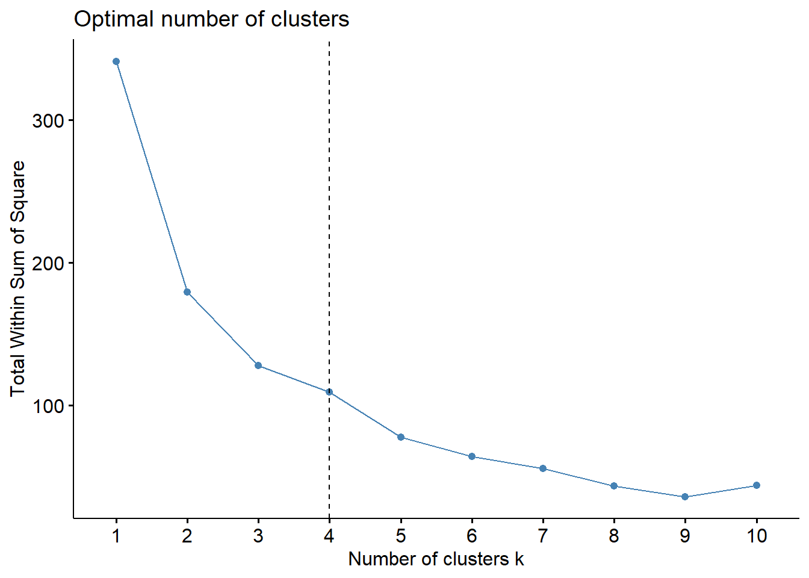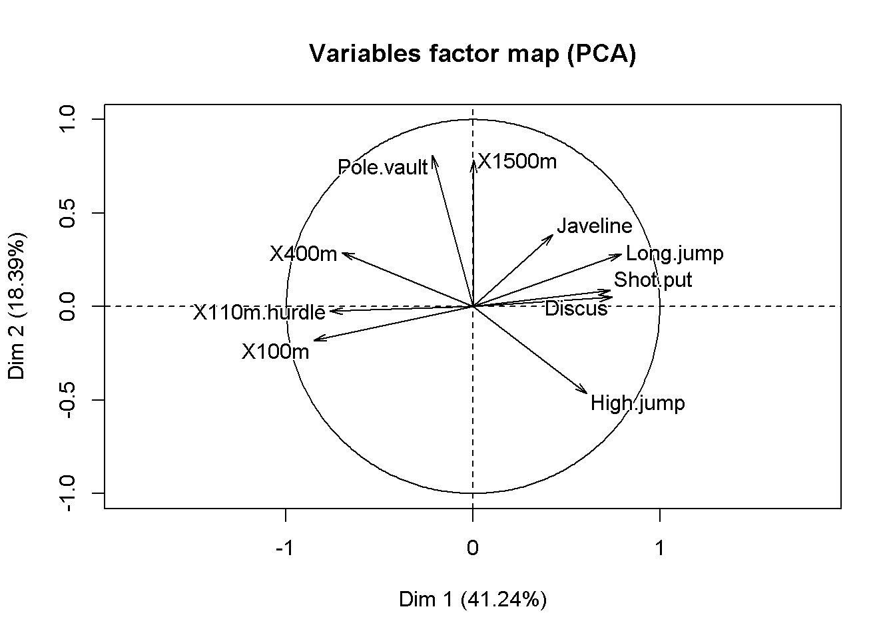

```r
pca
```

```
**Results for the Principal Component Analysis (PCA)**
The analysis was performed on 23 individuals, described by 10 variables
*The results are available in the following objects:

   name               description                          
1  "$eig"             "eigenvalues"                        
2  "$var"             "results for the variables"          
3  "$var$coord"       "coord. for the variables"           
4  "$var$cor"         "correlations variables - dimensions"
5  "$var$cos2"        "cos2 for the variables"             
6  "$var$contrib"     "contributions of the variables"     
7  "$ind"             "results for the individuals"        
8  "$ind$coord"       "coord. for the individuals"         
9  "$ind$cos2"        "cos2 for the individuals"           
10 "$ind$contrib"     "contributions of the individuals"   
11 "$call"            "summary statistics"                 
12 "$call$centre"     "mean of the variables"              
13 "$call$ecart.type" "standard error of the variables"    
14 "$call$row.w"      "weights for the individuals"        
15 "$call$col.w"      "weights for the variables"          
```

A variância retida em cada um dos compomentes é medida pelos "autovalores" (*eigenvalues*), que podem ser extraídos utilizando a função `get_eigenvalue()`:


```r
library(factoextra)
autovalores=get_eigenvalue(pca)
autovalores
```

```
       eigenvalue variance.percent cumulative.variance.percent
Dim.1      4.1242           41.242                       41.24
Dim.2      1.8385           18.385                       59.63
Dim.3      1.2391           12.391                       72.02
Dim.4      0.8194            8.194                       80.21
Dim.5      0.7016            7.016                       87.23
Dim.6      0.4229            4.229                       91.46
Dim.7      0.3026            3.026                       94.48
Dim.8      0.2745            2.745                       97.23
Dim.9      0.1552            1.552                       98.78
Dim.10     0.1220            1.220                      100.00
```


Autovaloes superiores a 1 indicam que a variância do componente é superior ao que representaria a variância dos dados originais, sendo possível utilizar inclusive como ponto de corte para decidir quantos componentes utilizar. Observa-se que no exemplo acima, foram criados 10 componentes principais, dos quais os três primeiros explicam 72,02\% da variação.


```r
fviz_eig(pca, addlabels=TRUE, ylim = c(0,50))
```


```r
variaveis=get_pca_var(pca)
head(variaveis$coord)
```

```
               Dim.1    Dim.2   Dim.3    Dim.4   Dim.5
X100m        -0.8506 -0.17940  0.3016  0.03357 -0.1944
Long.jump     0.7942  0.28086 -0.1905 -0.11539  0.2332
Shot.put      0.7339  0.08540  0.5176  0.12847 -0.2488
High.jump     0.6101 -0.46521  0.3301  0.14455  0.4027
X400m        -0.7016  0.29018  0.2835  0.43083  0.1039
X110m.hurdle -0.7641 -0.02474  0.4489 -0.01690  0.2242
```


# Análise de Clusters

*Felipe Micail da Silva Smolski*

\begin{flushright}
\emph{}
\end{flushright}


A ideia central da Análise de Cluster é a possibilidade de efetuar a classificação dos objetos em grupos, de forma que os objetos dentro do mesmo grupo sejam mais similares quanto possível e, de forma análoga, que os diversos grupos (clusters) sejam mais diferentes o possível em sua constituição [@Kassambara2017]. Embora possa parecer semelhante ao conteúdo do capítulo anterior, as diferenças residem no fato de que a Análise Fatorial agrega variáveis e efetua os agrupamentos em base de padrões de variação (correlação) dos dados enquanto a Análise de Cluster (agrupamentos) objetiva agregar objetos (e não variáveis), fazendo a agregação baseada na distância (proximidade) [@Hair2009].

A medida de distância utilizada de maneira mais comum utililizada é a Distância Euclidiana como mostra a Figura abaixo (embora existam outras métricas como a Distância de Manhattan, a Distância de Correlação de Pearson, a Distância de Correlação de  Eisen, a Distância de Correlação de  Spearman e a Distância de Correlação de  Kendal). 

<div class="figure" style="text-align: center">

<p class="caption">(\#fig:unnamed-chunk-51)Cálculo da distância entre A e B no espaço X Y</p>
</div>

Fonte: @Pereira2004a.

Em outro sentido, existem vários métodos de clusterização, dentre eles: a) Clusterização Particionada, que faz parte as técnicas K-Means, K-Medoids e CLARA; b) Clusterização Hierárquica, de que faz parte a Clusterização Aglomerativa [@Kassambara2017]. Neste capítulo serão apresentadas as técnicas denominadas K-Means e a Clusterização Aglomerativa.

## K-Means

O método de clusterização *K-means* classifica os objetos dentro de múltiplos grupos, de forma que a variação intra-cluster seja minimizada pela soma dos quadrados das distâncias Euclidianas entre os itens e seus centroides.

$$
W(C_k)=\sum _{x_i\in C_k}(x_i-\mu _k)^2
$$
Desta forma $x_i$ é o ponto que pertente ao cluster $C_k$ e $\mu _k$ representa a média do valor atribuído ao cluster $C_k$. Cada observação ($x_i$) é designada a um cluster de forma que a soma dos quadrados da distância da observação em relação ao seu cluster central ($\mu _k$) é mínima. Ainda, para definir a variação intra-cluster é utilizadaa fórmula abaixo, sendo que deve ser tão baixa quanto o possível [@Kassambara2017]:


$$
tot.intracluster=\sum_{k=1}^{k} W(C_k)=\sum_{k=1}^{k}\sum _{x_i\in C_k}(x_i-\mu _k)^2
$$
Como veremos adiante, deve-se selecionar o número de clusters desejado para que sejam criadas as classificações que precisar ou, executar o comando que definirá o número ótimos de clusters para a amostra carregada. O processo de seleção das variáveis, por padrão passa por [@Kassambara2017]: (a) determinação do número de clusters; (b) selecionar randomicamente objetos para determinar os valores centrais; (c) assinar as observações pela distância Euclidiana em relação aos seus centróides; (d) efetuar atualizações calculando a nova média dos valores dentro de seu cluster definido; (e) minimizar a soma dos quadrados intra-cluster (o R utiliza 10 repetições dos passos d-e).

Vamos carregar a tradicional base de dados nativa do RStudio `mtcars`, que traz informações sobre 32 modelos de automóveis, sendo as respectivas variáveis que os descrevem:

- **mpg**: milhas por galão;
- **cyl**:  número de cilindros;
- **disp**: número que representa o volume total no motor como um fator de circunferência do cilindro, profundidade e número total de cilindros;
- **hp**: potência;
- **drat**: relação do eixo traseiro;
- **wt**: peso (1.000 lbs);
- **qsec**: tempo de 1/4 de milha;
- **vs**: motor (0 = em forma de V; 1 = linha reta);
- **am**: transmissão (0 = automático; 1 = manual);
- **gear**: número de marchas na transmissão (3-4 automático; 4-5 manual);
- **carb**: número de carburadores;

Segue abaixo o carregamento da base de dados, sendo que neste exemplo foi utilizada a função `scale()` para balancear as informações (para mais informações utilize a ajuda do RStudio `?scale`).


```r
#Carregamento dos dados
data("mtcars")
df=scale(mtcars)
head(df, n=3)
```

```
                 mpg    cyl    disp      hp   drat      wt    qsec     vs   am
Mazda RX4     0.1509 -0.105 -0.5706 -0.5351 0.5675 -0.6104 -0.7772 -0.868 1.19
Mazda RX4 Wag 0.1509 -0.105 -0.5706 -0.5351 0.5675 -0.3498 -0.4638 -0.868 1.19
Datsun 710    0.4495 -1.225 -0.9902 -0.7830 0.4740 -0.9170  0.4260  1.116 1.19
                gear    carb
Mazda RX4     0.4236  0.7352
Mazda RX4 Wag 0.4236  0.7352
Datsun 710    0.4236 -1.1222
```

A função `kmeans()` é utilizada para o cálculo, sendo que **x** representa a base de dados a ser analisada; **centers** será substituído pelo número de clusters desejados; **iter.max** representa o número de iterações para a constituição dos objetos dentro dos clusters, sendo que o padrão é 10; **nstart** é o número inicial de partições, sendo que o recomendado é superior a 1.

`kmeans(x, centers, iter.max=10, nstart=1)`

Para determinar automaticamente o número ótimo de clusters da classificação, antes de rodar a função `kmeans()`, é possível utilizar a função `fviz_nbclust()` do pacote `factoextra`. Desta forma, utilizando a noção da soma dos quadrados intra cluster é possível verificar que o número ótimo de clusters para a amostra é 4. Isto porque novos clusters acima de 4 possuem baixo ganho para aumentar a diferenciação dos demais.


```r
# Número ótimo de clusters
library(factoextra)

fviz_nbclust(df, kmeans, method = "wss")+
  geom_vline(xintercept = 4, linetype = 2)
```


Em seguida utilizamos o número determinado de clusters (neste caso 4) com o comando `kmeans`. Como resultado temos a média dos centros por clusters e a classificação de cada modelo de veículo da amostra dentro do respectivo cluster. Observa-se que o cluste 1 tem 12 modelos de veículos, o cluster 2 tem 8 modelos, o cluster 3 possui 7 modelos e no cluster 4 foram enquadrados 5 modelos.


```r
# Clusterização k-means
set.seed(123)
km.res=kmeans(df, 4, nstart=25)
print(km.res)
```

```
K-means clustering with 4 clusters of sizes 12, 8, 7, 5

Cluster means:
      mpg     cyl     disp      hp     drat       wt    qsec     vs      am
1 -0.8363  1.0149  1.02385  0.6925 -0.88975  0.90636 -0.3952 -0.868 -0.8141
2  1.3248 -1.2249 -1.10627 -0.9453  1.09821 -1.20087  0.3365  0.868  1.1899
3  0.1082 -0.5849 -0.44867 -0.6497 -0.04968 -0.02347  1.1855  1.116 -0.8141
4 -0.2639  0.3430 -0.05908  0.7601  0.44782 -0.22101 -1.2495 -0.868  1.1899
     gear    carb
1 -0.9318  0.1677
2  0.7624 -0.8126
3 -0.1573 -0.4146
4  1.2368  1.4781

Clustering vector:
          Mazda RX4       Mazda RX4 Wag          Datsun 710      Hornet 4 Drive 
                  4                   4                   2                   3 
  Hornet Sportabout             Valiant          Duster 360           Merc 240D 
                  1                   3                   1                   3 
           Merc 230            Merc 280           Merc 280C          Merc 450SE 
                  3                   3                   3                   1 
         Merc 450SL         Merc 450SLC  Cadillac Fleetwood Lincoln Continental 
                  1                   1                   1                   1 
  Chrysler Imperial            Fiat 128         Honda Civic      Toyota Corolla 
                  1                   2                   2                   2 
      Toyota Corona    Dodge Challenger         AMC Javelin          Camaro Z28 
                  3                   1                   1                   1 
   Pontiac Firebird           Fiat X1-9       Porsche 914-2        Lotus Europa 
                  1                   2                   2                   2 
     Ford Pantera L        Ferrari Dino       Maserati Bora          Volvo 142E 
                  4                   4                   4                   2 

Within cluster sum of squares by cluster:
[1] 23.08 19.04 21.29 23.40
 (between_SS / total_SS =  74.5 %)

Available components:

[1] "cluster"      "centers"      "totss"        "withinss"     "tot.withinss"
[6] "betweenss"    "size"         "iter"         "ifault"      
```

Após determinado o número de clusters ideal e calculado para qual cluster cada variável do banco de dados pertence, é possível verificar as características de cada aglomeração. Com o cálculo da média utilizando a função `aggregate`, observa-se que os veículos com milhas por galão (mpg) médias mais baixos encontram-se no cluster 1, juntamente com aqueles com maior quantidade de cilindros (cyl) como é de se imaginar, com alta potência em cavalos (hp), concentranto-se automóveis automáticos (am=0). Já no cluster 2, por exemplo, estão aqueles veículos com maior similaridade e com uma maior autonomia (média de 28,07 mpg), baixa potência em cavalos (hp), veículos com câmbio manual (am) e baixos cilindros (cyl). Ainda os clusters 3 e 4 completam os grupos de veículos similares entre si.


```r
aggregate(mtcars, by=list(cluster=km.res$cluster), mean)
```

```
  cluster   mpg   cyl   disp     hp  drat    wt  qsec    vs am  gear  carb
1       1 15.05 8.000 357.62 194.17 3.121 4.104 17.14 0.000  0 3.000 3.083
2       2 28.07 4.000  93.61  81.88 4.184 2.042 18.45 0.875  1 4.250 1.500
3       3 20.74 5.143 175.11 102.14 3.570 3.194 19.97 1.000  0 3.571 2.143
4       4 18.50 6.800 223.40 198.80 3.836 3.001 15.62 0.000  1 4.600 5.200
```


Abaixo são incluídas as informações dos clusters calculados anteriormente para cada modelo de automóvel, bem como as distâncias dos centros calculados:


```r
mtcars2=cbind(mtcars, cluster=km.res$cluster)
head(mtcars2)
```

```
                   mpg cyl disp  hp drat    wt  qsec vs am gear carb cluster
Mazda RX4         21.0   6  160 110 3.90 2.620 16.46  0  1    4    4       4
Mazda RX4 Wag     21.0   6  160 110 3.90 2.875 17.02  0  1    4    4       4
Datsun 710        22.8   4  108  93 3.85 2.320 18.61  1  1    4    1       2
Hornet 4 Drive    21.4   6  258 110 3.08 3.215 19.44  1  0    3    1       3
Hornet Sportabout 18.7   8  360 175 3.15 3.440 17.02  0  0    3    2       1
Valiant           18.1   6  225 105 2.76 3.460 20.22  1  0    3    1       3
```

```r
km.res$centers
```

```
      mpg     cyl     disp      hp     drat       wt    qsec     vs      am
1 -0.8363  1.0149  1.02385  0.6925 -0.88975  0.90636 -0.3952 -0.868 -0.8141
2  1.3248 -1.2249 -1.10627 -0.9453  1.09821 -1.20087  0.3365  0.868  1.1899
3  0.1082 -0.5849 -0.44867 -0.6497 -0.04968 -0.02347  1.1855  1.116 -0.8141
4 -0.2639  0.3430 -0.05908  0.7601  0.44782 -0.22101 -1.2495 -0.868  1.1899
     gear    carb
1 -0.9318  0.1677
2  0.7624 -0.8126
3 -0.1573 -0.4146
4  1.2368  1.4781
```

É importante ainda verificar a similaridade dos clusters de veículos calculados neste exemplo de forma visual. Para isto uma sugestão elencada por @Kassambara2017 é a função `fviz_cluster` do pacote `factoextra`. Esta função utiliza os dados originais e os clusters encontrados para plotar os resultados em um gráfico utilizando a técnica de componentes princiapais, como segue na imagem abaixo. Desta forma fica nítido a proximidade entre os modelos de veículos em seus clusters:


```r
# Vizualizando os clusters

library(ggplot2)
library(factoextra)

fviz_cluster(km.res, data=mtcars2,
             palette = c("#2E9FDF", "#00AFBB", "#E7B800", "#FC4E07"),
             ellipse.type="euclid",
             star.plot=TRUE,
             repel=TRUE,
             ggtheme=theme_minimal()
             )
```

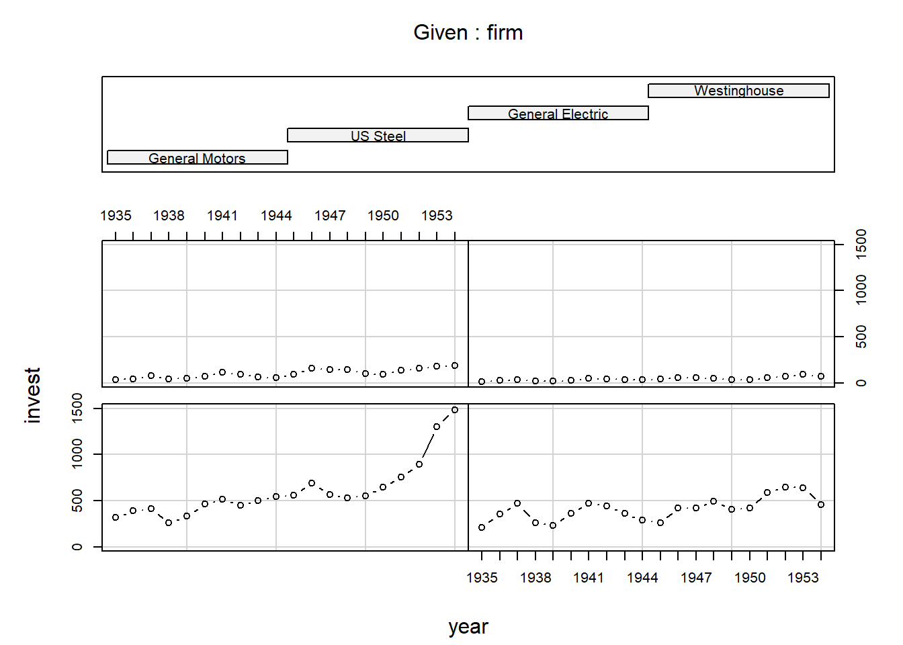


*Efetuando predições com o modelo de cluster*


```r
head(iris)
```

```
  Sepal.Length Sepal.Width Petal.Length Petal.Width Species
1          5.1         3.5          1.4         0.2  setosa
2          4.9         3.0          1.4         0.2  setosa
3          4.7         3.2          1.3         0.2  setosa
4          4.6         3.1          1.5         0.2  setosa
5          5.0         3.6          1.4         0.2  setosa
6          5.4         3.9          1.7         0.4  setosa
```

```r
table(iris$Species)
```

```

    setosa versicolor  virginica 
        50         50         50 
```


```r
library("gridExtra")
library(ggplot2)

a=ggplot(data = iris) +
  aes(x = Petal.Width, y = Petal.Length, color = Species) +
  geom_point() +
  theme_minimal()

b=ggplot(data = iris) +
  aes(x = Sepal.Width, y = Sepal.Length, color = Species) +
  geom_point() +
  theme_minimal()

grid.arrange(a, b, ncol=2)
```


```r
set.seed(123)

amostra = sample(2,150,replace=T, prob=c(0.7,0.3))
amostra
```

```
  [1] 1 2 1 2 2 1 1 2 1 1 2 1 1 1 1 2 1 1 1 2 2 1 1 2 1 2 1 1 1 1 2 2 1 2 1 1 2
 [38] 1 1 1 1 1 1 1 1 1 1 1 1 2 1 1 2 1 1 1 1 2 2 1 1 1 1 1 2 1 2 2 2 1 2 1 2 1
 [75] 1 1 1 1 1 1 1 1 1 2 1 1 2 2 2 1 1 1 1 1 1 1 2 1 1 1 1 1 1 2 1 2 2 1 1 1 2
[112] 1 1 2 2 1 1 2 1 1 1 1 1 1 1 2 1 1 1 1 1 2 1 2 1 1 2 2 2 1 1 1 1 1 2 1 1 1
[149] 1 2
```

```r
iristreino = iris[amostra==1,]
iristeste = iris[amostra==2,]
```


```r
set.seed(123)
km.res=kmeans(iristreino[1:4], 3, nstart=25)
print(km.res)
```

```
K-means clustering with 3 clusters of sizes 35, 29, 42

Cluster means:
  Sepal.Length Sepal.Width Petal.Length Petal.Width
1        4.940       3.406        1.446      0.2429
2        6.821       3.007        5.683      2.0690
3        5.883       2.733        4.317      1.3905

Clustering vector:
  1   3   6   7   9  10  12  13  14  15  17  18  19  22  23  25  27  28  29  30 
  1   1   1   1   1   1   1   1   1   1   1   1   1   1   1   1   1   1   1   1 
 33  35  36  38  39  40  41  42  43  44  45  46  47  48  49  51  52  54  55  56 
  1   1   1   1   1   1   1   1   1   1   1   1   1   1   1   2   3   3   3   3 
 57  60  61  62  63  64  66  70  72  74  75  76  77  78  79  80  81  82  83  85 
  3   3   3   3   3   3   3   3   3   3   3   3   3   2   3   3   3   3   3   3 
 86  90  91  92  93  94  95  96  98  99 100 101 102 103 105 108 109 110 112 113 
  3   3   3   3   3   3   3   3   3   3   3   2   3   2   2   2   2   2   2   2 
116 117 119 120 121 122 123 124 125 127 128 129 130 131 133 135 136 140 141 142 
  2   2   2   3   2   3   2   3   2   3   3   2   2   2   2   2   2   2   2   2 
143 144 146 147 148 149 
  3   2   2   3   2   2 

Within cluster sum of squares by cluster:
[1] 10.56 16.21 25.01
 (between_SS / total_SS =  89.2 %)

Available components:

[1] "cluster"      "centers"      "totss"        "withinss"     "tot.withinss"
[6] "betweenss"    "size"         "iter"         "ifault"      
```


```r
iristreino=cbind(iristreino, cluster=km.res$cluster)
head(iristreino)
```

```
   Sepal.Length Sepal.Width Petal.Length Petal.Width Species cluster
1           5.1         3.5          1.4         0.2  setosa       1
3           4.7         3.2          1.3         0.2  setosa       1
6           5.4         3.9          1.7         0.4  setosa       1
7           4.6         3.4          1.4         0.3  setosa       1
9           4.4         2.9          1.4         0.2  setosa       1
10          4.9         3.1          1.5         0.1  setosa       1
```

```r
confusao = table(iristreino$Species, km.res$cluster)
confusao
```

```
            
              1  2  3
  setosa     35  0  0
  versicolor  0  2 34
  virginica   0 27  8
```

```r
taxaacerto = (confusao[1] + confusao[5] + confusao[9]) / sum(confusao)
taxaacerto
```

```
[1] 0.4245
```

```r
taxaerro = (confusao[2]+ 
            confusao[3]+
            confusao[4]+
            confusao[6]+
            confusao[7]+
            confusao[8]) / sum(confusao)
taxaerro
```

```
[1] 0.5755
```


```r
set.seed(123)
library(flexclust)
```

```
Carregando pacotes exigidos: grid
```

```
Carregando pacotes exigidos: lattice
```

```
Carregando pacotes exigidos: modeltools
```

```
Carregando pacotes exigidos: stats4
```

```r
km = kcca(iristreino[ , 1:4], k=3, kccaFamily("kmeans"))
km
```

```
kcca object of family 'kmeans' 

call:
kcca(x = iristreino[, 1:4], k = 3, family = kccaFamily("kmeans"))

cluster sizes:

 1  2  3 
35 31 40 
```

```r
predteste=predict(km, newdata=iristeste[ , 1:4], k=3, kccaFamily("kmeans"))
head(predteste)
```

```
 2  4  5  8 11 16 
 1  1  1  1  1  1 
```


```r
iristeste=cbind(iristeste, predteste)
head(iristreino)
```

```
   Sepal.Length Sepal.Width Petal.Length Petal.Width Species cluster
1           5.1         3.5          1.4         0.2  setosa       1
3           4.7         3.2          1.3         0.2  setosa       1
6           5.4         3.9          1.7         0.4  setosa       1
7           4.6         3.4          1.4         0.3  setosa       1
9           4.4         2.9          1.4         0.2  setosa       1
10          4.9         3.1          1.5         0.1  setosa       1
```

```r
confusao = table(iristeste$Species, iristeste$predteste)
confusao
```

```
            
              1  2  3
  setosa     15  0  0
  versicolor  0  1 13
  virginica   0 11  4
```

```r
taxaacerto = (confusao[1] + confusao[5] + confusao[9]) / sum(confusao)
taxaacerto
```

```
[1] 0.4545
```

```r
taxaerro = (confusao[2]+ 
            confusao[3]+
            confusao[4]+
            confusao[6]+
            confusao[7]+
            confusao[8]) / sum(confusao)
taxaerro
```

```
[1] 0.5455
```


## Clusterização Aglomerativa

Uma das principais técnicas de Clusterização Hierárquica é a Clusterização Aglomerativa. Como premissa básica para a formação de clusters nesta técnica é realizada: a) a inclusão inicial de casa objeto considerando um agrupamento individual; b) próximo passo são formados pares de clusters com maiores similaridades entre si; c) repete-se o procedimento em novos clusters maiores, chegando até um único grande cluster [@Kassambara2017]. 

Pimeiramente é demonstrado o carregamento da base de dados `mtcars` (utilizada no subcapítulo anterior), efetuando o balanceamento dos dados com a função `scale()` (segundo @Kassambara2017 a padronização das variáveis ajuda a deixá-las comparáveis, pois estão originalmente em escalas diferentes):


```r
#Carregamento dos dados
data("mtcars")
df=scale(mtcars)
head(df, n=3)
```

```
                 mpg    cyl    disp      hp   drat      wt    qsec     vs   am
Mazda RX4     0.1509 -0.105 -0.5706 -0.5351 0.5675 -0.6104 -0.7772 -0.868 1.19
Mazda RX4 Wag 0.1509 -0.105 -0.5706 -0.5351 0.5675 -0.3498 -0.4638 -0.868 1.19
Datsun 710    0.4495 -1.225 -0.9902 -0.7830 0.4740 -0.9170  0.4260  1.116 1.19
                gear    carb
Mazda RX4     0.4236  0.7352
Mazda RX4 Wag 0.4236  0.7352
Datsun 710    0.4236 -1.1222
```


Agora é utilizada a função `dist()` para criar a distância entre os pares de dados que serão objeto de análise para a formação dos primeiros pares de dados similares. No exemplo abaixo foi utilizada a Distância Euclidiana como `method`.


```r
dista=dist(df, method="euclidean")
```

Depois de calculada a distância entre os objetos é possível verificar os índices encontrados (matriz de dissimilaridade), sendo que no exemplo abaixo extraímos somente as três primeiras linhas e as três primeiras colunas para fins de visualização:


```r
as.matrix(dista)[1:3,1:3]
```

```
              Mazda RX4 Mazda RX4 Wag Datsun 710
Mazda RX4        0.0000        0.4076      3.243
Mazda RX4 Wag    0.4076        0.0000      3.176
Datsun 710       3.2431        3.1764      0.000
```

O próximo passo é efetuar a criação dos clusters com base na similaridade, por meio de iterações que agrupem as variáveis em clusters cada vez maiores até formar uma árvore hierárquica. A função `hclust()` utiliza os dados das distâncias encontradas anteriormente (objeto "dista") e o método (`method`). O método a ser utilizado pode ser: `ward.D`, `ward.D2`, `single`, `complete`, `average`, `mcquitty`, `median` ou `centroid`, sendo que os métodos denominados ward e complete são mais utilizados, pois o primeiro minimiza a variância intra-cluster e o segundo define a distância entre dois clusters como o valor máximo de todos os pareamentos enrte os elementos do cluster 1 e os elementos do cluster 2 (extraído de @Kassambara2017, que traz maiores explicações sobre a diferença entre os métodos).


```r
dista.hc=hclust(d=dista, method="ward.D")
```

A representação gráfica da Aglomeração Hierárquica é efetuada através da imagem de um dendograma, que pode ser facilmente criada com a fórmula `plot(dista.hc)`. Aqui foi utilizado o pacote `factoextra` e sua função `fviz_dend` para a criação do dendograma:


```r
library("factoextra")
fviz_dend(dista.hc, cex=0.5)
```

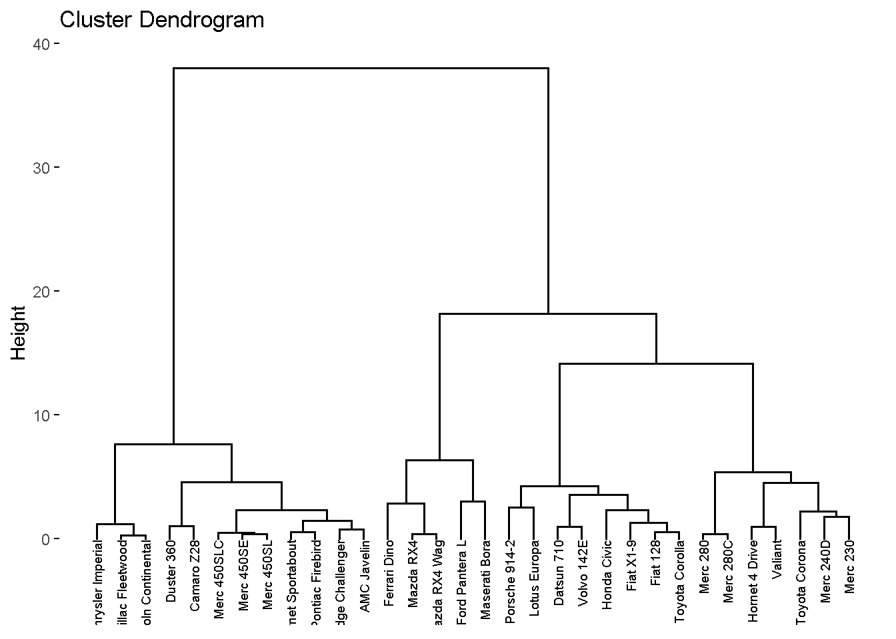


# Regressão Múltipla

*Iara Denise Endruweit Battisti*

\begin{flushright}
\emph{}
\end{flushright}


## Modelo geral

Um modelo de regressão múltipla é expresso como:

$$ 
y_{i} = \beta_0+\ \beta_1x_{1i}+\beta_2x_{2i}+\dots+\beta_kx_{ki}+\varepsilon_i\ 
$$
\noindent
em que:

- $y_{i}$: valores da variável resposta, $i = 1, 2,..., n$ observações;

- $x$: valores das variáveis explicativas, $k = 1, 2,..., K$ variáveis;

- $\beta_k$: parâmetros do modelo;

- $\varepsilon_i$: erro aleatório.


A equação estimada para este modelo é definida como:

$$ 
y_{i} = b_0+\ b_1x_{1i}+b_2x_{2i}+\dots+b_kx_{ki} 
$$
em que:

- $b_k$: coeficientes estimados.


## Variável dummy

Em algumas situações é necessário introduzir, como variável preditora (independente), uma variável categórica no
modelo de regressão linear simples ou múltiplo, como por exemplo, local (urbano ou rural), área (preservada ou degradada), etc, podendo ter mais que duas categorias. Essa variável terá que ser codificada, utilizando somente códigos 0 e 1, assim chamada variável dummy.

O número de variáveis dummy no modelo será sempre igual ao número de categorias da variável preditora original
menos 1. Por exemplo:

- Para a variável preditora "local" que assume valores - urbano ou rural, então têm-se a variável dummy
local_dummy assumindo 0 para rural e 1 para urbano; também, poderia ser utilizado 1 para rural e 0 para
urbano. Uma indicação é que a categoria que assume o valor 0 seja a categoria de referência.

- Para a variável preditora "grau de escolaridade"" que assume valores – ensino fundamental, ensino médio,
ensino superior, então têm-se as variáveis dummy: escola1 e escola2, assim definido:

a. escola1=0 e escola2=0 para ensino fundamental;
b. escola1=1 e escola2=0 para ensino médio;
c. escola1=0 e escola2=1 para ensino superior.

**Exercício**:

1) Utilizando o banco de dados `ARVORE2`, ajuste um modelo de regressão linear simples para predizer a altura das árvores
em função do diâmetro. Veja essa relação no diagrama de dispersão. Interprete os resultados.


Relembrando Modelos de Regressão Linear Simples – Curso Básico do Software R:

- 1.1 Ajustar a equação de regressão. Interpretá-la.
- 1.2 Encontrar e interpretar a significância da equação.
- 1.3 Encontrar e interpretar o coeficiente de determinação.
- 1.4 Analisar graficamente os resíduos.
- 1.5 Testar a normalidade dos resíduos.


Adicionalmente - Curso Avançado do Software R:

- 1.6 Analisar pontos *outliers* nos resíduos.

Para análise dos valores *outliers* nos resíduos (*residuals standard* e *residuals studentized*), utilizam-se os seguintes comandos:

`rstudent(regressao)`

`rstandard(regressao)`

E o gráfico para verificar valores outliers nos resíduos:

`plot(rstudent(regressao))`

`plot(rstandard(regressao))`

Aqueles valores maiores que |2| são possíveis outliers. Incluir uma linha y =2 e y=-2, para facilitar a visualização de outliers.

- 1.7 Analisar pontos influentes nos resíduos.

Para análise dos valores influentes, utiliza-se:

`dffits(regressao)`

Aqueles valores maiores que `2*(p/n)^(1/2)` são possíveis pontos influentes. Em que, p = número de parâmetros do modelo e n = tamanho da amostra. O gráfico para detectar pontos influentes pode ser elaborado pelo comando:

`plot(dffits(regressao))`

Aqueles valores maiores, em módulo, são possíveis influentes. Incluir linhas para facilitar a visualização de pontos influentes.

Ainda, pode-se utilizar o comando `plot(regressao)` elabora diferentes gráficos para o diagnóstico do modelo.


2) Ajuste um segundo modelo de regressão linear simples para predizer a altura das árvores em função da espécie. Veja essa relação no diagrama de dispersão. Interprete os resultados.

3) Ajuste um terceiro modelo de regressão múltipla para predizer a altura das árvores em função do diâmetro e da espécie. Interprete os resultados.


```r
library(readxl)
url <- "https://github.com/Smolski/livroavancado/raw/master/arvore2.xlsx"
destfile <- "arvore2.xlsx"
curl::curl_download(url, destfile)
arvore2 <- read_excel(destfile)
attach(arvore2)
head(arvore2)
```

```
# A tibble: 6 x 4
  Nomecientifico            diametro_cm altura_m especie
  <chr>                           <dbl>    <dbl>   <dbl>
1 Sebastiania commersoniana        52.2     15.2       0
2 Sebastiania commersoniana        95       17.3       0
3 Sebastiania commersoniana        67.3     16.3       0
4 Sebastiania commersoniana        46.3     14         0
5 Sebastiania commersoniana        64.1     15         0
6 Sebastiania commersoniana       122       22         0
```


```r
modelom=lm(altura_m~diametro_cm+especie) 
modelom
```

```

Call:
lm(formula = altura_m ~ diametro_cm + especie)

Coefficients:
(Intercept)  diametro_cm      especie  
    12.6959       0.0571      -1.6252  
```

Modelo:
$$
Y = 12,328 + 0,0576 x_1 – 1,423 x_2
$$
Ou

$$
\text{Altura} = 12,328 + 0,0576\text{diâmetro} – 1,423\text{espécie}
$$

Verificando a significância de cada coeficiente do modelo de regressão múltipla:


```r
summary(modelom)
```

```

Call:
lm(formula = altura_m ~ diametro_cm + especie)

Residuals:
   Min     1Q Median     3Q    Max 
-3.269 -0.766 -0.124  0.813  2.873 

Coefficients:
            Estimate Std. Error t value Pr(>|t|)    
(Intercept) 12.69592    0.38639   32.86  < 2e-16 ***
diametro_cm  0.05713    0.00445   12.84  < 2e-16 ***
especie     -1.62517    0.24459   -6.64  1.5e-09 ***
---
Signif. codes:  0 '***' 0.001 '**' 0.01 '*' 0.05 '.' 0.1 ' ' 1

Residual standard error: 1.19 on 102 degrees of freedom
Multiple R-squared:   0.7,	Adjusted R-squared:  0.694 
F-statistic:  119 on 2 and 102 DF,  p-value: <2e-16
```


Verificar a significância do modelo completo.

Verificar o coeficiente de determinação do modelo.

Realizar análise dos resíduos.

- gráfico dos resíduos com cada variável preditora
- resíduos padronizados para verificar outlier
- verificar pontos infuentes


A interpretação dos termos de regressão é um pouco mais complicada. Em geral, um modelo com múltiplos preditores indica a diferença média na variável desfecho quando mudamos o valor de uma variável e mantemos a outra constante.

Nesse caso, entre árvores de mesmo diâmetro ($x_1$), a diferença média esperada da altura (y) para a espécie *Syphoneugena reitzii* em relação a espécie *Sebastiania* commersoniana é de cerca de 1,42m a menos (pois $b_3$=-1,42).

Da mesma forma, árvores da mesma espécie têm, em média, 0,05758m (pois $b_2$=0,05758) a mais a cada 1 cm de diâmetro.

Como envolvem mais variáveis, não é possível resolver o modelo inteiro num único gráfico. Como alternativa, pode-se plotar a reta para cada espécie (variável categórica).

Primeiro, os pontos são plotados. O argumento `type='n'` indica que não é para acrescentar nenhum ponto ao gráfico.
Em seguida, os pontos são acrescentados separadamente, com a função points, a qual acrescenta pontos ao gráfico, sendo que o colchetes `[espécie==0]` seleciona somente os casos desejados.

Por fim, acrescentamos as retas de regressão para cada resposta a variável independente espécie. Usamos a função `coef` para extrair os coeficientes de interesse.


```r
plot(diametro_cm,altura_m)
```


```r
# Gera o gráfico sem pontos
plot(diametro_cm,altura_m,type='n') 
# Acrescenta os pontos
points(diametro_cm[especie==0],altura_m[especie==0],col='blue')
points(diametro_cm[especie==1],altura_m[especie==1],col='red')
# Acrescenta as linhas
abline(coef(modelom)[1], coef(modelom)[2], col='blue')
abline(coef(modelom)[1]+coef(modelom)[3], coef(modelom)[2], col='red')
```

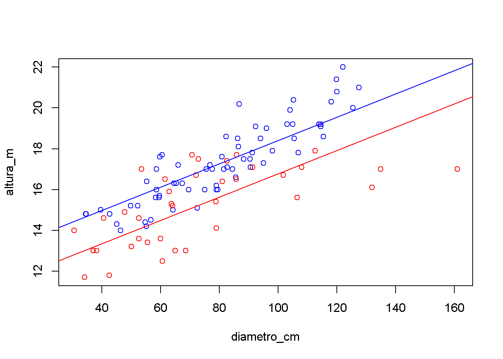


## Interação entre variáveis preditoras

Quando suspeita-se que os coeficientes de inclinação podem variar entre as categorias da variável preditora então aconselha-se testar a interação entre as duas variáveis. No software R utiliza-se ‘:’ para indicar a interação entre as duas variáveis. Se a interação for significativa (P<0,05), então conclui-se que os coeficientes de inclinação diferem entre si.

O modelo de regressão múltipla apresentando anteriormente pressupõe que a inclinação da reta de regressão é igual para os dois grupos considerados, espécie Syphoneugena reitzii e espécie Sebastiania commersoniana espécie. Se existem motivos para acreditar que a inclinação pode variar de um grupo para o outro, pode-se acrescentar um termo de interação (interação entre variáveis) (Kaszubowski, 2016).

A interação, neste caso, nada mais é do que o acréscimo de uma nova variável preditora ao modelo. Essa nova variável preditora é o produto das duas variáveis que já constam no modelo. Para acrescentar um termo de interação no R, basta utilizar dois pontos ‘:’ entre o nome das duas variáveis para as quais se deseja criar o termo de interação.


```r
modelom=lm(`altura_m`~`diametro_cm`+especie+`diametro_cm`:especie, data = arvore2)
modelom
```

```

Call:
lm(formula = altura_m ~ diametro_cm + especie + diametro_cm:especie, 
    data = arvore2)

Coefficients:
        (Intercept)          diametro_cm              especie  
            11.5480               0.0714               0.7863  
diametro_cm:especie  
            -0.0316  
```


```r
summary(modelom)
```

```

Call:
lm(formula = altura_m ~ diametro_cm + especie + diametro_cm:especie, 
    data = arvore2)

Residuals:
    Min      1Q  Median      3Q     Max 
-2.2460 -0.8545  0.0632  0.7552  2.5561 

Coefficients:
                    Estimate Std. Error t value Pr(>|t|)    
(Intercept)         11.54805    0.47544   24.29  < 2e-16 ***
diametro_cm          0.07137    0.00566   12.62  < 2e-16 ***
especie              0.78630    0.68304    1.15  0.25237    
diametro_cm:especie -0.03158    0.00842   -3.75  0.00029 ***
---
Signif. codes:  0 '***' 0.001 '**' 0.01 '*' 0.05 '.' 0.1 ' ' 1

Residual standard error: 1.12 on 101 degrees of freedom
Multiple R-squared:  0.736,	Adjusted R-squared:  0.728 
F-statistic:   94 on 3 and 101 DF,  p-value: <2e-16
```


```r
plot(diametro_cm,altura_m,type='n')

points(diametro_cm[especie==0],altura_m[especie==0],col='blue')
points(diametro_cm[especie==1],altura_m[especie==1],col='red')

abline(coef(modelom)[1],coef(modelom)[2], col='blue')
abline(coef(modelom)[1]+coef(modelom)[3],coef(modelom)[2]+coef(modelom)[4], col='red')
```

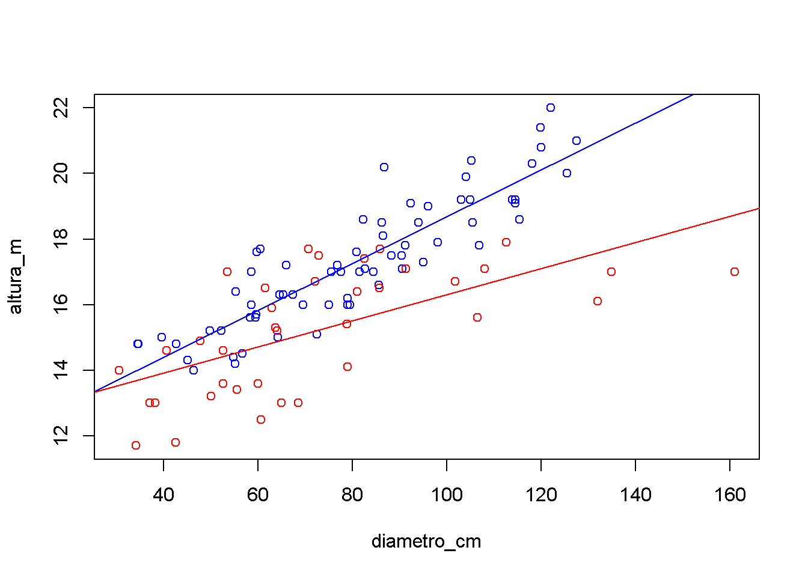


## Métodos seleção de variáveis na regressão múltipla

### Full model – Modelo completo

Sintaxe no software R para um modelo de regressão múltipla com três variáveis preditivas:

`regressao=lm(y~x1+x2+x3)`


`summary(regressao)`


Existem três métodos de seleção de variáveis para modelos de regressão múltipla: *backward*, *forward* e *stepwise*.


`regressao=step(lm(y~x1+x2+x3),direction = 'método')`


### Procedimento backward

Considera todas as variáveis inicialmente, testando posteriormente, a permanência de cada uma no modelo. Se p $\leq$ 15%, permanece no modelo (saiu do modelo não entra mais) (Riboldi, 2005).

Passo 1) Ajustar o modelo completo de m variáveis e obter $SQR^{c}_{eg}$ e $\sigma^{2}$;

Passo 2) Para cada uma das m variáveis do modelo completo do passo 1, considerar o modelo reduzido – retirando esta variável
– e calcular $SQR^{r}_{eg}$ para obter o valor da estatística (slide 24);

Passo 3) Achar o mínimo dos m valores da estatística obtidos no passo 2, denotado por F~min~;

Passo 4) Seja F~out~ o valor da distribuição F com 1 e (n-m-1) gl;

- Se F~min~ > F~out~: interromper o processo e optar pelo modelo completo desta etapa;

- Se F~min~ < F~out~:  voltar ao passo 1, iniciando nova etapa em que o modelo completo tem (m-1) variáveis – dada a
eliminação da variável cuja estatística é igual a F~min~.

### Procedimento forward

Inclui uma variável de cada vez, se p $\leq$ 20%, entra no modelo. Este método não testa a permanência da variável (entrou no modelo não sai mais) @Riboldi2005.

Passo 1) Ajustar o modelo reduzido de m variáveis e obter $SQR^{c}_{eg}$;

Passo 2) Para cada variável não pertencente ao modelo do passo 1, considerar o modelo completo com adição desta variável
extra e calcular $SQR^{r}_{eg}$ e $\sigma^{2}$ para obter o valor da estatística (slide 26);

Passo 3) Achar o máximo dos valores da estatística obtidos no passo 2, denotado por F~max~;

Passo 4) Seja F~in~ o valor da distribuição F com 1 e (n-m) gl;

- Se F~max~ > F~in~: voltar ao passo 1, iniciando nova etapa em que o modelo reduzido tem (m+1) variáveis – dada a inclusão
da variável cuja estatística é igual a F~max~.

- Se F~max~ < F~in~: interromper o processo e optar pelo modelo reduzido desta etapa;

### Procedimento stepwise

Inclui as variáveis passo-a-passo e testa a permanência (as variáveis podem entrar e sair do modelo) (Riboldi, 2005).

Passo 1) Ajustar o modelo reduzido de m variáveis e obter $SQR^{r}_{eg}$;

Passo 2) Para cada variável não pertencente ao modelo do passo 1, considerar o modelo completo - com adição desta variável
extra - e calcular $SQR^{c}_{eg}$ e $\sigma^{2}$ para obter o valor da estatística (slide 26);

Passo 3) Achar o máximo dos valores da estatística obtidos no passo 2, denotado por F~max~;

Passo 4) Seja Fin o valor da distribuição F com 1 e (n-m) gl;

- Se Fmax > Fin -> passar ao passo 5, com modelo completo composto por (m+1) variáveis – as m variáveis do modelo do
passo 1 e a variável cuja estatística é igual a Fmax.

- Se Fmax < Fin -> passar ao passo 5, com modelo completo igual ao modelo do passo 1 ou encerrar o processo se no passo
8 da etapa anterior, nenhuma variável tiver sido eliminada;

Passo 5) Ajustar o modelo completo de k variáveis – sendo k igual a m ou (m+1), e obter $SQR^{c}_{eg}$ e $\sigma^{2}$;

Passo 6) Para cada uma das k variáveis do modelo completo do passo 5, considerar o modelo reduzido – retirando esta variável – e calcular $SQR^{r}_{eg}$ para obter o valor da estatística;

Passo 7) Achar o mínimo dos k valores da estatística obtidos no passo 6, denotado por F~min~;

Passo 8) Seja F~out~ o valor da distribuição F com 1 e (n-k-1) gl;

- Se F~min~ > F~out~: não eliminar nenhuma variável e voltar ao passo 1, iniciando nova etapa com modelo reduzido com k
variáveis ou encerrar o processo de no passo 4 nenhuma variável tiver sido anexada;

- Se Fmin < Fout: eliminar a variável cuja estatística é igual a Fmin e voltar ao passo 1 iniciando nova etapa com modelo
reduzido com (k-1) variáveis.

<div class="figure" style="text-align: center">

<p class="caption">(\#fig:unnamed-chunk-77)Modelagem estatística</p>
</div>

Fonte: @Riboldi2005

## Roteiro para o diagnóstico do modelo de regressão múltipla ajustado

Identificação de observações destoantes para Y

- Resíduo studentizado externamente – r_student (studentized residual with currente observation deleted)
- Resíduo studentizado internamente – student (studentized residual)
- Identificação de observações destoantes com base nos resíduos – residual

Identificação de observações destoantes para X

- Matriz H
- Alavanca (Leverage =  )

Identificação de casos de influência

- DFFITS (standard influence of observation on predict values)
- Distância de Cook (_cookd)
- DFBetas
	
Verificação da existência de multicolinearidade (correlação entre os X’s)

- Matriz de correlação das variáveis
- Análise de estrutura k (condition index)
- Fator de inflação de variância – VIF (variance inflation)
- Teste de Durbin-Watson pra atutocorrelação


<!--
\printbibliography[segment=\therefsegment,heading=subbibliography]
-->

# Regressão com Dados em Painel

*Felipe Micail da Silva Smolski*

\begin{flushright}
\emph{}
\end{flushright}


O modelo de regressão com dados em painel possui uma característica especial: se constitui de uma dimensão *temporal* e outra *espacial*. Isto porque a mesma unidade de corte transversal (família, países, etc.) é acompanhada ao longo do tempo. Por exemplo, a produção industrial mensal dos Estados brasileiros em função da taxa de juros no período de 2015-2016. Têm-se então a 624 (26x24) observações *combinadas*: de cada um dos 26 Estados (exluindo o Distrito Federal) e 24 observações para os meses.


Dentre os benefícios da regressão com dados em painel [@Gujarati2011]:

- Devido à heterogeneidade da análise entre indivíduos, empresas, estados, países, etc., esta técnica pode levar em conta estas variáveis individuais específicas;

- Maior informação, maior variabilidade e menor colinearidade entre variáveis, devido à combinaçãod e séries temporais e dados com corte transversal;

- Dados em painel são mais adequados ao estudo da *dinâmica da mudança* (emprego, renda, etc).

- Detecta e mede melhor os efeitos em comparação aos estudos transversais puros ou em séries temporais puras;

- Possibilidade de modelos comportamentais mais complexos;

- Minimização do viés decorrente da agregação de pessoas e/ou empresas nos grandes conjuntos.


## Carregamento e transformação dos dados

A base de dados utilizada neste exemplo ("Grunfeld") é proveniente do pacote `AER`. É constituída da variável dependente do nível de investimento ("invest") de diversas empresas ("firm"), bem como das variáveis explicativas de seu valor de mercado ("value") e do valor do estoque de capital ("capital") durante o período de 1935-1954 (20 anos). Portanto pretende-se descobrir os determinantes do valor do nível investimento das firmas durente o período.


```r
require(AER) 
data(Grunfeld, package="AER")
```


Após carregada a base para o estudo, serão selecionadas quatro empresas ("General Electric", "General Motors", "US Steel" e "Westinghouse") para fins de análise dos dados. Utiliza-se o pacote `plm` e a função `pdata.frame` para alocar a base de dados para a análise de regressão de dados em painel, uma vez que é necessário definir o atributo individual ("firm") e temporal ("year") das observações. Para isso utiliza-se o argumento `index`, como segue:


```r
require(plm)

Grunfeld=subset(Grunfeld, firm %in% c("General Electric",
                                      "General Motors",
                                      "US Steel",
                                      "Westinghouse"))
Grunfeld=pdata.frame(Grunfeld, index=c("firm","year"))
  
head(Grunfeld)
```

```
                    invest value capital           firm year
General Motors-1935  317.6  3078     2.8 General Motors 1935
General Motors-1936  391.8  4662    52.6 General Motors 1936
General Motors-1937  410.6  5387   156.9 General Motors 1937
General Motors-1938  257.7  2792   209.2 General Motors 1938
General Motors-1939  330.8  4313   203.4 General Motors 1939
General Motors-1940  461.2  4644   207.2 General Motors 1940
```

```r
summary(Grunfeld)
```

```
     invest           value         capital                     firm   
 Min.   :  12.9   Min.   : 192   Min.   :   0.8   General Motors  :20  
 1st Qu.:  55.3   1st Qu.:1192   1st Qu.: 118.1   US Steel        :20  
 Median : 199.8   Median :1971   Median : 254.7   General Electric:20  
 Mean   : 290.9   Mean   :2229   Mean   : 357.3   Westinghouse    :20  
 3rd Qu.: 459.8   3rd Qu.:2795   3rd Qu.: 368.9                        
 Max.   :1486.7   Max.   :6242   Max.   :2226.3                        
                                                                       
      year   
 1935   : 4  
 1936   : 4  
 1937   : 4  
 1938   : 4  
 1939   : 4  
 1940   : 4  
 (Other):56  
```

Nota-se que nesta base que será trabalhada os dados das empresas aparecem "empilhados", uma vez que a variável referente ao ano da observação ("year") está repetida para cada observação da referida empresa (corte transversal repetido em diversos períodos de tempo). Desta forma a nossa base de dados possui igualmente 20 informações para cada empresa, se constituindo em um *painel equilibrado*. Caso o número de informações para cada empresa fossem desiguais, teríamos um *painel desequilibrado*.

Uma questão interessante emerge para a análise de regressão de dados em painel, em virtude da interação de variáveis individuais ("firm") com a série temporal ("year"): a elevação da complexidade da análise. Desta forma, várias possibilidades de análise de modelos de regressão surgem, dentre elas: 

a) regressão considerando que o intercepto do modelo e seus coeficientes angulares são constantes ao londo do tempo e no espaço, sendo que o termo de erro capta a diferença no tempo e entre os indivíduos (POOLED);

b) regressão considerando que os coeficientes angulares são constantes e o intercepto varia entre os indivíduos (EFEITOS FIXOS);

c) regressão considerando que o intercepto assume um valor médio comum entre os indivíduos e os coeficientes angulares variam ao longo do tempo e também entre indivíduos (EFEITOS ALEATÓRIOS).

Abaixo é demonstrada a evolução do investimento de acordo com cada empresa estudada:


```r
coplot(invest ~ year|firm, type="b", data=Grunfeld)
```

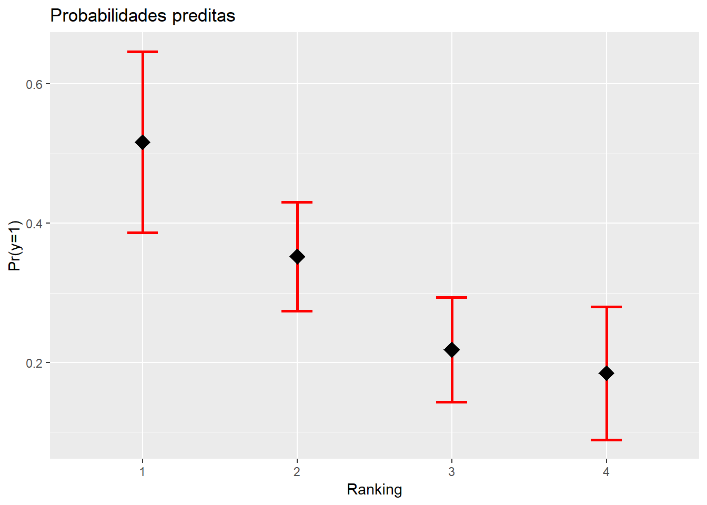


## Modelo Pooled

Este modelo trata de "empilhar" todas as observações da base de dados, ignorando a estrutura de dados em painel. Desta forma, todas as observações são tratadas como não correlacionadas para os indivíduos, com erros homoscedásticos para com os indivíduos. Trata-se, portanto, da forma mais simplista e ingênua pois desconsidera as dimensões de tempo e espaço combinados, ao mesmo tempo que estima a regressão pelo método dos Mínimos Quadrados Ordinários (MQO) [@Gujarati2011]. Desta forma:

$$
 \begin{matrix}
Y_{it} = \beta_1+\beta_2X_{2it} + \beta_3X_{3it} +u_{it}\\
i=1,2,3,4\\
t=1,2,\dots,20
 \end{matrix}
$$

em que $i$ corresponde à $i$-nésima unidade de corte transversal e $t$ o $t$-nésimo período de tempo.

Para executar este modelo de regressão é necessário utilizar a função `plm`, juntamente com as variáveis dependente e independentes, indicando a base de dados (`data`) e o tipo da regressão (`"pooling"`).


```r
reg.pooled=plm(invest~value+capital, 
               data=Grunfeld, model="pooling")
summary(reg.pooled)
```

```
Pooling Model

Call:
plm(formula = invest ~ value + capital, data = Grunfeld, model = "pooling")

Balanced Panel: n = 4, T = 20, N = 80

Residuals:
   Min. 1st Qu.  Median 3rd Qu.    Max. 
-319.68  -99.95    1.96   65.99  336.21 

Coefficients:
            Estimate Std. Error t-value Pr(>|t|)    
(Intercept) -62.8318    29.7254   -2.11    0.038 *  
value         0.1105     0.0138    8.02  9.2e-12 ***
capital       0.3005     0.0494    6.08  4.3e-08 ***
---
Signif. codes:  0 '***' 0.001 '**' 0.01 '*' 0.05 '.' 0.1 ' ' 1

Total Sum of Squares:    6410000
Residual Sum of Squares: 1570000
R-Squared:      0.755
Adj. R-Squared: 0.748
F-statistic: 118.424 on 2 and 77 DF, p-value: <2e-16
```

A estimação da regressão *pooled* averiguou alta significância estatística nas variáveis dependentes ("value" e "capital"), indicando sinal positivo para os coeficientes (em consonância com a literatura), bem como um valor de R$^2$ alto. Este tipo de modelo não faz diferenciação entre a influência/diferença das empresas na variável investimento e nem se a resposta do investimento às variáveis explicativas é a mesma  ao longo do tempo. Isto faz com que não se saiba se existe heterogeneidade entre as empresas. A comparação do modelo *pooled* com as regressões de efeitos fixos e efeitos aleatórios, que serão estimados na sequência, servirá mostrar ao pesquisador qual é o melhor modelo dentre eles.

<!--

```r
#my.pooltest <- pooltest(invest~value+capital, data = Grunfeld, model = "pooling")

#print(my.pooltest)

#plmtest(reg.pooled)
```
-->

## Modelo Efeitos Fixos

O modelo de regressão com efeitos fixos considera, como visto anteriormente, que os valores dos interceptos para cada regressão ($\alpha_i$) variam de acordo com o efeito de cada indivíduo ("firma") e que os coeficientes de declividade (das variáveis independentes "value" e "capital") para cada equação são os mesmos para cada empresa, conforme equação abaixo:

$$
invest_{it} = value_{1it} + capital_{2it} + \alpha_i + \varepsilon_{it}
$$
em que $i=1,...,4$, $t=1,...,20$ (painel balanceado).

Desta forma, o intercepto da equação é diferente para cada empresa, mas o efeito das variáveis independentes é o mesmo sobre a variável independente. Isto indica que existe características especiais em cada empresa influenciando o investimento, como por exemplo o estilo de gestão [@Gujarati2011].

Abaixo é montada a regressão de efeitos fixos:


```r
reg.ef=plm(invest~value+capital, 
           data=Grunfeld, model="within")
summary(reg.ef)
```

```
Oneway (individual) effect Within Model

Call:
plm(formula = invest ~ value + capital, data = Grunfeld, model = "within")

Balanced Panel: n = 4, T = 20, N = 80

Residuals:
   Min. 1st Qu.  Median 3rd Qu.    Max. 
-184.66  -48.26    9.33   40.55  197.67 

Coefficients:
        Estimate Std. Error t-value Pr(>|t|)    
value     0.1084     0.0176    6.17  3.3e-08 ***
capital   0.3451     0.0267   12.92  < 2e-16 ***
---
Signif. codes:  0 '***' 0.001 '**' 0.01 '*' 0.05 '.' 0.1 ' ' 1

Total Sum of Squares:    2170000
Residual Sum of Squares: 422000
R-Squared:      0.806
Adj. R-Squared: 0.792
F-statistic: 153.291 on 2 and 74 DF, p-value: <2e-16
```

Nota-se que o impacto do valor da empresa ("value") e do capital ("capital") é positivo sobre o investimento ("invest"), para todas as empresas como visto acima. Inclusive, há significância estatística
 para estas variáveis. No entanto, ainda resta definir o efeito dos interceptos de cada empresa, como segue:


```r
summary(fixef(reg.ef))
```

```
                 Estimate Std. Error t-value Pr(>|t|)    
General Motors      -85.5       73.5   -1.16   0.2483    
US Steel             95.0       36.7    2.59   0.0115 *  
General Electric   -246.2       35.9   -6.85  1.9e-09 ***
Westinghouse        -59.4       20.2   -2.94   0.0044 ** 
---
Signif. codes:  0 '***' 0.001 '**' 0.01 '*' 0.05 '.' 0.1 ' ' 1
```


Com este resultado é possível observar que o efeito das firmas sobre o investimento parece ser diferente para cada indivíduo. Desta forma, somente a empresa US Steel consta com efeito positivo sobre o investimento. Por outo lado, a fórmula da regressão é apresentada de maneira diversa, por exemplo: $invest = -85,515 + 0,108400value + 0,345058capital$ para a regressão considerando a General Motors; $invest = 94.988 + 0,108400value + 0,345058capital$ considerando a firma US Steel e assim por diante.

Outra forma de visualizar a equação de efeitos fixos é utilizando a função `lm` para definir a regressão, definindo a variável "firm" como um fator:


```r
summary(lm(invest~value+capital+as.factor(firm), 
           data=Grunfeld))
```

```

Call:
lm(formula = invest ~ value + capital + as.factor(firm), data = Grunfeld)

Residuals:
    Min      1Q  Median      3Q     Max 
-184.66  -48.26    9.33   40.55  197.67 

Coefficients:
                                 Estimate Std. Error t value Pr(>|t|)    
(Intercept)                      -85.5153    73.4898   -1.16  0.24831    
value                              0.1084     0.0176    6.17  3.3e-08 ***
capital                            0.3451     0.0267   12.92  < 2e-16 ***
as.factor(firm)US Steel          180.5029    45.7168    3.95  0.00018 ***
as.factor(firm)General Electric -160.7122    46.6224   -3.45  0.00094 ***
as.factor(firm)Westinghouse       26.1296    64.9435    0.40  0.68859    
---
Signif. codes:  0 '***' 0.001 '**' 0.01 '*' 0.05 '.' 0.1 ' ' 1

Residual standard error: 75.5 on 74 degrees of freedom
Multiple R-squared:  0.934,	Adjusted R-squared:  0.93 
F-statistic:  210 on 5 and 74 DF,  p-value: <2e-16
```

Note que o intercepto definido (-85,51533) refere-se à presença da empresa General Motors. Caso seja evidenciada a presença da empresa US Steel, o valor do intercepto passa para 94,988 (= -85,51533 + 180,50295), a mesma lógica vale para as demais empresas.


## Modelo Efeitos Aleatórios

No modelo de regressão com efeitos aleatórios, os efeitos individuais das firmas ("firms") são considerados variáveis aleatórias, ao contrário do modelo visto anteriormente. Desta forma:

$$
Y_{1i}=\beta_{1i}+\beta_2X_{2it}+\beta_3X_{3it}+u_{it}
$$

onde $\beta_{1i}$ é variável aleatória com valor médio $\beta_1$, e o intercepto para a empresa individual é dado por [@Gujarati2011]:

$$
\beta_{1i} = \beta_{1}+\varepsilon_{i} \quad i=1,2,\dots,N
$$
em que $\varepsilon_{i}$ é um termo de erro de média zero e variânvia $\sigma^{2}_{\varepsilon}$. Assim, as empresas possuem um valor médio para o intercepto (=$\beta_1$), sendo que as diferenças refletem o termo de erro $\varepsilon_i$. Obtêm-se:

$$
 \begin{matrix}
Y_{it}=\beta_1+\beta_2X_{2it}+\beta_3X_{3it}+ w_{it}\\
w_{it}=\varepsilon_i+u_{it}
 \end{matrix}
$$

O erro composto $w_{it}$ é formado por $\varepsilon_i$ - elemento de corte transversal dos indivíduos e $u_{it}$, que é o elemento da série temporal e do corte transversal [@Gujarati2011]. Desta forma, assume-se que os erros individuais não estão correlacionados entre si e também não estão correlacionados entre aquelas unidades de corte transversal e das séries temporais.

A montagem deste tipo de regressão é feita através da função `plm`, incluindo como modelo "random" e como método "walhus", como segue:


```r
reg.ea=plm(invest~value+capital,
           data=Grunfeld, model="random", 
           random.method = "walhus")
summary(reg.ea)
```

```
Oneway (individual) effect Random Effect Model 
   (Wallace-Hussain's transformation)

Call:
plm(formula = invest ~ value + capital, data = Grunfeld, model = "random", 
    random.method = "walhus")

Balanced Panel: n = 4, T = 20, N = 80

Effects:
                  var std.dev share
idiosyncratic  5786.5    76.1  0.29
individual    13872.6   117.8  0.71
theta: 0.857

Residuals:
   Min. 1st Qu.  Median 3rd Qu.    Max. 
-193.89  -46.17    1.35   41.98  198.11 

Coefficients:
            Estimate Std. Error z-value Pr(>|z|)    
(Intercept) -72.6322    68.9083   -1.05     0.29    
value         0.1079     0.0167    6.48  9.3e-11 ***
capital       0.3443     0.0269   12.81  < 2e-16 ***
---
Signif. codes:  0 '***' 0.001 '**' 0.01 '*' 0.05 '.' 0.1 ' ' 1

Total Sum of Squares:    2260000
Residual Sum of Squares: 446000
R-Squared:      0.802
Adj. R-Squared: 0.797
Chisq: 312.731 on 2 DF, p-value: <2e-16
```

Os resultados corroboram com a direção dos sinais para as variáveis dependentes "value" e "capital", ambos positivos. Por outro lado, os resultados do modelo de efeitos aleatórios trazem os valores sobre a variância dos erros, primeiramente voltado ao componente de corte transversal (específico dos indivíduos) denominado `individual`, e outro fator idissiossincrático, o qual varia com o tempo e também com o corte transversal, denominado `idiosyncratic`.


## Comparação e escolha dos modelos

Após a evidenciação dos modelos de regressão dos tipos agrupado (pooled), de efeitos fixos e de efeitos aleatórios, é preciso efetuar os testes para definir qual é o melhor modelo e que por consequência deverá ser considerado.

- **Modelo Pooled x Modelo de Efeitos Fixos**

Inicialmente compara-se o modelo Pooled com a regressão de Efeitos Fixos (*within*). Para isto utiliza-se o Teste F ou teste F de Chow. A hipótese nula é de que há igualdade nos interceptos e nas inclinações para todos os indivíduos, caracterizando o modelo de dados agrupados (pooled). A função utilizada é `pFtest()` do pacote `plm`.


```r
require(plm)
pFtest(reg.ef,reg.pooled)
```

```

	F test for individual effects

data:  invest ~ value + capital
F = 67, df1 = 3, df2 = 74, p-value <2e-16
alternative hypothesis: significant effects
```

Como o valor *p* é inferior a 0,05, o modelo de Efeitos Fixos é melhor do que o modelo Pooled.


- **Modelo Pooled x Modelo de Efeitos Aleatórios**

O teste desenvolvido por Breusch e Pagan -@breusch1980 compara as estimativas entre os modelos, verificando se $\sigma^{2}_{\alpha} = 0$, sendo que:

$$
 \begin{matrix}
H_{0}: \sigma^{2}_{\alpha} = 0 \\
H_{1}: \sigma^{2}_{\alpha} \neq 0
 \end{matrix}
$$

Desta forma, a aceitação da hipótese nula implica que o modelo de dados agrupados (pooled) é preferível. A função `plmtest` efetua este teste:


```r
plmtest(reg.pooled, type="bp")
```

```

	Lagrange Multiplier Test - (Breusch-Pagan) for balanced panels

data:  invest ~ value + capital
chisq = 380, df = 1, p-value <2e-16
alternative hypothesis: significant effects
```

Como o *p* valor foi inferior a 0,05 o modelo de Efeitos Aleatórios é superior ao modelo Pooled.


- **Modelo Efeitos Fixos x Modelo de Efeitos Aleatórios**

O teste de Hausmann [@hausman1978] efetua a especificação dos modelos de Efeito Fixo e de Efeitos Aleatórios, sendo que se o teste rejeitar a hipótese nula, o modelo de Efeitos Fixos é o mais adequado.

$$
 \begin{matrix}
H_0: \alpha_{i} \text{ não são correlacionados com } X_{it} \\
H_1: \alpha_{i} \text{ são correlacionados com } X_{it}
 \end{matrix}
$$
A função a ser utilizada para este teste é `phtest`:


```r
phtest(reg.ef,reg.ea)
```

```

	Hausman Test

data:  invest ~ value + capital
chisq = 0.075, df = 2, p-value = 1
alternative hypothesis: one model is inconsistent
```

Como o valor *p* foi superior a 0,05 o modelo de Efeitos Aleatórios foi considerado superior ao modelo de Efeitos Fixos.

## Alguns testes para os modelos

### Testando dependência transversal (*cross-sectional*)

A dependência *cross-sectional* se apresenta em panieis com longas séries de tempo. A hipótese nula é de que os resíduos através dos indivíduos não estão correlacionados. Como resultado, nossa regressão aceita a hipótese nula do teste de Pesaran [-@pesaran2015]:


```r
pcdtest(reg.ea, test="cd")
```

```

	Pesaran CD test for cross-sectional dependence in panels

data:  invest ~ value + capital
z = 0.31, p-value = 0.8
alternative hypothesis: cross-sectional dependence
```

### Normalidade dos resíduos

Segue o já conhecido teste para verificar a normalidade dos resíduos. Como resultado, foi aprovada a hipótese nula (H$_0$) de normalidade nos resíduos da regressão.


```r
shapiro.test(reg.ea$residuals)
```

```

	Shapiro-Wilk normality test

data:  reg.ea$residuals
W = 0.99, p-value = 0.9
```


### Homocedasticidade dos resíduos

Abaixo o teste para homocedasticidade (variância constante) dos resíduos de Breusch-Pagan [-@breusch1979]:


```r
library(lmtest)
bptest(reg.ea)
```

```

	studentized Breusch-Pagan test

data:  reg.ea
BP = 7.6, df = 2, p-value = 0.02
```

Como a hipótese nula é a de que não há homocedasticidade nos resíduos e o *p-value* foi inferior a 0,05, há problemas nos resíduos da regressão, portanto as veriáveis apresentam problemas de heterocedasticidade. Algumas soluções são possíveis, como a transformação das variáveis.

### Testando correlação serial

A hipótese nula do teste de correlação serial do teste Breusch-Godfrey/Wooldridge [@breusch1978] é a de que não se encontra esta característica na série. Abaixo o resultado do teste, sendo que aprovou a hipótese nula, ou seja, não há problemas de correlação serial nos dados, pois o *p-value* é superior a 0,05.


```r
# teste Breusch-Godfrey/Wooldridge - EFEITOS ALEATÓRIOS
pbgtest(reg.ea) 
```

```

	Breusch-Godfrey/Wooldridge test for serial correlation in panel models

data:  invest ~ value + capital
chisq = 26, df = 20, p-value = 0.2
alternative hypothesis: serial correlation in idiosyncratic errors
```

### Teste para efeitos individuais ou de tempo

Pode ser efetuado o teste para verificar a presença de efeitos não observados de tempo ou individuais nos modelos de dados em painel [@wooldridge2010]. A hipótse nula é a não correlação entre os erros do mesmo grupo. Observa-se que para o efeito tempo ("time") há aceitação da hipótese alternativa, mostrando a correlação entre erros, ao contrário do efeito individual:


```r
# teste Wooldridge - POOLED
pwtest(reg.pooled) 
```

```

	Wooldridge's test for unobserved individual effects

data:  formula
z = 1.4, p-value = 0.2
alternative hypothesis: unobserved effect
```

```r
pwtest(reg.pooled, effect = "time") 
```

```

	Wooldridge's test for unobserved time effects

data:  formula
z = -3.2, p-value = 0.001
alternative hypothesis: unobserved effect
```


### Testando raízes unitárias

O teste de Dickey-Fuller prova se a série é estocástica, sendo que a hipótese nula é de que a série possui raiz unitária (não-estacionaridade). Abaixo o resultado do teste, sendo que observou-se que a série é não estacionária, ou seja, tem problemas para a regressão pois o *p-value* aprovou a hipótese nula. Desta forma, algumas saídas são possíveis, como a transformação da série ou mesmo a utilização da primeira diferença da série.


```r
require(tseries)
```

```
Carregando pacotes exigidos: tseries
```

```r
adf.test(Grunfeld$invest, k=2)
```

```

	Augmented Dickey-Fuller Test

data:  Grunfeld$invest
Dickey-Fuller = -3.4, Lag order = 2, p-value = 0.07
alternative hypothesis: stationary
```


# Regressão Logística{#reglog}

*Felipe Micail da Silva Smolski*

\begin{flushright}
\emph{}
\end{flushright}


A técnica de regressão logística é uma ferramenta estatística utilizada nas análises preditivas. O interesse em mensurar a probabilidade de um evento ocorrer é extremamente relevante em diversas áreas, como por exemplo em Marketing, Propaganda e Internet, na Aplicação da Lei e Detecção de Fraude, na Assistência Médica, com relação aos Riscos Financeiros e Seguros ou mesmo estudando a Força de Trabalho. É imprescindível elevar o conhecimento sobre quais clientes possuem maior propensão à responder o contato de marketing, quais transações serão fraudulentas, quais e-mails são *spam*, quem efetivamente fará o pagamento de uma obrigação ou mesmo qual criminoso reincidirá ^[Para mais exemplos como estes sobre análises preditivas, ver @Siegel2017.].

## O modelo

O modelo de regressão logística é utilizado quando a variável dependente é binária, categórica ordenada ou mesmo categórica desordenada (quando não há relação hierárquica entre elas). Abaixo exemplificam-se algumas perguntas que podem levar a estes três tipos de variáveis. 

Table: (\#tab:logtip)Tipos de variáveis

||||
|---|---|---|
|**Variável dependente binária:**| Você votou na última eleição?|0 - Não; 1 - Sim|
|**Variável dependente categórica ordenada:**| Você concorda ou desconcorda com o presidente?|1 - Disconcordo; 2 - Neutro; 3 - Concordo|
|**Variável dependente categórica não ordenada:**|Se as eleições fossem hoje, em que partido você votaria? |  1 - Democratas; 2 - Qualquer um; 3 - Republicanos|

Fonte: Adaptado de @Torres-Reyna2014.

Nota-se primeiramente que em sendo somente a variável dependente **binária** (0 e 1), é detectada a presença ou não de determinada característica da variável a ser estudada pelo pesquisador. Outros exemplos abrangem a qualificação dos indivíduos estaudados em sendo do sexo feminino (1) ou do sexo masculino (0), se a empresa analisada está inadimplente (1) ou não (0) no mês de referência, etc. Por outro lado, quando a variável dependente é **categórica ordenada**, há uma hierarquia determinada entre as variáveis resposta (neste caso entre Disconcordo, Neutro e Concordo). No terceiro exemplo, a variável resposta é **categórica não ordenada** não possuindo nenhuma relação de ordem entre elas (Democratas, Qualquer um, Republicanos). 

A regressão logística a ser estudada neste capítulo será com a variável resposta dependente binária, portanto, tratando os grupos de interesse (variável dependente) com valores de 0 e 1. Sua funcionalidade se ocupa de prever a probabilidade de uma observação estar no grupo igual a 1 ("eventos"), em relação ao grupo igual a zero ("não eventos").

A previsão da variável dependente depende dos coeficientes logísticos e das variáveis independentes escolhidas ao modelo, lembrando que os valores sempre estarão entre 0 e 1. Convenciona-se que valores de probabilidade acima de 0,50 sejam classificados como pertencendo ao grupo de "eventos", o que pode distinguir a os resultados preditos e avaliando a precisão preditiva. Utiliza-se a razão de desigualdades - a razão entre as probabilidades dos dois resultados ou eventos: Prob$_{i}/$(1-Prob$_{i}$).

Para a estimação dos coeficientes das variáveis independentes, são utilizados o valor logit ou a razão de desigualdades [@Hair2009]:

$$
Logit_i=ln\left (\frac{prob_{eventos}}{1-prob_{eventos}}  \right )=b_0+b_1X_1+\ldots+b_nX_n
$$

ou

$$
Logit_i=\left (\frac{prob_{eventos}}{1-prob_{eventos}}  \right )=e^{b_0+b_1X_1+\ldots+b_nX_n}
$$

Algumas características importantes da regressão logística: a análise é semelhante à regressão linear simples/múltipla (possui a relação entre a variável dependente e a(s) variável(is) independente(s)); possui testes estatísticos diretos, incorporando variáveis métricas e não-métricas, com efeitos não-lineares; é menos afetada pela não satisfação de normalidade dos dados (pois o termo de erro da variável discreta segue a distribuição binomial) e; foi elaborada para que seja prevista a probabilidade de determinado evento ocorrer [@Hair2009]. 

A regressão logística utiliza a **curva logística** para assim representar a relação entre a variável dependente e as independentes. Os valores previstos portanto permanecem entre 0 e 1, sendo definidos pelos coeficientes estimados. A Figura \@ref(fig:curvalog)a demonstra a relação da curva logistica geral, enquanto a Figura \@ref(fig:curvalog)b mostra uma relação pobremente ajustada dos dados reais e a Figura \@ref(fig:curvalog)c demonstra um bom ajuste na relação entre as variáveis. 


<div class="figure" style="text-align: center">

<p class="caption">(\#fig:curvalog)Curva logística</p>
</div>
Fonte: Adaptado de @Hair2009.

A estimação dos coeficientes da regressão logística, ao contrário da regressão múltipla que utiliza o método dos mínimos quadrados, é efetuada pelo uso da **máxima verossimilhança**. Esta, por sua vez, busca encontrar as estimativas mais prováveis dos coeficientes e maximizar a probabilidade de que um evento ocorra. A qualidade do ajuste do modelo é avaliada pelo "pseudo" R$^2$ e pelo exame da precisão preditiva (matriz de confusão).

O valor de verossimilhança é parecido com o procedimento das somas dos quadrados da regressão múltipla, estimando o quão bem o procedimento de máxima verossimilhança se ajusta ao modelo. O ajuste da estimação do modelo dá-se pelo valor -2 vezes o logaritmo da verossimilhança (-2LL), sendo que quando menor este valor, melhor o modelo [@Hair2009].


Para otimizar o tempo do estudante, é recomendada a instalação prévia dos pacotes no RStudio a serem utilizados neste capítulo. Segue abaixo o comando a ser efetuado no console do RStudio:

`install.packages(c("readr","mfx","caret","pRoc",`

`"ResourceSelection","modEvA","foreign","stargazer"))`

<!--
Mais detalhes sobre o modelo de regressão logística podem ser verificados na seção chamada **O Modelo de Regressão Logística**, bem como em @Hosmer2000 e @Gujarati2011.
-->

## Regressão Logística Simples

Este primeiro exemplo tratará da regressão logística simples, portanto, utilizando somente uma variável independente, neste caso numérica. Os dados são originados do livro de @Hosmer2000, tratando-se de uma amostra com 100 pessoas. A variável dependente é a ocorrência ou não (1 ou 0) de doença coronária cardíaca (CHD), associando-se com a idade (AGE) dos indivíduos, criando assim um modelo de regressão logística.


```r
require(readr)
```

```
Carregando pacotes exigidos: readr
```

```r
chd <- read_delim("https://github.com/Smolski/livroavancado/raw/master/cdh.csv", 
    ";", escape_double = FALSE, col_types = cols(CHD = col_factor(levels = c())), 
    trim_ws = TRUE)

summary(chd)
```

```
      AGE            AGRP      CHD   
 Min.   :20.0   Min.   :1.00   0:57  
 1st Qu.:34.8   1st Qu.:2.75   1:43  
 Median :44.0   Median :4.00         
 Mean   :44.4   Mean   :4.48         
 3rd Qu.:55.0   3rd Qu.:7.00         
 Max.   :69.0   Max.   :8.00         
```

Observa-se na figura abaixo a dispersão dos "eventos" e dos "nao-eventos" da CHD relacionando-se com a variável idade (AGE).


```r
require(ggplot2)

ggplot(chd, aes(x=AGE, y=CHD)) + 
  geom_point() + 
  stat_smooth(method="glm", method.args=list(family="binomial"), se=FALSE)
```

<div class="figure" style="text-align: center">

<p class="caption">(\#fig:dispev)Dispersão de evendos e não-eventos</p>
</div>

Monta-se então o modelo de regressão logística com a variável dependente CHD e a variável independente AGE. Abaixo é demonstrada a descrição da equação utilizando o comando `summary()` para o modelo m1 com a sintaxe básica:

`glm(Y~modelo, family=binomial(link="logit"))` 

Assim é obtida a função de ligação estimada do modelo: 

<!--
$$
\hat g(CHD) = -5,309 +0,1109AGE
$$
-->

$$
ln\left (\frac{prob_{CHD}}{1-prob_{CHD}}  \right ) = - 5,309 + 0,1109AGE
$$


```r
m1=glm(CHD~AGE, family = binomial(link="logit"), data = chd)
summary(m1)
```

```

Call:
glm(formula = CHD ~ AGE, family = binomial(link = "logit"), data = chd)

Deviance Residuals: 
   Min      1Q  Median      3Q     Max  
-1.972  -0.846  -0.458   0.825   2.286  

Coefficients:
            Estimate Std. Error z value Pr(>|z|)    
(Intercept)  -5.3095     1.1337   -4.68  2.8e-06 ***
AGE           0.1109     0.0241    4.61  4.0e-06 ***
---
Signif. codes:  0 '***' 0.001 '**' 0.01 '*' 0.05 '.' 0.1 ' ' 1

(Dispersion parameter for binomial family taken to be 1)

    Null deviance: 136.66  on 99  degrees of freedom
Residual deviance: 107.35  on 98  degrees of freedom
AIC: 111.4

Number of Fisher Scoring iterations: 4
```

Se observa o intercepto com o valor de -5,309, sendo que para a análise aqui proposta da relação entre CHD e AGE não obtém-se um significado prático para este resultado. No entanto, a variável de interesse é idade, que no modelo de regressão obteve o coeficiente de 0,1109. Pelo fato de ser positivo informa que quando a idade (AGE) se eleva, elevam-se as chances de ocorrência de CHD. De igual forma, nota-se que há significância estatística a $p=0,001$ na utilização da variável AGE para o modelo, mostrando que possui importância ao modelo de regressão proposto.

Por fim, o modelo é utilizado para construção da predição de todos os valores das idades de todos os indivíduos desta amostra. Para isto, será criada um novo objeto contendo somente a variável dependente do modelo (AGE) e em sequida, é criada nova coluna constando os valores preditos. Assim, pode ser plotado um gráfico completo com todas as probabilidades desta base de dados:


```r
# Filtrando a idade dos indivíduos
IDADE<-chd[,1]  

# Criando campo de predição para cada idade dos indivíduos 
chd$PRED=predict(m1, newdata=IDADE, type="response")

# Plotando a probabilidade predita pelo modelo
require(ggplot2)
ggplot(chd, aes(x=AGE, y=PRED)) + 
  geom_point()
```

<div class="figure" style="text-align: center">

<p class="caption">(\#fig:distrpred)Distribuição das probabilidades preditas</p>
</div>


### Estimando a Razão de Chances

O modelo de regressão logística, porém, traz os resultados dos estimadores na forma logarítma, ou seja, o log das chances da variável idade no modelo é 0,1109. No entanto, para uma interpretação mais enriquecida da relação da idade com o CHD é necessária a transformação deste coeficiente, ou seja, que seja efetuada a exponenciação da(s) variavel(eis) da regressão. Assim, obtém-se a razão das chances (OR - Odds Ratio em inglês) para as variáveis independentes.

Uma maneira prática de se obter a razão de chances no RStudio é utilizando o pacote $mfx$. Novamente o intercepto não nos interessa nesta análise mas sim a variável AGE. Como demonstrado abaixo, o resultado da razão de chances da variável AGE foi de 1,1173, o que pode assim ser interpretado: para cada variação unitária na idade (AGE), as chances de ocorrência de CHD aumentam 1,1173 vezes. Dito de outra forma, para cada variação unitária em AGE, aumentam-se 11,73\% ((1,1173-1)*100) as chances da ocorrência de CHD.


```r
require(mfx)
logitor(CHD~AGE,data = chd)
```

```
Call:
logitor(formula = CHD ~ AGE, data = chd)

Odds Ratio:
    OddsRatio Std. Err.    z P>|z|    
AGE    1.1173    0.0269 4.61 4e-06 ***
---
Signif. codes:  0 '***' 0.001 '**' 0.01 '*' 0.05 '.' 0.1 ' ' 1
```


### Determinando o Intervalo de Confiança

A determinação do intervalo de confiança do modelo proposto é relevante para que seja analizada a estimativa do intervalo de predição do coeficiente da variável independente, a um nível de confiança de 95\%. Desta forma, em 95\% dos casos, o parâmetro dos coeficientes estará dentro deste intervalo.

De forma prática é possível determinar os intervalos de confiança com o comando `confint()` commo observado abaixo, sendo que o coeficiente AGE toma o valor de 1,1173, podendo variar de 1,0692 a 1,1758.


```r
exp(cbind(OR=coef(m1), confint(m1)))
```

```
                  OR     2.5 %  97.5 %
(Intercept) 0.004945 0.0004413 0.03892
AGE         1.117307 1.0692223 1.17587
```

### Predição de Probabilidades

A partir dos coeficientes do modelo de regressão logística é possível, portanto, efetuar a predição da variável categórica CHD, ou seja, saber a chance de ocorrer CHD com relação à uma determinada idade (AGE). No exemplo abaixo, primeiramente utilizamos a idade média das observações (44,38 anos), criando assim um novo data.frame chamado media. Para utilizar o valor da idade média na função de regressão obtida ($m1$), utiliza-se a função `predict()`, de acordo com  valor da média encontrada (data.frame media). O resultado mostra que para a idade média da amostra, 44,38 anos, há uma probabilidade de 40,44\% na ocorrência da doença CHD. Esta ferramenta permite também a comparação pelo pesquisador das diferentes probabilidades entre as diversas idades (variável AGE).


```r
media = data.frame(AGE=mean(chd$AGE))
media
```

```
    AGE
1 44.38
```


```r
media$pred.prob = predict(m1, newdata=media, type="response")
media
```

```
    AGE pred.prob
1 44.38    0.4045
```


### Matriz de Confusão


Uma maneira prática de qualificar o ajuste do modelo de regressão logística é pela projeção do modelo na tabela de classificação (ou Matriz de Confusão). Para isto, precisa-se criar uma tabela com o resultado da classificação cruzada da variável resposta, de acordo com uma variável dicotômica em que os valores se derivam das probabilidades logísticas estimadas na regressão [@Hosmer2000]. No entanto, é preciso definir uma regra de predição, que dirá se houve acerto ou não da probabilidade estimada com os valores reais, pois as probabilidades variam de 0 a 1 enquanto os valores reais binários possuem valores fixos de 0 "ou" 1.

É intuitivo supor que se as probabilidades aproximam-se de 1 o indivíduo estimado pode ser classificado como $\hat Y_i=1$, bem como de forma contrária, se o modelo estimar probabilidades perto de 0, classificá-la como $\hat Y_i=0$. Mas qual nível utilizar? Para resolver este problema, é preciso em primeiro lugar determinar um ponto de corte para classificar a estimação como 0 ou 1. Usualmente na literatura se utiliza o valor de 0,5 mas dependendo do estudo proposto pode não ser limitado a este nível [@Hosmer2000]. 

Após determinado o ponto de corte, é importante avaliar o poder de discriminação do modelo, pelo seu desempenho portanto em classificar os "eventos" dos "não eventos". Cria-se a Matriz de Confusão (vide Tabela \@ref(tab:matriz)) com as observações de Verdadeiro Positivo (VP), Falso Positivo (FP), Falso Negativo (FN) e Verdadeiro Negativo (VN)  e em seguida determinam-se alguns parâmetros numéricos, a serem descritos abaixo:

**Precisão**: representa a proporção das predições corretas do modelo sobre o total:

$$
ACC=\frac{VP+VN}{P+N}
$$

onde $P$ representa o total de "eventos" positivos (Y=1) e N é o total de "não eventos" (Y=0, ou negativo).

**Sensibilidade**: representa a proporção de verdadeiros positivos, ou seja, a capacidade do modelo em avaliar o evento como $\hat Y=1$ (estimado) dado que ele é evento real $Y=1$:

$$
SENS=\frac{VP}{FN}
$$

**Especificidade**:  a proporção apresentada dos verdadeiros negativos, ou seja, o poder de predição do modelo em avaliar como "não evento"  $\hat Y=0$ sendo que ele não é evento  $Y=0$:

$$
SENS=\frac{VN}{VN+FP}
$$

**Verdadeiro Preditivo Positivo**: se caracteriza como proporção de verdadeiros positivos com relação ao total de predições positivas, ou seja, se o evento é real $Y=1$ dada a classificação do modelo $\hat Y=1$:

$$
VPP=\frac{VPP}{VN+FP}
$$

**Verdadeiro Preditivo Negativo**: se caracteriza pela proporção de verdadeiros negativos comparando-se com o total de predições negativas, ou seja, o indivíduo não ser evento $Y=0$ dada classificação do modelo como "não evento" $\hat Y=0$:

$$
VPN=\frac{VN}{VN+FN}
$$

Table: (\#tab:matriz)Matriz de confusão.

  --------------------------------------------------------------
                                  **Valor Observado**
  ------------------  ----------  ------------------- ----------
                                  $Y=1$               $Y=0$
  
  **Valor Estimado**  $\hat Y$=1  VP                  FP
  
                      $\hat Y$=0  FN                  VN
  ------------------  ------------------------------------------

Fonte: Adaptado de @Fawcett2006.


<!--

-->


```r
require(caret)
```

```
Carregando pacotes exigidos: caret
```

```

Attaching package: 'caret'
```

```
The following object is masked from 'package:survival':

    cluster
```

```
The following object is masked from 'package:sampling':

    cluster
```

```r
chd$pdata <- as.factor(
    ifelse(
        predict(m1, 
                newdata = chd, 
                type = "response")
        >0.5,"1","0"))

confusionMatrix(chd$pdata, chd$CHD, positive="1")
```

```
Confusion Matrix and Statistics

          Reference
Prediction  0  1
         0 45 14
         1 12 29
                                        
               Accuracy : 0.74          
                 95% CI : (0.643, 0.823)
    No Information Rate : 0.57          
    P-Value [Acc > NIR] : 0.000319      
                                        
                  Kappa : 0.467         
                                        
 Mcnemar's Test P-Value : 0.844519      
                                        
            Sensitivity : 0.674         
            Specificity : 0.789         
         Pos Pred Value : 0.707         
         Neg Pred Value : 0.763         
             Prevalence : 0.430         
         Detection Rate : 0.290         
   Detection Prevalence : 0.410         
      Balanced Accuracy : 0.732         
                                        
       'Positive' Class : 1             
                                        
```

A matriz de confusão retoma uma excelente acurácia total do modelo em 74\%, sendo que o modelo consegue acertos de 70,7\% na predição de valores positivos ou dos "eventos" (29/41) e 76,3\% na predição de valores negativos ou os "não eventos" (45/59).


### Curva ROC

A Curva ROC (Receiver Operating Characteristic Curve) associada ao modelo logístico mensura a capacidade de predição do modelo proposto, através das predições da sensibilidade e da especificidade. Segundo @Fawcett2006 esta técnica serve para visualizar, organizar e classificar o modelo com base na performance preditiva. 

A curva ROC é produzida bi-dimensionalmente como mostra a Figura \@ref(fig:curvaroc)a, pela obtenção da relação entre a taxa dos verdadeiros positivos do modelo e da taxa dos falsos positivos preditos. Desta forma, o ponto inferior esquerdo (0,0) significa que não é predita uma classificação positiva; no canto oposto do gráfico (1,1) classifica os resultados incondicionalmente positivos e; o ponto (0,1) representa uma excelente classificação. Quanto mais ao noroeste do gráfico o ponto estiver melhor, assim sendo o ponto B da Figura \@ref(fig:curvaroc)a classifica melhor os resultados que o ponto C.

<div class="figure" style="text-align: center">
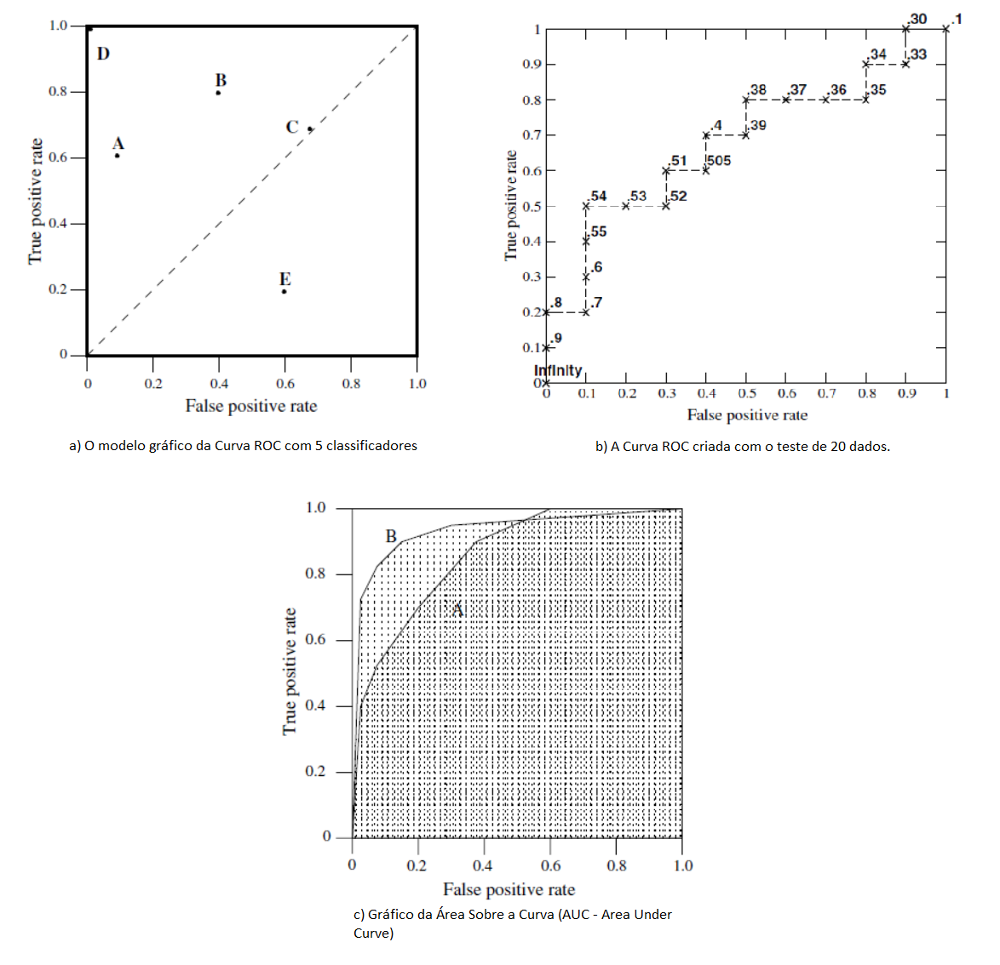
<p class="caption">(\#fig:curvaroc)Curva ROC</p>
</div>
Fonte: Adaptado de @Fawcett2006.

A Figura \@ref(fig:curvaroc)b mostra a formação da curva ROC para um teste com 20 instâncias, uma amostra pequena servindo portanto de exemplificação da sua criação. Para isto, o modelo de regressão logística é rodado randomicamente e a predição resultante é comparada com o valor real da variável dependente. O ponto de corte padrão, como visto anteriormente, é o valor de 0,5: acima deste valor, a predição é classificada como 1 e, abaixo dele 0. Na Figura \@ref(fig:curvaroc)b, a primeira predição foi 0,9 e a segunda 0,8 sendo que como estão mais perto do eixo X do gráfico, representam predições acertadas. Já para predições que não foram acertadas (como no exemplo as predições 0,7 e 0,54 por exemplo) a curva caminha para a direita. A lógica se mantém até o final da elaboração da curva.

Já na Figura \@ref(fig:curvaroc)c é demonstrada a elaboração do conceito da Área sobre a Curva ROC (AUC - Area Under the ROC Curve), que objetiva comparar os classificadores a partir da parformance da curva em um único valor escalar [@Fawcett2006]. Este indicador representa a probabilidade de que o classificador efetue predições randômicas na instância positiva melhor do que na instância negativa.
O indicador AUC sempre terá seu valor entre 0 e 1, sendo que quanto maior, melhor e nunca um classificador realístico deve estar abaixo de 0,5. @Hosmer2000 sugere a utilização de AUC acima de 0,7 como aceitável. Como exemplo, a Figura \@ref(fig:curvaroc)c mostra que a curva ROC B tem uma melhor capacidade preditiva que a curva A.

Seguem os passos para elaboração da curva ROC.


- Passo 1:


`require(pROC)`

`roc1=plot.roc(chd$CHD,fitted(m1))`


- Passo 2:


```r
plot(roc1,
     print.auc=TRUE, 
     auc.polygon=TRUE, 
     grud=c(0.1,0.2),
     grid.col=c("green","red"), 
     max.auc.polygon=TRUE, 
     auc.polygon.col="lightgreen", 
     print.thres=TRUE)
```

<div class="figure" style="text-align: center">

<p class="caption">(\#fig:roc)Curva Roc</p>
</div>


### O teste Hosmer e Lemeshow

O teste de Hosmer e Lemeshow é utilizado para demonstrar a qualidade do ajuste do modelo, ou seja, se o modelo pode explicar os dados observados. Para este teste, os dados são divididos de acordo com as probabilidades previstas em 10 grupos iguais, sendo que os números previstos e os reais são comparados com a estatística do qui-quadrado. @Hair2009 sugerem um tamanho de amostra de pelo menos 50 casos para a realização deste teste.

A hipótese nula H${_0}$ do qui-quadrado (`p=0,05`) deste teste é a de que as proporções observadas e esperadas são as mesmas ao longo da amostra. Abaixo segue a estrutura do teste, sendo que o modelo apresenta dificuldade de ajuste em função de que rejeita a hipótese nula a *p=0,05*.


```r
require(ResourceSelection)
hl=hoslem.test(chd$CHD,fitted(m1),g=10)
hl
```

```

	Hosmer and Lemeshow goodness of fit (GOF) test

data:  chd$CHD, fitted(m1)
X-squared = 100, df = 8, p-value <2e-16
```


### Pseudo R$^2$

Semelhante ao coeficiente de determinação R${^2}$ da regressão múltipla, a medida de pseudo R${^2}$ representam o ajuste geral do modelo proposto. Sua interpretação, portanto, é semelhante à regressão múltipla. Abaixo segue o cálculo do pseudo R${^2}$:

$$
R{^2}_{LOGIT} = \frac{-2LL_{nulo}-(-2LL_{modelo})}{-2LL_{nulo}}
$$
Lembrando que o valor -2LL representa -2 vezes o logaritmo do valor de verossimilhança, onde a verossimilhança do modelo nulo é comparado com o modelo completo. Abaixo mostra-se o código para calcular os indicadores, sendo que constam as medidas de pseudo R${^2}$ estipuladas por Cox e Snell, Nagelkerke e McFadden.


```r
require(modEvA)
RsqGLM(m1)
```

```
$CoxSnell
[1] 0.2541

$Nagelkerke
[1] 0.341

$McFadden
[1] 0.2145

$Tjur
[1] 0.2706

$sqPearson
[1] 0.2726
```


## Regressão Logística Múltipla


O exemplo abaixo abordado foi extraído de @Torres-Reyna2014, onde observa-se o banco de dados criado chamado `mydata`, possuindo as variáveis`country`,`year`,`y`,`y_bin`,`x1`,`x2`,`x3` e`opinion`. A variável dependente é `y_bin`, da qual foi categorizada entre 0 e 1 conforme a ocorrência de valores negativos em`y`. As variáveis independentes do modelo serão`x1`,`x2`e`x3`.


```r
require(haven)
```

```
Carregando pacotes exigidos: haven
```

```r
mydata <- read_dta("http://dss.princeton.edu/training/Panel101.dta") 
summary(mydata)
```

```
    country       year            y                 y_bin           x1        
 Min.   :1   Min.   :1990   Min.   :-7.86e+09   Min.   :0.0   Min.   :-0.568  
 1st Qu.:2   1st Qu.:1992   1st Qu.: 2.47e+08   1st Qu.:1.0   1st Qu.: 0.329  
 Median :4   Median :1994   Median : 1.90e+09   Median :1.0   Median : 0.641  
 Mean   :4   Mean   :1994   Mean   : 1.85e+09   Mean   :0.8   Mean   : 0.648  
 3rd Qu.:6   3rd Qu.:1997   3rd Qu.: 3.37e+09   3rd Qu.:1.0   3rd Qu.: 1.096  
 Max.   :7   Max.   :1999   Max.   : 8.94e+09   Max.   :1.0   Max.   : 1.446  
       x2               x3            opinion    
 Min.   :-1.622   Min.   :-1.165   Min.   :1.00  
 1st Qu.:-1.216   1st Qu.:-0.079   1st Qu.:1.00  
 Median :-0.462   Median : 0.514   Median :2.50  
 Mean   : 0.134   Mean   : 0.762   Mean   :2.44  
 3rd Qu.: 1.608   3rd Qu.: 1.155   3rd Qu.:3.00  
 Max.   : 2.530   Max.   : 7.169   Max.   :4.00  
```


Utiliza-se uma função para Modelos Lineares Generalizados (glm - em inglês Generalized Linear Models), determinando a variável dependente (y_bin), as variáveis independentes `(x1+x2+x3)`, a base de dados a ser utilizada `(data=mydata)` e a família dos modelos `(family = binomial(link="logit"))`.

Abaixo os resultados da estimação do modelo utilizando o comando `summary`. Observa-se que os valores `estimados` mostram os coeficientes em formato logarítmo de chances. Assim, quando x3 eleva-se em 1 (uma) unidade, o log das chances esperado para x3 altera-se em 0,7512. Neste ponto, observa-se que as três variáveis independentes possuem efeitos positivos para determinação das chances do preditor ser igual a 1, caso contrário constariam com sinal negativo. A coluna $Pr(>|z|)$ traz os p-valores das variáveis indicando o teste da hipótese nula. Como resultado a variável x3 revelou significância estatística a 10\% ($<$0,10), no entanto o valor usual para considerá-la estatísticamente significante é 5\% (0,05). Para fins de explanação do modelo, neste trabalho, serão efetuadas as demais análises do modelo de forma explicativa.


```r
logit=glm(y_bin~x1+x2+x3, data=mydata, family = binomial(link="logit"))
summary(logit)
```

```

Call:
glm(formula = y_bin ~ x1 + x2 + x3, family = binomial(link = "logit"), 
    data = mydata)

Deviance Residuals: 
   Min      1Q  Median      3Q     Max  
-2.028   0.235   0.554   0.702   1.084  

Coefficients:
            Estimate Std. Error z value Pr(>|z|)  
(Intercept)    0.426      0.639    0.67    0.505  
x1             0.862      0.784    1.10    0.272  
x2             0.367      0.308    1.19    0.234  
x3             0.751      0.455    1.65    0.099 .
---
Signif. codes:  0 '***' 0.001 '**' 0.01 '*' 0.05 '.' 0.1 ' ' 1

(Dispersion parameter for binomial family taken to be 1)

    Null deviance: 70.056  on 69  degrees of freedom
Residual deviance: 65.512  on 66  degrees of freedom
AIC: 73.51

Number of Fisher Scoring iterations: 5
```


<!--
%Uma forma eficiente para construção da tabela com os resultados do modelo é a utilização do pacote \textbf{stargazer}, sendo que após instalado (install.packages("stargazer")),  utiliza-se o comando \textbf{stargazer(logit, title="seu título")} ou \textbf{stargazer(logit, title="seu título", type="text")} (plotando assim os resultados diretamente no console do RStudio) para plotagem dos resultados, como segue:
-->


```r
require(stargazer)
stargazer(logit, title="Resultados",type = "text")
```

```

Resultados
=============================================
                      Dependent variable:    
                  ---------------------------
                             y_bin           
---------------------------------------------
x1                           0.862           
                            (0.784)          
                                             
x2                           0.367           
                            (0.308)          
                                             
x3                          0.751*           
                            (0.455)          
                                             
Constant                     0.426           
                            (0.639)          
                                             
---------------------------------------------
Observations                  70             
Log Likelihood              -32.760          
Akaike Inf. Crit.           73.510           
=============================================
Note:             *p<0.1; **p<0.05; ***p<0.01
```


A razão de chances (OR - odds ratio em inglês) estimada no modelo terá de ser transformada por estar apresentada na forma logarítma conforme o modelo de regressão logística o estima. Assim, utiliza-se o pacote `mfx` para efetuar esta transformação para todo o modelo de forma automatizada `(logitor(y_bin~x1+x2+x3,data=mydata))`:


```r
require(mfx)
logitor(y_bin~x1+x2+x3,data=mydata)
```

```
Call:
logitor(formula = y_bin ~ x1 + x2 + x3, data = mydata)

Odds Ratio:
   OddsRatio Std. Err.    z P>|z|  
x1     2.367     1.856 1.10 0.272  
x2     1.443     0.445 1.19 0.234  
x3     2.120     0.964 1.65 0.099 .
---
Signif. codes:  0 '***' 0.001 '**' 0.01 '*' 0.05 '.' 0.1 ' ' 1
```

O resultado acima evidencia que para uma alteração em 1 (uma) unidade em x3, a chance de que y seja igual a 1 aumenta em 112\% ((2,12-1)*100). Dito de outra forma, a chance de y=1 é 2,12 vezes maior quando x3 aumenta em uma unidade (sendo que aqui mantêm-se as demais variáveis independentes constantes).

Como visto, para cada variação unitária em x3 o log das chances varia 0,7512. É possível estimar, portanto, a alteração das chances em função das médias dos valores de cada variável x1 e x2, e utilizar como exemplo os valores de 1, 2 e 3  para x3, para assim alcançar os preditores do log das chances nesta simulação, como segue abaixo:


Para facilitar a interpretação do modelo, se torna mais fácil depois de transformado a sua exponenciação dos coeficientes logísticos utilizando o comando `exp(coef(logit))`. Desta forma, para cada incremento unitário em x2 e mantendo as demais variáveis constantes, conclui-se que é 1,443 vezes provável que y seja igual a 1 em oposição a não ser (igual a zero), ou seja, as chances aumentam em 44,30\%.


```r
exp(coef(logit))
```

```
(Intercept)          x1          x2          x3 
      1.531       2.367       1.443       2.120 
```


O **intervalo de confiança** do modelo pode ser exposto utilizando o comando `confint` para os coeficientes estimados, como segue abaixo:


```r
exp(cbind(OR=coef(logit), confint(logit)))
```

```
               OR  2.5 % 97.5 %
(Intercept) 1.531 0.4387  5.625
x1          2.367 0.5129 11.675
x2          1.443 0.8041  2.738
x3          2.120 1.0039  5.719
```


A partir do modelo logístico, podemos realizar **predições das probabilidades** de se encontrar o resultado y=1 conforme visto acima. Para isto, como exercício utilizaremos as médias das observações de cada variável independente do modelo. Em primeiro lugar deve ser criado um data.frame com os valores médios, como segue:


```r
allmean = data.frame(x1=mean(mydata$x1),
                     x2=mean(mydata$x2),
                     x3=mean(mydata$x3))
allmean
```

```
     x1     x2     x3
1 0.648 0.1339 0.7619
```

Utiliza-se o comando `predict()` para predição do modelo, como segue abaixo, informando o objeto criado com a equação do modelo (logit), a base de dados com as condições dos valores médios (allmean) e o tipo de teste requerido ("response") para predizer as probabilidades. Como resultado, o modelo informa que constando os valores médios das variáveis independentes, obtêm-se a probabilidade de 83\% em y se constituir igual a 1.


```r
allmean$pred.prob = predict(logit, newdata=allmean, type="response")
allmean
```

```
     x1     x2     x3 pred.prob
1 0.648 0.1339 0.7619    0.8329
```


### Método Stepwise

O método Stepwise auxilia o pesquisador em selecionar as variáveis importantes ao modelo, sendo que podem ser utilizadas nas direções "both", "backward", "forward". Este método, por sua vez, utiliza o Critério de Informação de Akaike (AIC - Akaike Information Criterion) na combinação das variáveis dos diversos modelos simulados para selecionar o modelo mais ajustado. Quanto menor o AIC, melhor o ajuste do modelo. O AIC é calculado da seguitne forma:

$$
AIC = -2log(L_{p})+2[(p+1)+1]
$$
onde $L_{p}$ é a função de máxima verossimilhança e $p$ é o número de variáveis explicativas do modelo. Segue o código para execução no console:


```r
step(logit, direction = 'both')
```

```
Start:  AIC=73.51
y_bin ~ x1 + x2 + x3

       Df Deviance  AIC
- x1    1     66.7 72.7
- x2    1     67.0 73.0
<none>        65.5 73.5
- x3    1     69.4 75.4

Step:  AIC=72.74
y_bin ~ x2 + x3

       Df Deviance  AIC
- x2    1     67.3 71.3
<none>        66.7 72.7
+ x1    1     65.5 73.5
- x3    1     70.0 74.0

Step:  AIC=71.33
y_bin ~ x3

       Df Deviance  AIC
<none>        67.3 71.3
- x3    1     70.1 72.1
+ x2    1     66.7 72.7
+ x1    1     67.0 73.0
```

```

Call:  glm(formula = y_bin ~ x3, family = binomial(link = "logit"), 
    data = mydata)

Coefficients:
(Intercept)           x3  
      1.134        0.487  

Degrees of Freedom: 69 Total (i.e. Null);  68 Residual
Null Deviance:	    70.1 
Residual Deviance: 67.3 	AIC: 71.3
```

### VIF - Variance Inflation Factor

Os problemas de multicolinearedade nos modelos de regressão, ou seja, as relações entre as variáveis do modelo, podem prejudicar a capacidade preditiva do mesmo. Nas palavras de @Hair2009 [p. 191], "multicolinearidade cria variância “compartilhada” entre variáveis, diminuindo assim a capacidade de prever a medida dependente, bem como averiguar os papéis relativos de cada variável independente".
Para resolver esta questão, utiliza-se o teste do fator de inflação da variância (VIF - Variance Inflation Factor), índice o qual não deve ficar abaixo de 10 para representar baixo problema de multicolinearidade segundo @Rawlings1998.


```r
require(faraway)
vif(logit)
```

```
    x1     x2     x3 
 9.292 12.318 29.860 
```


## Regressão Logística Múltipla com variável categórica


Agora segue um exemplo de regressão logística utilizando uma variável dependente categórica juntamente com variáveis numéricas. Trata-se de uma base de dados em que o interesse é descobrir a probabilidade de um aluno ser admitido no vestibular com base no ranqueamento de escola em que estudou no ensino médio, bem como nas notas do aluno nas provas do Gpa (Grade Point Average - uma nota de performance dos alunos nos Estados Unidos) e do Gre (Graduate Record Examinations - exame padrão que qualifica o estudante para o ensino superior nos Estados Unidos). Seguem as variáveis.


- **admin**: Variável dependente = 0 (não admitido) e 1 (admitido)
- **Rank**: Variável independente = ranking da escola de proveniência do candidato
- **Gre**: Variável independente = exames prévios do candidato.
- **Gpa**: Variável independente = exames prévios do candidato.

Abaixo seguem os resultados do modelo, partindo-se do carregamento dos dados. É observado que as variáveis **gre** e **gpa** obtiveram significância estatística em 10\%, bem como rank2, já rank3 e rank4 obtiveram `p=0,001`. A variância do modelo nulo
ficou em 499,98 e com a inclusão das variáveis ao modelo baixou para 458,52, o que mostra que contribuíram para explicação da variável dependente.


```r
# Carregando o arquivo
require(readr)
binary <- read_csv("http://www.karlin.mff.cuni.cz/~pesta/prednasky/NMFM404/Data/binary.csv")

# Transformando a variável rank em categórica
binary$rank <- factor(binary$rank)

# Determinando a regressão
mylogit <- glm(admit ~ gre + gpa + rank, data = binary, 
               family = binomial(link="logit"))

# Resultado
summary(mylogit)
```

```

Call:
glm(formula = admit ~ gre + gpa + rank, family = binomial(link = "logit"), 
    data = binary)

Deviance Residuals: 
   Min      1Q  Median      3Q     Max  
-1.627  -0.866  -0.639   1.149   2.079  

Coefficients:
            Estimate Std. Error z value Pr(>|z|)    
(Intercept) -3.98998    1.13995   -3.50  0.00047 ***
gre          0.00226    0.00109    2.07  0.03847 *  
gpa          0.80404    0.33182    2.42  0.01539 *  
rank2       -0.67544    0.31649   -2.13  0.03283 *  
rank3       -1.34020    0.34531   -3.88  0.00010 ***
rank4       -1.55146    0.41783   -3.71  0.00020 ***
---
Signif. codes:  0 '***' 0.001 '**' 0.01 '*' 0.05 '.' 0.1 ' ' 1

(Dispersion parameter for binomial family taken to be 1)

    Null deviance: 499.98  on 399  degrees of freedom
Residual deviance: 458.52  on 394  degrees of freedom
AIC: 470.5

Number of Fisher Scoring iterations: 4
```

Utilizando o teste de análise de variância `anova` pode-se observar a variância com o modelo nulo (500) e à medida que as variáveis explicativas foram sendo incluídas, estas reduziram a variância do modelo para 459, contribuindo para o modelo.


```r
anova(mylogit, test = "Chisq")
```

```
Analysis of Deviance Table

Model: binomial, link: logit

Response: admit

Terms added sequentially (first to last)

     Df Deviance Resid. Df Resid. Dev Pr(>Chi)    
NULL                   399        500             
gre   1    13.92       398        486  0.00019 ***
gpa   1     5.71       397        480  0.01685 *  
rank  3    21.83       394        459  7.1e-05 ***
---
Signif. codes:  0 '***' 0.001 '**' 0.01 '*' 0.05 '.' 0.1 ' ' 1
```

Caso seja interessante comparar diversos modelos de regressão com variáveis explicativas distintas, estes podem ser comparados no teste de variância `anova`. Utilizando a função `update` pode ser criada uma nova regressão com base na regressão anterior (`mylogit`) e é excluído do modelo a variável `gre` para exemplificar. Após, é efetuado novamente o teste `anova`, agora comparando os dois modelos, como segue abaixo. Evidencia-se que a exclusão da variável `gre` causou elevaçãod a variância do modelo para 463, piorando portanto a capacidade do modelo pois espera-se sempre reduções na sua variância.


```r
# Criação de novo modelo com base no anterior
mylogit2=update(mylogit,~. - gre)
# 
anova(mylogit,mylogit2, test = "Chisq")
```

```
Analysis of Deviance Table

Model 1: admit ~ gre + gpa + rank
Model 2: admit ~ gpa + rank
  Resid. Df Resid. Dev Df Deviance Pr(>Chi)  
1       394        459                       
2       395        463 -1    -4.36    0.037 *
---
Signif. codes:  0 '***' 0.001 '**' 0.01 '*' 0.05 '.' 0.1 ' ' 1
```


Voltando ao modelo determinado anteriormente (`mylogit`), observa-se que os parâmetros da regressão logística proposta utilizando todas as variáveis foram assim determinados:


$$
ln(P=Y) = 
-3,98998 + 0.00226gre + 0,80404gpa -0,67544rank2 -1,34020rank3 -1,55146rank4
$$


Determinam-se os coeficientes exponenciados (as razões de chance) para cada variável do modelo, bem como seus intervalos de confiança:


```r
exp(cbind(OR = coef(mylogit), confint(mylogit)))
```

```
                OR    2.5 % 97.5 %
(Intercept) 0.0185 0.001889 0.1665
gre         1.0023 1.000138 1.0044
gpa         2.2345 1.173858 4.3238
rank2       0.5089 0.272290 0.9448
rank3       0.2618 0.131642 0.5115
rank4       0.2119 0.090716 0.4707
```

A leitura dos resultados, para as variáveis numéricas continua sendo a mesma. Com relação ao resultado para a variável **gre**, para cada aumento unitário nesta variável, mantendo-se as demais constantes, elevam-se em 0,23\% ((1,0023-1)\*100) as chances de que o aluno seja aprovado no vestibular. Já para a cada variação unitária na variável **gpa**, aumentam em 123,45\% ((2,2345-1)*100). 
Dito de outra forma, para cada elevação em **gpa** aumentam 2,2345 vezes as chances em ser aprovado no vestibular. Tais resultados vão de encontro ao conceito teórico de que quanto melhor a nota do aluno em exame prévios maiores as chances de este aluno passar no vestibular.

Outra questão é sobre o *ranking* das escolas que os alunos estudaram. Será que aqueles que estudaram em escolas melhores ranqueadas possuem mais chances de passar no vestibular? A variável **rank** traz esta análise, sendo que como é uma variável categórica (pois retoma as categorias de 1 a 4), as comparações das chances de que o aluno passe no vestibular são comparadas com a escola de *ranking* 1. 

Desta forma, em sendo o aluno proveniente de uma escola de *ranking* 2, diminuem-se as chances em 49,11\% ((0,5089-1)$*$100) de que o aluno passe no vestibular. Já para os alunos que estudaramem uma escola de *ranking* 3 tem 73,82\% ((0,2618-1)\*100) menos chances de passar no vestibular. 
Pioram ainda mais as chances de passar no vestibular daqueles alunos que estudaram em uma escola de *ranking* 4: diminuem-se em 78,81\% as chances de que estes aluno passe no vestibular, mantidas as demais veriáveis.


**Predição das probabilidades**: a partir da equação de regressão logística auferida neste exemplo, qual é a probabilidade de que um aluno que tirou nota no **gre** de 700, no **gpa** de 3,67 e estudou em uma escola de *ranking* 1 passe no vestibular?
Nota-se que a probabilidade de que este aluno passe no vestibular é de 63,32\%. Segue a predição para estas variáveis:


```r
pred=data.frame(gre=700,
                gpa=3.67,
                rank=factor(1)
                )
pred$prob=predict(mylogit, newdata=pred, type="response")
pred
```

```
  gre  gpa rank   prob
1 700 3.67    1 0.6332
```

Comparando com um aluno que tirou as mesmas notas no **gre** e **gpa**, mas que estudou em uma escola *ranking* 4:


```r
pred=data.frame(gre=700,
                gpa=3.67,
                rank=factor(4)
                )
pred$prob=predict(mylogit, newdata=pred, type="response")
pred
```

```
  gre  gpa rank   prob
1 700 3.67    4 0.2679
```


Agora será efetuada a predição comparando-se os *rankings* das escolas. No exemplo abaixo, é criada uma base de dados com as notas médias dos alunos nas variáveis **gre** e **gpa**, intercalando com todos os *rankings* das escolas onde estudaram. Após criar a tabela, esta é unida com as colunas de predição dos valores da equação. São renomeadas as variáveis de *fit* para *prob* e *se.fit* para *se.prob*, no primeiro caso pois obteiveram-se as probabilidades de cada caso e no segundo caso incluiu-se o erro padrão (*se: standart error*) desta probabilidade. Com este erro padrão calculou-se os limites inferior (*LL: low level*) e superior (*UL: upper level *) no intervalo de confiança de 95\%.


```r
# Criação da tabela
novosdados=with(binary,
                data.frame(gre=mean(gre),
                           gpa=mean(gpa),
                           rank=factor(1:4)))

# Incluindo a predição dos valores
novosdados=cbind(novosdados,predict(mylogit, 
                                    newdata=novosdados,
                                    type="response",
                                    se.fit=TRUE))
# Renomeando as variáveis
names(novosdados)[names(novosdados)=='fit']="prob"
names(novosdados)[names(novosdados)=='se.fit']="se.prob"

# Estimando os intervalos de confiança

novosdados$LL=novosdados$prob-1.96*novosdados$se.prob
novosdados$UL=novosdados$prob+1.96*novosdados$se.prob

# Vizualização dos dados
novosdados
```

```
    gre  gpa rank   prob se.prob residual.scale      LL     UL
1 587.7 3.39    1 0.5166 0.06632              1 0.38662 0.6466
2 587.7 3.39    2 0.3523 0.03978              1 0.27431 0.4303
3 587.7 3.39    3 0.2186 0.03825              1 0.14364 0.2936
4 587.7 3.39    4 0.1847 0.04864              1 0.08934 0.2800
```


```r
require(ggplot2)
ggplot(novosdados, aes(x=rank,y=prob))+
  geom_errorbar(aes(ymin=LL, ymax=UL), width=0.2,lty=1,lwd=1,col="red")+
  geom_point(shape=18, size=5, fill="black")+
  scale_x_discrete(limits=c("1","2","3","4"))+
  labs(title="Probabilidades preditas", x="Ranking",y="Pr(y=1)")
```

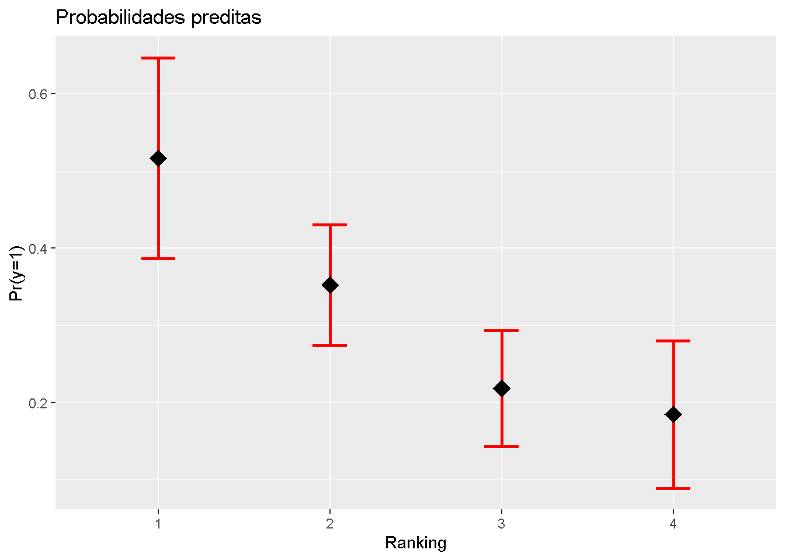


<!--
\printbibliography[segment=\therefsegment,heading=subbibliography]
-->
<!--
## Exemplos de trabalhos que utilizaram regressão logística

- **Uso da regressão logística na estimação da probabilidade de reincidência de jovens infratoras**. <http://bdm.unb.br/bitstream/10483/13133/1/2015_FelipeGomesRibeiro.pdf>

- **Técnicas de Regressão Logística aplicada à Análise Ambiental**
<http://www.uel.br/revistas/uel/index.php/geografia/article/download/6878/9676>

- **Reincidência penal: uma análise a partir da e"conomia do crime" para subsidiar decisões judiciais.** <http://177.101.17.124/index.php/sociais/article/download/6029/4134>
-->

## Exercícios
<!--

reinc=sample(x = c(1, 0), size = 500, replace = TRUE)
raca=sample(x = c("branca", "outro"), size = 500, replace = TRUE)
idade=sample(x = 18:80, size = 500, replace = TRUE)
sexo=sample(x = c("M", "F"), size = 500, replace = TRUE)
crime=sample(x = c("transito", "drogas","roubo","outros"), size = 500, replace = TRUE)
temporeclusao=sample(x = 1:10, size = 500, replace = TRUE)
condicionalcrime=data.frame(reinc,raca,idade,sexo,crime,temporeclusao)
View(condicionalcrime)
summary(condicionalcrime)
glm(reinc~., data=condicionalcrime)
summary(glm(reinc~., data=condicionalcrime))
step(glm(reinc~., data=condicionalcrime),direction = 'both')
-->

**1.** O Titanic foi um famoso navio britânico construído a partir de março de 1909 e lançado ao mar em maio de 1911. Em sua viagem inaugural em 10 de abril de 1912, cujo objetivo era partir de Southampton para Nova Iorque passando pela França e Irlanda, colidiu com um iceberg às 23h40min do dia 14 de abril. Baixe os dados do acidente em 
<https://vincentarelbundock.github.io/Rdatasets/csv/COUNT/titanic.csv>. Esta base de dados possui as seguintes informações:

- **survived**: informa se o tripulante sobreviveu ou não ("yes", "no");
- **class**: representa a classe em que viajavam os tripulantes ("1st class", "2nd class" e "3rd class").
- **age**: variável que separa entre as crianças ("child") e adultos ("adults")
- **sex**: fator com o sexo do tripulante ("women", "man")

**1.1.** Importe os dados para um objeto denominado *titanic* (lembre-se de determinar que as variávei sejam fatores). 

**1.2** Crie uma nova a variável *sobreviveu* a partir de *survived* com fatores binários 0 e 1 (1 para os sobreviventes).

**1.3**  Crie um modelo de regressão logística para descobrir a probabilidade de sobrevivência dos tripulantes (variável dependente `sobreviveu`) em relação às variáveis `class`, `age`, `sex`. Utilize o comando `summary` com o modelo. Declare a significância estatística das variáveis.

**1.4** Com base na resposta anterior, disserte sobre a direção do sinal do *log* da probabilidade de sobrevivência com relação à cada variável independente do modelo. Quem estava na primeira classe tinha maiores chances de sobrevivência, ou na terceira? Adultos ou crianças tinham melhores chances de sobreviver, homens ou mulheres?

**1.5** Transforme os coeficientes encontrados em Razão de Chances (OR - Odds Ratio), bem como verifique os intervalos de confiança.


**1.6** Com base na resposta anterior, disserte sobre a razão das chances (OR) de cada variável independente do modelo.

**1.7** Efetue a predição da probabilidade de sobrevivência de uma tripulante do sexo feminino, adulta e que viajava na primeira classe do navio.


**1.8** Efetue a predição da probabilidade de sobrevivência de um tripulante do sexo masculino, adulto e que viajava na terceira classe do navio.


**1.9** Crie a matriz de confusão e a Curva ROC para o modelo, avaliando seus dados.

**1.10** Efetue o teste de Hosmer e Lemeschow para o modelo.

**1.11** Encontre as medidas de pseudo R$^2$.

**1.12** Utilize o método **Stepwise** (*direction='both'*) no modelo completo e avalie se as variáveis devem permanecer no modelo ou alguma deve sair.


# Regressão de Poisson

*Felipe Micail da Silva Smolski*

\begin{flushright}
\emph{}
\end{flushright}


O modelo de Regressão de Poisson é aquele mais adequado quando os dados das variáveis dependentes são contáveis. Em muitos casos é de interesse do pesquisador modelar e estimar tais episódios. O número de alunos matriculados, a quantidade de visitantes de um parque, o número de multas efetuadas em determinado ano, o número de produtos registrados em determinado ano, etc. Em todos estes casos, a variável resposta é discreta e assume um número finito de valores.

## O modelo

A distribuição de *Poisson* é dada por [@Gujarati2011]:

$$
f(Y_i) = \frac{\mu^{Y}e^{-\mu}}{Y!}
$$
sendo $Y=0,1,2,...$ e $f(Y)$ é a probabilidade de $Y$ assumir valores inteiros não negativos e $Y!$ (fatorial de Y) representa $Y! = Y \times (Y-1) \times (Y-2) \times 2 \times 1$. Ainda:

$$
E(Y) = \mu
$$
$$
var(Y) = \mu
$$

A distribuição de Poisson tem a variância igual à sua média. O modelo de regressão de Poisson, portanto, é dado por:

$$
Y_i = E(Y_i) +\mu_i = \mu_i + u_i
$$
assim os $Y$ se distribuem independentemente como variáveis de Poisson aleatórias com média $\mu_i$ para cada indivíduo [@Gujarati2011] expresso:

$$
\mu_i = E(Y_i) = \beta_{i} + \beta _{2} X_{2i} + \beta_{3} X_{3i} + \dots + \beta_{k} X_{ki}
$$

onde X são as variáveis que podem afetar o valor médio. Para que a equação seja estimada, representa-se o modelo:

$$
Y_i = \frac{\mu^{Y}e^{-\mu}}{Y!} + u_i
$$

Assim, o modelo de regressão resultante não será linear nos parâmetros. 


## Estimando os parâmetros do modelo

No exemplo abaixo consta uma base de dados que será denominada `caranguejo`, derivada de @penn2018. Este estudo buscou investigar os fatores que afetam a quantidade de caranguejos machos (satélites) residindo perto dos caranguejos fêmeas. As variáveis explicativas: 

- **(Sa)** número de satélites (variável dependente);
- **(C)** cor do caranguejo fêmea;
- **(S)** condição da coluna;
- **(Wt)** peso;
- **(W)** largura da carapaça.

Seguem os procedimentos para importação da base de dados do exemplo:


```r
library(readr)
caranguejo <- read_table2("https://goo.gl/Wvvnrf", 
    col_names = FALSE)
colnames(caranguejo)=c("Obs","C","S","W","Wt","Sa")
summary(caranguejo)
```

```
      Obs            C              S              W              Wt      
 Min.   :  1   Min.   :1.00   Min.   :1.00   Min.   :21.0   Min.   :1.20  
 1st Qu.: 44   1st Qu.:2.00   1st Qu.:2.00   1st Qu.:24.9   1st Qu.:2.00  
 Median : 87   Median :2.00   Median :3.00   Median :26.1   Median :2.35  
 Mean   : 87   Mean   :2.44   Mean   :2.49   Mean   :26.3   Mean   :2.44  
 3rd Qu.:130   3rd Qu.:3.00   3rd Qu.:3.00   3rd Qu.:27.7   3rd Qu.:2.85  
 Max.   :173   Max.   :4.00   Max.   :3.00   Max.   :33.5   Max.   :5.20  
       Sa       
 Min.   : 0.00  
 1st Qu.: 0.00  
 Median : 2.00  
 Mean   : 2.92  
 3rd Qu.: 5.00  
 Max.   :15.00  
```

Abaixo o histograma da distribuição do número de satélites (variável dependente) da base de dados:


```r
hist(caranguejo$Sa)
```

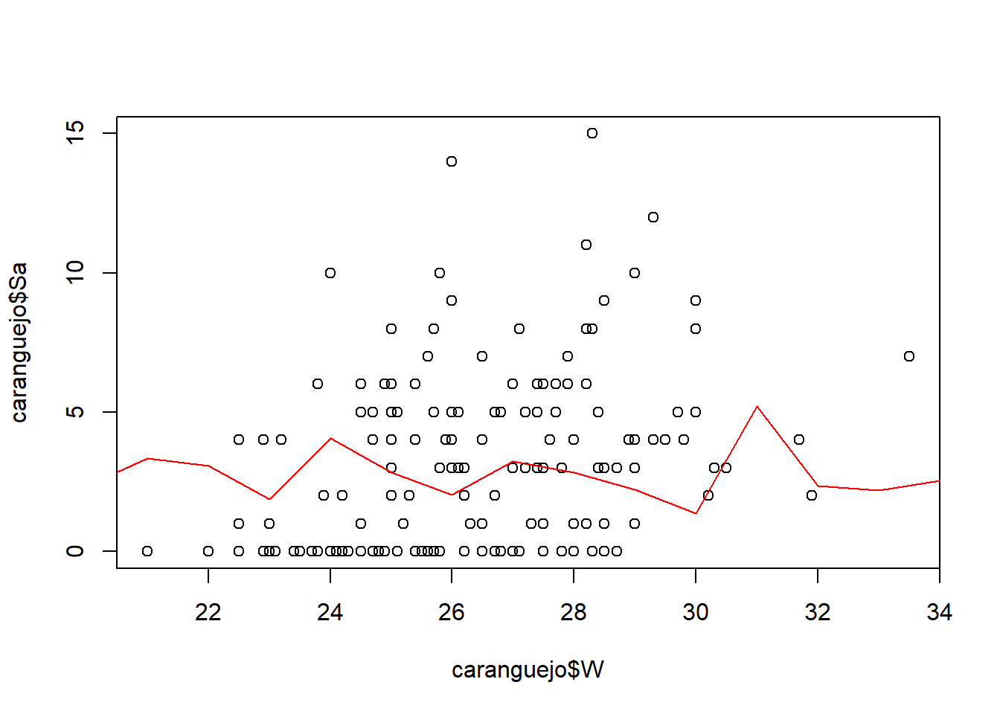

Relacionando a quantidade de satélites (Sa) com a largura da carapaça:


```r
plot(caranguejo$W,caranguejo$Sa)
```


Para criação da regressão de Poisson utiliza-se a função já conhecida `glm()`, sendo que em `family` é determinado o tipo de análise desejada ("poisson"):


```r
regpoisson=glm(Sa~W, family="poisson", data=caranguejo)
summary(regpoisson)
```

```

Call:
glm(formula = Sa ~ W, family = "poisson", data = caranguejo)

Deviance Residuals: 
   Min      1Q  Median      3Q     Max  
-2.853  -1.988  -0.493   1.097   4.922  

Coefficients:
            Estimate Std. Error z value Pr(>|z|)    
(Intercept)   -3.305      0.542   -6.09  1.1e-09 ***
W              0.164      0.020    8.22  < 2e-16 ***
---
Signif. codes:  0 '***' 0.001 '**' 0.01 '*' 0.05 '.' 0.1 ' ' 1

(Dispersion parameter for poisson family taken to be 1)

    Null deviance: 632.79  on 172  degrees of freedom
Residual deviance: 567.88  on 171  degrees of freedom
AIC: 927.2

Number of Fisher Scoring iterations: 6
```

O modelo estimado:

$$
log(\hat\mu {/t}) = -3.30476 + 0,16405 W_i
$$
ou

$$
E(Y)= e^{-3.30476} + e^{0,16405 W_i}
$$


A leitura do resultado da regressão em geral se assemelha com os modelos de regressão linear e múltipla. Os resultados mostram que a largura da carapaça (W) tem relação positiva com o número de satélites (Sa) em volta do caranguejo fêmea, possuindo significância estatística a $p=0,001$. 

A interpretação do parâmetro $0,16405W_i$:


- **(a)** como o parâmetro $\beta_1$ é positivo, há uma relação positiva entre oa largura da carapaça (W) e o número de satélites (sa) esperados.

- **(b)** exp(0,16405) = 1,178273. Logo, para cada elevação unitária na largura da carapaça (W) dos caranguejos, eleva-se em 1,178273 vezes o número de satélites (Sa).

Teste de dispersão:


```r
require(AER)
dispersiontest(regpoisson)
```

```

	Overdispersion test

data:  regpoisson
z = 5.6, p-value = 1e-08
alternative hypothesis: true dispersion is greater than 1
sample estimates:
dispersion 
     3.157 
```


- **(c)** O parâmetro de super-dispersão para esta equação é maior que 1. Sempre que for muito superior a 1 há vestígios de super-disposição no modelo.

Abaixo a análise de variância.  


```r
anova(regpoisson, test="Chisq")
```

```
Analysis of Deviance Table

Model: poisson, link: log

Response: Sa

Terms added sequentially (first to last)

     Df Deviance Resid. Df Resid. Dev Pr(>Chi)    
NULL                   172        633             
W     1     64.9       171        568  7.8e-16 ***
---
Signif. codes:  0 '***' 0.001 '**' 0.01 '*' 0.05 '.' 0.1 ' ' 1
```

Abaixo são incluídos os valores preditos `regpoisson$fitted.values` juntamente com os dados originais.


```r
print=data.frame(caranguejo, pred=(regpoisson$fitted.values))
head(print)
```

```
  Obs C S    W   Wt Sa  pred
1   1 2 3 28.3 3.05  8 3.810
2   2 3 3 26.0 2.60  4 2.613
3   3 3 3 25.6 2.15  0 2.447
4   4 4 2 21.0 1.85  0 1.150
5   5 2 3 29.0 3.00  1 4.274
6   6 1 2 25.0 2.30  3 2.217
```

É possível comparar a distribuição dos valores preditos decorrentes da utilização do modelo de regressão de Poisson com a amostra inicial da base de dados analisada:


```r
plot(caranguejo$W,caranguejo$Sa)
points(regpoisson$fitted.values,col='red', type = "l")
```

<div class="figure" style="text-align: center">
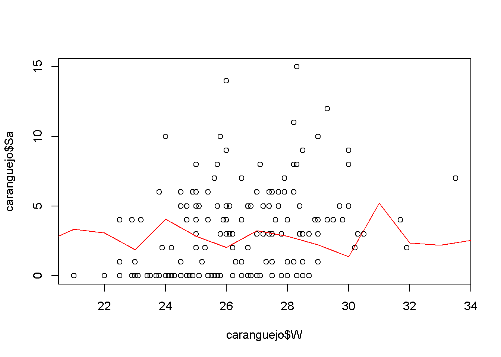
<p class="caption">(\#fig:unnamed-chunk-131)Valores ajustados e preditos do número de satélites (Sa) em função do tamanho da carapaça (W)</p>
</div>


No entanto, é possível melhorar a precisão do modelo de regressão utilizado, uma vez que os dados iniciais apresentam os casos individuais da amostra de cada caranguejo observado com suas respectivas características das variáveis independentes. Uma forma é agrupar os dados em intervalos da variável independente, contando os o número de casos (variável dependente) em cada intervalo. 

Foram determinados 8 intervalos ("Intervalo") conforme o tamanho da carapaça dos caranguejos. Contou-se o número de casos (variável "numcasos") de caranguejos em cada intervalo de tamanho da carapaça; o camanho médio da carapaça ("width") em cada intervalo e; o número total de satélites ("satotal") esperados em cada intervalo:


```r
Intervalo=c("<23,25", "23,25-24,25","24,25-25,25","25,25-26,25",
            "26,25-27,25","27,25-28,25","28,25-29,25",">29,25")
attach(caranguejo)
numcasos=list(length(subset(W, W <23.25)),
              length(subset(W, W >23.25 & W <24.25)),
              length(subset(W, W >24.25 & W <25.25)),
              length(subset(W, W >25.25 & W <26.25)),
              length(subset(W, W >26.25 & W <27.25)),
              length(subset(W, W >27.25 & W <28.25)),
              length(subset(W, W >28.25 & W <29.25)),
              length(subset(W, W >29.25)))
width=list(mean(subset(W, W <23.25)),
              mean(subset(W, W >23.25 & W <24.25)),
              mean(subset(W, W >24.25 & W <25.25)),
              mean(subset(W, W >25.25 & W <26.25)),
              mean(subset(W, W >26.25 & W <27.25)),
              mean(subset(W, W >27.25 & W <28.25)),
              mean(subset(W, W >28.25 & W <29.25)),
              mean(subset(W, W >29.25)))
satotal=list(sum(subset(Sa, W <23.25)),
              sum(subset(Sa, W >23.25 & W <24.25)),
              sum(subset(Sa, W >24.25 & W <25.25)),
              sum(subset(Sa, W >25.25 & W <26.25)),
              sum(subset(Sa, W >26.25 & W <27.25)),
              sum(subset(Sa, W >27.25 & W <28.25)),
              sum(subset(Sa, W >28.25 & W <29.25)),
              sum(subset(Sa, W >29.25)))
numcasos <- data.frame(matrix(unlist(numcasos), nrow=8, byrow=T),
                       stringsAsFactors=FALSE)
width <- data.frame(matrix(unlist(width), nrow=8, byrow=T),
                    stringsAsFactors=FALSE)
satotal <- data.frame(matrix(unlist(satotal), nrow=8, byrow=T),
                      stringsAsFactors=FALSE)

novosdados=data.frame(Intervalo,numcasos,round(width,2),satotal)

names(novosdados)=c("Intervalo","numcasos","width","satotal")
novosdados
```

```
    Intervalo numcasos width satotal
1      <23,25       14 22.69      14
2 23,25-24,25       14 23.84      20
3 24,25-25,25       28 24.77      67
4 25,25-26,25       39 25.84     105
5 26,25-27,25       22 26.79      63
6 27,25-28,25       24 27.74      93
7 28,25-29,25       18 28.67      71
8      >29,25       14 30.41      72
```

Segue a especificação deste novo modelo agrupado. Segundo @penn2018, utiliou-se o componente de ajuste da equação (`offset`) como o logarítmo do número de casos ("lcases"), como "o valor de ajuste 't' no modelo que representa o espaço fixo, neste caso o grupo (caranguejos com largura similar)". O resultado da nova regressão se mostra melhor ajustado, com redução do índice AIC:


```r
# Log do Número de Casos
lcases=log(numcasos) 
# Incluir a varíavel anterior no objeto novosdados
novosdados=data.frame(novosdados,lcases) 
names(novosdados)[5]="lcases"
model=glm(satotal~width, offset=lcases, family="poisson", data=novosdados)
summary(model)
```

```

Call:
glm(formula = satotal ~ width, family = "poisson", data = novosdados, 
    offset = lcases)

Deviance Residuals: 
   Min      1Q  Median      3Q     Max  
-1.533  -0.773  -0.345   0.712   1.039  

Coefficients:
            Estimate Std. Error z value Pr(>|z|)    
(Intercept)  -3.5355     0.5760   -6.14  8.4e-10 ***
width         0.1727     0.0212    8.13  4.1e-16 ***
---
Signif. codes:  0 '***' 0.001 '**' 0.01 '*' 0.05 '.' 0.1 ' ' 1

(Dispersion parameter for poisson family taken to be 1)

    Null deviance: 72.3772  on 7  degrees of freedom
Residual deviance:  6.5168  on 6  degrees of freedom
AIC: 56.96

Number of Fisher Scoring iterations: 4
```

A fórmula para esta nova regressão:

$$
log(\hat\mu/t)=-3.535 + 0,1727 width_i + log(t)
$$
Desta forma:

- **(a)** em conformidade com a equação anterior, o número esperado de satélites (satotal) cresce de acordo com o tamanho médio da carapaça dos caranguejos (width), pois o coeficiente é positivo.
- **(b)** como exp(0,1727)=1,188509, espera-se que para cada alteração unitária no tamanho médio da carapaça dos caranguejos (width) eleve-se em 1,188509 vezes o número esperado de satélites (satotal).

Teste de super-dispersão:


```r
require(AER)
dispersiontest(model)
```

```

	Overdispersion test

data:  model
z = -0.66, p-value = 0.7
alternative hypothesis: true dispersion is greater than 1
sample estimates:
dispersion 
    0.8273 
```

- **(c)** o tesde de superdispersão aprovou a hipótese nula ($p>0,05$) de que não há problemas de super-dispersão no modelo.


Abaixo a análise de variância:


```r
anova(model, test="Chisq")
```

```
Analysis of Deviance Table

Model: poisson, link: log

Response: satotal

Terms added sequentially (first to last)

      Df Deviance Resid. Df Resid. Dev Pr(>Chi)    
NULL                      7       72.4             
width  1     65.9         6        6.5  4.8e-16 ***
---
Signif. codes:  0 '***' 0.001 '**' 0.01 '*' 0.05 '.' 0.1 ' ' 1
```


Abaixo demonstra-se a plotagem dos valores originais e preditos com a regressão de Poisson:


```r
plot(novosdados$satotal, pch="o", col="blue", xlab="Width (grupos)",
     ylab="Número de satélites")
points(model$fitted.values, pch="p", col="red")
legend(6,30,c("obs","pred"), pch=c("o","p"), col=c("blue","red"))
```

<div class="figure" style="text-align: center">
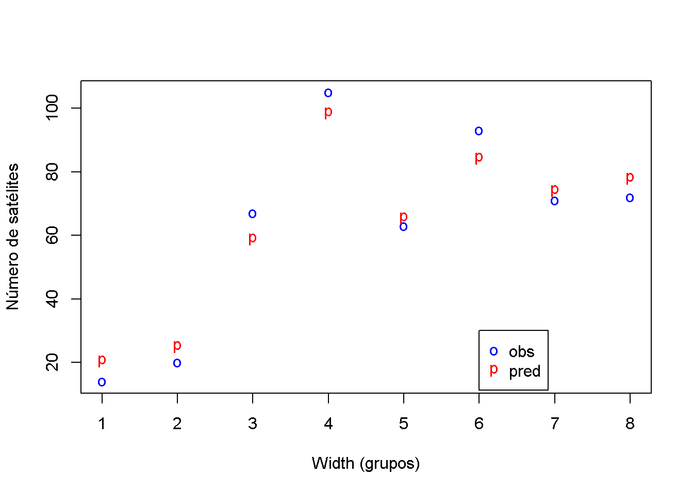
<p class="caption">(\#fig:unnamed-chunk-136)Valores observados e preditos</p>
</div>
Fonte: Adaptado de @penn2018.


```r
novosdados$pred=model$fitted.values
head(novosdados)
```

```
    Intervalo numcasos width satotal lcases  pred
1      <23,25       14 22.69      14  2.639 20.54
2 23,25-24,25       14 23.84      20  2.639 25.06
3 24,25-25,25       28 24.77      67  3.332 58.85
4 25,25-26,25       39 25.84     105  3.664 98.61
5 26,25-27,25       22 26.79      63  3.091 65.54
6 27,25-28,25       24 27.74      93  3.178 84.25
```

Alguns procedimentos usuais para avaliar a qualidade do modelo e ajuste dos dados da regressão de Poisson:

- Análise de resíudos;
- Análise de pontos influentes;
- Análise de variância;
- Indicador AIC;
- Análise de super-dispersão do modelo (quando Var(Y) > E(Y)). Neste caso, pode ocorrer por três motivos: a) função de ligação inadequada: talvez outras funções além da logarítimica se ajustem melhor; b) não inclusão de variáveis relevantes ao modelo; c) excessos de zeros. 


<!--
# Classificação


## Árvores de Decisão


```r
library(rpart)
```

```

Attaching package: 'rpart'
```

```
The following object is masked from 'package:faraway':

    solder
```

```r
library(rpart.plot)

set.seed(123)
data(iris)
head(iris)
```

```
  Sepal.Length Sepal.Width Petal.Length Petal.Width Species
1          5.1         3.5          1.4         0.2  setosa
2          4.9         3.0          1.4         0.2  setosa
3          4.7         3.2          1.3         0.2  setosa
4          4.6         3.1          1.5         0.2  setosa
5          5.0         3.6          1.4         0.2  setosa
6          5.4         3.9          1.7         0.4  setosa
```

```r
dim(iris)
```

```
[1] 150   5
```

```r
amostra = sample(2,150,replace=T, prob=c(0.7,0.3))
amostra
```

```
  [1] 1 2 1 2 2 1 1 2 1 1 2 1 1 1 1 2 1 1 1 2 2 1 1 2 1 2 1 1 1 1 2 2 1 2 1 1 2
 [38] 1 1 1 1 1 1 1 1 1 1 1 1 2 1 1 2 1 1 1 1 2 2 1 1 1 1 1 2 1 2 2 2 1 2 1 2 1
 [75] 1 1 1 1 1 1 1 1 1 2 1 1 2 2 2 1 1 1 1 1 1 1 2 1 1 1 1 1 1 2 1 2 2 1 1 1 2
[112] 1 1 2 2 1 1 2 1 1 1 1 1 1 1 2 1 1 1 1 1 2 1 2 1 1 2 2 2 1 1 1 1 1 2 1 1 1
[149] 1 2
```

```r
iristreino = iris[amostra==1,]
iristeste = iris[amostra==2,]

dim(iristreino)
```

```
[1] 106   5
```

```r
dim(iristeste)
```

```
[1] 44  5
```

```r
arvore = rpart(Species ~ ., data=iris,  method="class")

print(arvore)
```

```
n= 150 

node), split, n, loss, yval, (yprob)
      * denotes terminal node

1) root 150 100 setosa (0.33333 0.33333 0.33333)  
  2) Petal.Length< 2.45 50   0 setosa (1.00000 0.00000 0.00000) *
  3) Petal.Length>=2.45 100  50 versicolor (0.00000 0.50000 0.50000)  
    6) Petal.Width< 1.75 54   5 versicolor (0.00000 0.90741 0.09259) *
    7) Petal.Width>=1.75 46   1 virginica (0.00000 0.02174 0.97826) *
```

```r
#plot(arvore)
#text(arvore, use.n=TRUE, all=TRUE, cex=.8)

rpart.plot(arvore)
```


```r
teste = predict(arvore,newdata=iristeste)

teste
```

```
    setosa versicolor virginica
2        1    0.00000   0.00000
4        1    0.00000   0.00000
5        1    0.00000   0.00000
8        1    0.00000   0.00000
11       1    0.00000   0.00000
16       1    0.00000   0.00000
20       1    0.00000   0.00000
21       1    0.00000   0.00000
24       1    0.00000   0.00000
26       1    0.00000   0.00000
31       1    0.00000   0.00000
32       1    0.00000   0.00000
34       1    0.00000   0.00000
37       1    0.00000   0.00000
50       1    0.00000   0.00000
53       0    0.90741   0.09259
58       0    0.90741   0.09259
59       0    0.90741   0.09259
65       0    0.90741   0.09259
67       0    0.90741   0.09259
68       0    0.90741   0.09259
69       0    0.90741   0.09259
71       0    0.02174   0.97826
73       0    0.90741   0.09259
84       0    0.90741   0.09259
87       0    0.90741   0.09259
88       0    0.90741   0.09259
89       0    0.90741   0.09259
97       0    0.90741   0.09259
104      0    0.02174   0.97826
106      0    0.02174   0.97826
107      0    0.90741   0.09259
111      0    0.02174   0.97826
114      0    0.02174   0.97826
115      0    0.02174   0.97826
118      0    0.02174   0.97826
126      0    0.02174   0.97826
132      0    0.02174   0.97826
134      0    0.90741   0.09259
137      0    0.02174   0.97826
138      0    0.02174   0.97826
139      0    0.02174   0.97826
145      0    0.02174   0.97826
150      0    0.02174   0.97826
```

```r
iris1 = cbind(iristeste,teste)

head(iris1)
```

```
   Sepal.Length Sepal.Width Petal.Length Petal.Width Species setosa versicolor
2           4.9         3.0          1.4         0.2  setosa      1          0
4           4.6         3.1          1.5         0.2  setosa      1          0
5           5.0         3.6          1.4         0.2  setosa      1          0
8           5.0         3.4          1.5         0.2  setosa      1          0
11          5.4         3.7          1.5         0.2  setosa      1          0
16          5.7         4.4          1.5         0.4  setosa      1          0
   virginica
2          0
4          0
5          0
8          0
11         0
16         0
```

```r
iris1['Result'] = ifelse(iris1$setosa>=0.5,"setosa",
                         ifelse(iris1$versicolor>=0.5, "versicolor",
                         "virginica"))
head(iris1)
```

```
   Sepal.Length Sepal.Width Petal.Length Petal.Width Species setosa versicolor
2           4.9         3.0          1.4         0.2  setosa      1          0
4           4.6         3.1          1.5         0.2  setosa      1          0
5           5.0         3.6          1.4         0.2  setosa      1          0
8           5.0         3.4          1.5         0.2  setosa      1          0
11          5.4         3.7          1.5         0.2  setosa      1          0
16          5.7         4.4          1.5         0.4  setosa      1          0
   virginica Result
2          0 setosa
4          0 setosa
5          0 setosa
8          0 setosa
11         0 setosa
16         0 setosa
```

```r
confusao = table(iris1$Species,iris1$Result)
taxaacerto = (confusao[1] + confusao[5] + confusao[9]) / sum(confusao)
taxaacerto
```

```
[1] 0.9318
```

```r
taxaerro = (confusao[2]+ 
            confusao[3]+
            confusao[4]+
            confusao[6]+
            confusao[7]+
            confusao[8]) / sum(confusao)
taxaerro
```

```
[1] 0.06818
```


## Naive Bayes


```r
library(e1071)
```

```

Attaching package: 'e1071'
```

```
The following object is masked from 'package:flexclust':

    bclust
```

```
The following object is masked from 'package:gtools':

    permutations
```

```
The following objects are masked from 'package:agricolae':

    kurtosis, skewness
```

```r
data(iris)
head(iris)
```

```
  Sepal.Length Sepal.Width Petal.Length Petal.Width Species
1          5.1         3.5          1.4         0.2  setosa
2          4.9         3.0          1.4         0.2  setosa
3          4.7         3.2          1.3         0.2  setosa
4          4.6         3.1          1.5         0.2  setosa
5          5.0         3.6          1.4         0.2  setosa
6          5.4         3.9          1.7         0.4  setosa
```

```r
dim(iris)
```

```
[1] 150   5
```

```r
amostra = sample(2,150,replace=T, prob=c(0.7,0.3))
amostra
```

```
  [1] 2 1 2 2 1 1 1 1 1 1 1 1 2 1 1 2 2 1 1 2 2 1 1 2 1 1 2 1 1 2 1 1 2 2 1 1 1
 [38] 1 1 2 1 1 1 1 1 1 2 1 1 1 1 2 1 1 1 2 1 1 1 2 1 1 2 1 1 2 1 1 1 1 1 1 2 1
 [75] 1 2 2 1 1 2 1 2 1 2 1 2 1 1 1 1 2 1 2 2 1 1 1 1 1 2 2 1 2 1 1 1 2 1 1 1 1
[112] 2 1 1 1 1 2 1 1 1 1 1 1 1 2 1 1 1 1 2 2 1 1 2 1 1 1 1 1 1 1 1 2 1 2 2 2 1
[149] 1 1
```

```r
iristreino = iris[amostra==1,]
iristeste = iris[amostra==2,]

dim(iristreino)
```

```
[1] 106   5
```

```r
dim(iristeste)
```

```
[1] 44  5
```

```r
modelo <- naiveBayes(Species ~., iris)

modelo
```

```

Naive Bayes Classifier for Discrete Predictors

Call:
naiveBayes.default(x = X, y = Y, laplace = laplace)

A-priori probabilities:
Y
    setosa versicolor  virginica 
    0.3333     0.3333     0.3333 

Conditional probabilities:
            Sepal.Length
Y             [,1]   [,2]
  setosa     5.006 0.3525
  versicolor 5.936 0.5162
  virginica  6.588 0.6359

            Sepal.Width
Y             [,1]   [,2]
  setosa     3.428 0.3791
  versicolor 2.770 0.3138
  virginica  2.974 0.3225

            Petal.Length
Y             [,1]   [,2]
  setosa     1.462 0.1737
  versicolor 4.260 0.4699
  virginica  5.552 0.5519

            Petal.Width
Y             [,1]   [,2]
  setosa     0.246 0.1054
  versicolor 1.326 0.1978
  virginica  2.026 0.2747
```

```r
predicao <- predict(modelo, iristreino)

predicao
```

```
  [1] setosa     setosa     setosa     setosa     setosa     setosa    
  [7] setosa     setosa     setosa     setosa     setosa     setosa    
 [13] setosa     setosa     setosa     setosa     setosa     setosa    
 [19] setosa     setosa     setosa     setosa     setosa     setosa    
 [25] setosa     setosa     setosa     setosa     setosa     setosa    
 [31] setosa     setosa     setosa     setosa     setosa     versicolor
 [37] virginica  versicolor versicolor versicolor versicolor versicolor
 [43] versicolor versicolor versicolor versicolor versicolor versicolor
 [49] versicolor versicolor virginica  versicolor versicolor versicolor
 [55] virginica  versicolor versicolor versicolor versicolor versicolor
 [61] versicolor versicolor versicolor versicolor versicolor versicolor
 [67] versicolor versicolor versicolor virginica  virginica  virginica 
 [73] virginica  virginica  virginica  virginica  virginica  virginica 
 [79] virginica  virginica  virginica  virginica  virginica  versicolor
 [85] virginica  virginica  virginica  virginica  virginica  virginica 
 [91] virginica  virginica  virginica  virginica  virginica  virginica 
 [97] virginica  virginica  virginica  virginica  virginica  virginica 
[103] virginica  virginica  virginica  virginica 
Levels: setosa versicolor virginica
```

```r
confusao = table(iristreino$Species,predicao)
taxaacerto = (confusao[1] + confusao[5] + confusao[9]) / sum(confusao)
taxaacerto
```

```
[1] 0.9623
```

```r
taxaerro = (confusao[2]+ 
            confusao[3]+
            confusao[4]+
            confusao[6]+
            confusao[7]+
            confusao[8]) / sum(confusao)

class(modelo)
```

```
[1] "naiveBayes"
```

```r
#Prevendo com novos dados
predict(modelo,iristeste)
```

```
 [1] setosa     setosa     setosa     setosa     setosa     setosa    
 [7] setosa     setosa     setosa     setosa     setosa     setosa    
[13] setosa     setosa     setosa     versicolor versicolor versicolor
[19] versicolor versicolor versicolor versicolor versicolor versicolor
[25] versicolor versicolor versicolor versicolor versicolor versicolor
[31] versicolor virginica  virginica  versicolor virginica  virginica 
[37] virginica  virginica  virginica  versicolor virginica  virginica 
[43] virginica  virginica 
Levels: setosa versicolor virginica
```


## Redes Neurais


## Máquina de Vetor de  Suporte


```r
data(iris)
head(iris)
```

```
  Sepal.Length Sepal.Width Petal.Length Petal.Width Species
1          5.1         3.5          1.4         0.2  setosa
2          4.9         3.0          1.4         0.2  setosa
3          4.7         3.2          1.3         0.2  setosa
4          4.6         3.1          1.5         0.2  setosa
5          5.0         3.6          1.4         0.2  setosa
6          5.4         3.9          1.7         0.4  setosa
```

```r
dim(iris)
```

```
[1] 150   5
```

```r
amostra = sample(2,150,replace=T, prob=c(0.7,0.3))
amostra
```

```
  [1] 1 1 1 1 1 2 2 2 1 1 2 1 1 1 1 1 1 1 1 2 1 2 1 2 1 1 1 1 1 2 1 2 1 1 2 1 1
 [38] 1 1 2 2 1 1 2 1 2 1 1 1 2 1 1 1 1 1 1 1 1 2 1 1 1 2 1 2 1 1 2 1 2 1 1 1 1
 [75] 1 1 2 1 2 1 2 1 1 2 1 2 1 2 1 1 2 1 2 1 2 2 1 2 2 1 1 1 1 2 1 1 1 1 1 1 1
[112] 2 2 1 1 1 1 2 1 2 1 2 1 1 2 2 1 1 1 1 2 2 2 1 2 1 1 1 2 1 1 1 2 1 1 2 1 1
[149] 2 1
```

```r
iristreino = iris[amostra==1,]
iristeste = iris[amostra==2,]
```


```r
library(e1071)
modelo <- svm(Species ~., iristreino)
predicao <- predict(modelo,iristeste)
confusao = table(iristeste$Species,predicao)
confusao
```

```
            predicao
             setosa versicolor virginica
  setosa         15          0         0
  versicolor      0         16         1
  virginica       0          1        15
```

```r
taxaacerto = (confusao[1] + confusao[5] + confusao[9]) / sum(confusao)
taxaacerto
```

```
[1] 0.9583
```

```r
taxaerro = (confusao[2]+ 
            confusao[3]+
            confusao[4]+
            confusao[6]+
            confusao[7]+
            confusao[8]) / sum(confusao)
taxaerro
```

```
[1] 0.04167
```


## Vizinho mais próximo


```r
# ALTERAR OS DADOS!!!
#install.packages("class", dependencies=T)
library(class)

head(iris)
```

```
  Sepal.Length Sepal.Width Petal.Length Petal.Width Species
1          5.1         3.5          1.4         0.2  setosa
2          4.9         3.0          1.4         0.2  setosa
3          4.7         3.2          1.3         0.2  setosa
4          4.6         3.1          1.5         0.2  setosa
5          5.0         3.6          1.4         0.2  setosa
6          5.4         3.9          1.7         0.4  setosa
```

```r
summary(iris)
```

```
  Sepal.Length   Sepal.Width    Petal.Length   Petal.Width        Species  
 Min.   :4.30   Min.   :2.00   Min.   :1.00   Min.   :0.1   setosa    :50  
 1st Qu.:5.10   1st Qu.:2.80   1st Qu.:1.60   1st Qu.:0.3   versicolor:50  
 Median :5.80   Median :3.00   Median :4.35   Median :1.3   virginica :50  
 Mean   :5.84   Mean   :3.06   Mean   :3.76   Mean   :1.2                  
 3rd Qu.:6.40   3rd Qu.:3.30   3rd Qu.:5.10   3rd Qu.:1.8                  
 Max.   :7.90   Max.   :4.40   Max.   :6.90   Max.   :2.5                  
```

```r
amostra = sample(2,150,replace=T, prob=c(0.7,0.3))
iristreino = iris[amostra==1,]
classificar = iris[amostra==2,]

dim(iristreino)
```

```
[1] 98  5
```

```r
dim(classificar)
```

```
[1] 52  5
```

```r
previsao = knn(iristreino[,1:4],classificar[,1:4],iristreino[,5],k=3)
# knn(vizinhomaisproximo, dadosaclassificar, classeaclassificar)
tabela=table(classificar[,5],previsao)
tabela
```

```
            previsao
             setosa versicolor virginica
  setosa         20          0         0
  versicolor      0         14         1
  virginica       0          0        17
```

```r
(tabela[1] + tabela[5] + tabela[9]) / sum(tabela) 
```

```
[1] 0.9808
```


## Random Forest


## Seleção de Variáveis

-->


# Produção de Mapas

*Felipe Micail da Silva Smolski*

\begin{flushright}
\emph{}
\end{flushright}


Este capítulo almeja levantar o ferra  mental básico para a construção de mapas simples no RStudio. Ainda, interessa demonstrar os comandos para a manipulação destes tipos de bases de dados, inclusive possibilitando a junção de indicadores de municípios, regiões e países. Estes dados podem ser advindos de institutos de pesquisas ou mesmo dados criados pelo estudante em suas análises.

Os pacotes utilizados neste capítulo são: `tmap`, `maptools`,
`tmap` e `rgdal`.

## Introdução aos *shapes*

Existem vários *softwares* específicos para a produção de mapas, sejam produtos comerciais ou no formato *software* livre. A grande vantagem da utilização do R para criação de mapas é a utilização dos *shapes* disponibilizadas para vários programas. 

Denominam-se *shapes* os arquivos que contém os elementos gráficos, em formato de ponto, linhas ou polígonos, contendo coordenadas geográficas para um elemento para que possa ser transformado em mapa. O *shape* é formado por três arquivos principais individuais que armazenam os dados: o arquivo ".shp", ".shx" e ".dbf". Além disto, podem ser acompanhados de arquivos ".prj", o ".sbn" e o ".sbx" [@Semace2018].

Os *shapefiles* podem ser obtidos de várias fontes oficiais, como institutos de pesquisa e universidades. A seguir alguns links para *download*:

- IBGE: ftp://geoftp.ibge.gov.br/organizacao_do_territorio/malhas_territoriais/malhas_municipais/municipio_2017/
<!--
ftp://geoftp.ibge.gov.br/organizacao_do_territorio/malhas_territoriais/malhas_municipais/municipio_2016/Brasil/BR/
https://mapas.ibge.gov.br/bases-e-referenciais/bases-cartograficas/malhas-digitais.html

http://dados.gov.br/dataset/malha-geometrica-dos-municipios-brasileiros
-->

- IPEAGEO: http://www.ipea.gov.br/ipeageo/malhas.html

- Forest Gis: http://forest-gis.com/2009/04/base-de-dados-shapefile-do-brasil-todo.html/

- FEPAM: http://www.fepam.rs.gov.br/biblioteca/geo/bases_geo.asp


No exemplo abaixo, é utilizado um *shape* proveniente do IBGE representando os municípios do Estado do Rio Grande do Sul (ftp://geoftp.ibge.gov.br/organizacao_do_territorio/malhas_territoriais/malhas_municipais/municipio_2017/UFs/RS/rs_municipios.zip). Ao *shape* denominado `municipios_IBGE` será dado o nome de "MAPARS", com a utilização do pacote `raster` para carregar a malha:


```r
library(raster)
# Carregando o arquivo
MAPARS=shapefile("D:/Github/livroavancado/mapas/rs_municipios/43MUE250GC_SIR.shp")

# Excluindo dados inconvenientes
MAPARS=MAPARS[MAPARS$CD_GEOCMU !="4300001" & MAPARS$CD_GEOCMU !="4300002",]
```

<!--
#library(tmaptools)
#library(tmap)
#library(rgdal)
#MAPARS=readShapePoly("D:/Github/livroavancado/mapas/RS_Mun97_region/RS_Mun97_region.shp")
#MAPA_RS=readShapeSpatial('D:/Github/livroavancado/mapas/RS_Mun97_region/RS_Mun97_region.shp')
#MAPA=readShapePoly(file.choose())
-->

O arquivo MAPARS se constitui em um *SpatialPolygonsDataFrame*, objeto complexo que carrega informações dos dados (`MAPARS@data`) e demais informações com as coordenadas  para criarem-se os mapas no R. Utilizando a função `summary` podem ser observados alguns dos os itens que compõe este objeto,  o nome do municípios (NM\_MUNICIP) o seu código IBGE (CD\_GEOCMU), lembrando que cada município terá um código de IBGE diferente, informação extremamente útil como será visto posteriormente ao efetuar a manipulação da base de dados e a inclusão de informações provenientes de outras bases. Abaixo efetua-se também a padronização do código IBGE (comando `substr`), mantendo os 6 primeiros dígitos, sendo necessária para que posteriormente sejam agregados outros dados.


```r
class(MAPARS)
```

```
[1] "SpatialPolygonsDataFrame"
attr(,"package")
[1] "sp"
```

```r
summary(MAPARS)
```

```
Object of class SpatialPolygonsDataFrame
Coordinates:
     min    max
x -57.65 -49.69
y -33.75 -27.08
Is projected: FALSE 
proj4string : [+proj=longlat +ellps=GRS80 +no_defs]
Data attributes:
  NM_MUNICIP         CD_GEOCMU        
 Length:497         Length:497        
 Class :character   Class :character  
 Mode  :character   Mode  :character  
```

```r
# Corrigindo os dados do código IBGE dos municípios
MAPARS$CD_GEOCMU=substr(MAPARS$CD_GEOCMU,1,6)
# Vizualização dos dados principais
head(MAPARS@data)
```

```
   NM_MUNICIP CD_GEOCMU
0     ACEGUÃ\201    430003
1 Ã\201GUA SANTA    430005
2       AGUDO    430010
3   AJURICABA    430020
4     ALECRIM    430030
5    ALEGRETE    430040
```

Note novamente que este objeto pertence a uma classe diferente (*SpatialPolygonsDataFrame*), indicando que é constituída especialmente de um conjunto de polígonos para a construção de mapas conjuntamente com o carregamento de dados.

A seguir, a função `plot()` pode ser utilizada para a plotagem da malha carregada:


```r
plot(MAPARS)
```


Um exercício simples é a filtragem dos dados do *shape* pelo nome do município, obtendo assim apenas o mapa da(s) unidade(s) escolhida(s):


```r
plot(MAPARS[MAPARS$NM_MUNICIP=='SANTA ROSA',], 
    axes="TRUE",  
    main="Mapa do município de Santa Rosa - RS",
    border=gray(0.5), 
    lwd=.5)
```


## Pacote tmap

O pacote `tmap` [@tmap] é utilizado para gerar mapas temáticos com relativa facilidade, sendo possível ajustar todos os itens de visualização (legendas, cores, bordas, alinhamento, etc.) para um ajuste desejado do pesquisador. Todas as funções do pacote podem ser encontradas em <https://www.rdocumentation.org/packages/tmap/versions/2.2> ou no endereço <https://www.jstatsoft.org/article/view/v084i06> como exemplos.

Inicialmente utiliza-se a função `tm_shape` para carregar a base, `tm_fill` para plotar o fundo e `tm_borders` cria as bordas entre os municípios. A função `tmap_mode` não é obrigatória, e varia da apresentação tradicional do mapa ("plot") e da apresentação para web ("view").


```r
library(tmap)
tmap_mode("plot")
tm_shape(MAPARS)+
  tm_fill()+
  tm_borders()
```

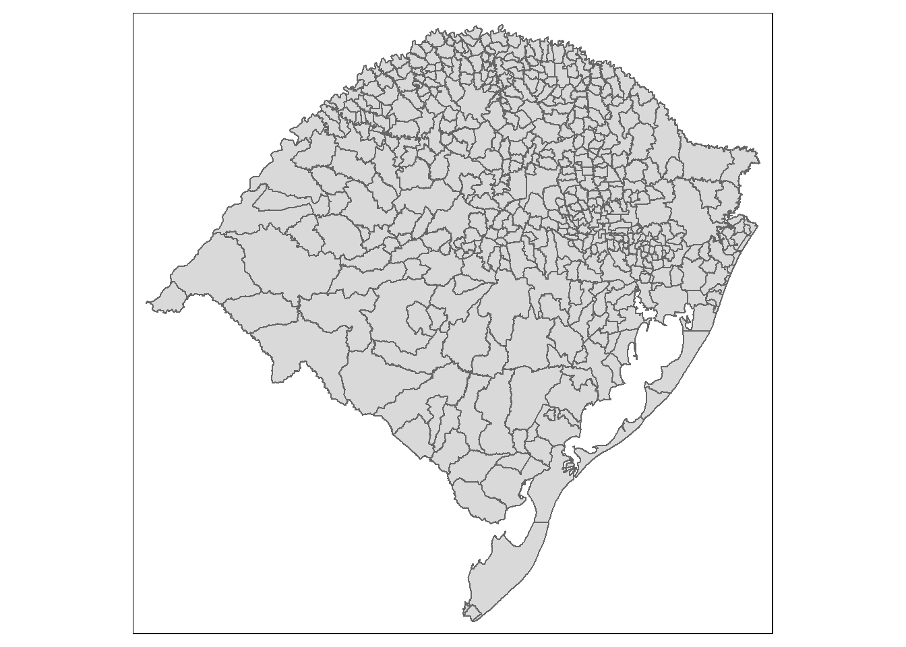


### Adicionando dados ao mapa

Para enriquecer a análise, serão incluídos novos dados relativos aos municípios do Rio Grande do Sul provenientes da @FEE2016, como o indicador de IDESE (Índice de Desenvolvimento Socioeconômico), PIB (Produto Interno Bruto), população, etc.


```r
#Carrega a planilha com as informações
library(readr)
RS2013 <- read_delim("mapas/RS2013.csv", 
    ";", escape_double = FALSE, trim_ws = TRUE)

# Corrigindo o campo com o código do IBGE
names(RS2013)[3]="CD_GEOCMU" 
# Corrigindo os dados do código IBGE dos municípios
RS2013$CD_GEOCMU=substr(RS2013$CD_GEOCMU,1,6)

head(RS2013)
```

```
# A tibble: 6 x 20
  Label_N COREDE CD_GEOCMU IDESE_2013 POUPANCA OP_CREDITO `OBRIGACOES _RE~
  <chr>   <chr>  <chr>     <chr>         <dbl>      <dbl>            <dbl>
1 Alto A~ "Alto~ 430055    0,7973015~       NA         NA               NA
2 Barros~ "Alto~ 430200    0,6103697~  7647609   27295139             5931
3 Campos~ "Alto~ 430410    0,7352054~       NA         NA               NA
4 Espumo~ "Alto~ 430750    0,79296863 45673907  230697134            66237
5 Fontou~ "Alto~ 430830    0,6336514~ 13985159   54390691             4177
6 Gramad~ "Alto~ 430915    0,6578415~  1119359    2073680                0
# ... with 13 more variables: DEP_A_VISTA_PRIV <dbl>, DEP_A_VISTA_GOV <dbl>,
#   DEP_PRAZO <dbl>, COOP_CRED <dbl>, CEF <dbl>, BANCO_COM <dbl>,
#   N_VINCULOS_EMP <dbl>, DENS_DEM_HABKM2 <dbl>, IMPOSTOS <dbl>,
#   AREA_KM2 <dbl>, PIB_PERC <dbl>, PIB <dbl>, POPULACAO <dbl>
```

Para agregar estas informações aos dados das malhas, é preciso em primeiro lugar que se tenha um campo em comum único dos arquivos. Neste caso, o código do IBGE dos municípios ("CD\_GEOCMU") será utilizado, sendo  que precisa ser exatamente igual nos dois objetos que se quer unir, para que as informações de determinado município sejam corretamente unidas às informações geográficas da malha para o mapa.


```r
#Une a base de dados da planilha com o mapa pelo nome do município
RS2013MAPA=merge(MAPARS,RS2013,by="CD_GEOCMU", all.x=T) 
names(RS2013MAPA)
```

```
 [1] "CD_GEOCMU"               "NM_MUNICIP"             
 [3] "Label_N"                 "COREDE"                 
 [5] "IDESE_2013"              "POUPANCA"               
 [7] "OP_CREDITO"              "OBRIGACOES _RECEBIMENTO"
 [9] "DEP_A_VISTA_PRIV"        "DEP_A_VISTA_GOV"        
[11] "DEP_PRAZO"               "COOP_CRED"              
[13] "CEF"                     "BANCO_COM"              
[15] "N_VINCULOS_EMP"          "DENS_DEM_HABKM2"        
[17] "IMPOSTOS"                "AREA_KM2"               
[19] "PIB_PERC"                "PIB"                    
[21] "POPULACAO"              
```

```r
head(RS2013MAPA@data)
```

```
  CD_GEOCMU  NM_MUNICIP       Label_N             COREDE  IDESE_2013  POUPANCA
1    430003     ACEGUÃ\201     Acegu<e1>           Campanha 0,718832327    654998
2    430005 Ã\201GUA SANTA <c1>gua Santa           Nordeste 0,867600828   5771664
3    430010       AGUDO         Agudo            Central 0,702817421  60413751
4    430020   AJURICABA     Ajuricaba  Noroeste Colonial 0,785470135  10097428
5    430030     ALECRIM       Alecrim Fronteira Noroeste 0,677111834  11317058
6    430040    ALEGRETE      Alegrete    Fronteira Oeste 0,726877131 143979215
  OP_CREDITO OBRIGACOES _RECEBIMENTO DEP_A_VISTA_PRIV DEP_A_VISTA_GOV DEP_PRAZO
1    2123323                     990           436095          211613         0
2   58309611                   40094          1814681           89008   3205509
3  129527759                   28351          7005194          593901   5826631
4   89098650                   35621          4739225         1116209   2322985
5   14649086                     265          1754832          150166    740890
6  747409945                  232866         42122392         1138492  63194800
  COOP_CRED CEF BANCO_COM N_VINCULOS_EMP DENS_DEM_HABKM2 IMPOSTOS AREA_KM2
1        NA  NA         1           1075       2.922e+09  7712922  1549383
2        NA  NA         1            743       1.293e+08  2339861   291792
3         1   1         3           3374       3.105e+09 26733502   536114
4        NA  NA         2           1610       2.223e+08 12668813   323239
5        NA  NA         2            690       2.163e+09  3193931   314743
6        NA   1         6          20091       9.794e+09 96877929  7803954
  PIB_PERC       PIB POPULACAO
1   383451 1.778e+08      4623
2  6343962 2.435e+08      3825
3   206121 3.537e+08     17044
4  2715728 2.015e+08      7568
5  1202022 8.426e+07      6905
6  1902703 1.504e+09     78056
```


### Plotando o mapa e melhorando a visualização

Após unidas as informações da malha e dos índices para todos os municípios, é possível criar o mapa temático. Além de utilizar a função `tm_shape` para carregar os novos dados e `tm_fill` inclui a área de cada município (KM$^2$). Ainda é possível definir opções de formato (`tm_format_Europe2`), de estilo (`tm_style_classic`), ajustar a legenda (`tm_legend`), incluir o compasso (`tm_compass`), a escala (`tm_scale_bar`). 


```r
    tm_shape(RS2013MAPA)+
      tm_fill("AREA_KM2", auto.palette.mapping=FALSE, 
              title="Área por município")+
      tm_format_Europe2()+
      tm_style_classic()+
      tm_legend(position=c("left","bottom"))+
      tm_compass()+
      tm_scale_bar()+
      tm_borders(alpha=.5)+
  tm_bubbles(size = 'PIB',col = '#b3de69', title.size='PIB') +
  tm_legend(legend.format = list(text.separator= "a"))
```


Algumas opções de layout podem ser escolhidas pelo pesquisador com as funções:`tm_format_World`,`tm_format_World_wide`, `tm_format_Europe`, `tm_format_Europe2`, `tm_format_Europe_wide`, `tm_format_NLD`, `tm_format_NLD_wide`, `tm_format_NLD_wide`. Seguem as opções de estilo do gráfico:`tm_style_white`, `tm_style_gray`, `tm_style_natural`, `tm_style_grey`, `tm_style_cobalt`, `tm_style_col_blind`, `tm_style_albatross`, `tm_style_beaver`, `tm_style_bw`, `tm_style_classic`.


Abaixo segue um exemplo de criação e plotagem de múltiplos mapas na mesma imagem. A função `style` determinda como serão determinadas as cores do mapa, juntamente com a função `palette`. Já a função `breaks` ajuda a determinar os pontos de corte para a plotagem das cores, no primeiro mapa utilizando a função `quantile` e no segundo determinando intervalos de valores pré-determinados pelo autor.


```r
tm_shape(RS2013MAPA) +
    tm_polygons(c("PIB", "POPULACAO"), 
        style=c("kmeans","fixed"),
        palette=list("Reds", "Blues"),
        auto.palette.mapping=FALSE,
        breaks=list(quantile(RS2013MAPA$POPULACAO),
                    c(-Inf,100000,200000,Inf)),
        title=c("PIB", "População")) +
tm_format_World() + 
tm_style_grey()+
tm_compass()+
tm_scale_bar()+
tm_legend(legend.format = list(text.separator= "a"))+
tm_layout(legend.position = c("LEFT","BOTTOM"),
            legend.frame = FALSE, title = c("Mapa 1","Mapa 2"))
```


É possível ainda efetuar a filtragem de uma determinada característica para a criação do mapa. No exemplo, são filtrados os municípios do Corede Sul:


```r
tm_shape(RS2013MAPA[RS2013MAPA$COREDE =='Sul',]) +
    tm_polygons("POPULACAO", title="Pop", 
                style="kmeans", text="Label_N") +
    tm_facets("COREDE") +
    tm_text("NM_MUNICIP", scale=0.45)+
tm_style_grey()+
tm_layout(inner.margins = c(.03,.03,.03,.03),
            main.title = "Municípios do Corede Sul",
            main.title.position = 'center')+
tm_legend(legend.format = list(text.separator= "a"))  
```

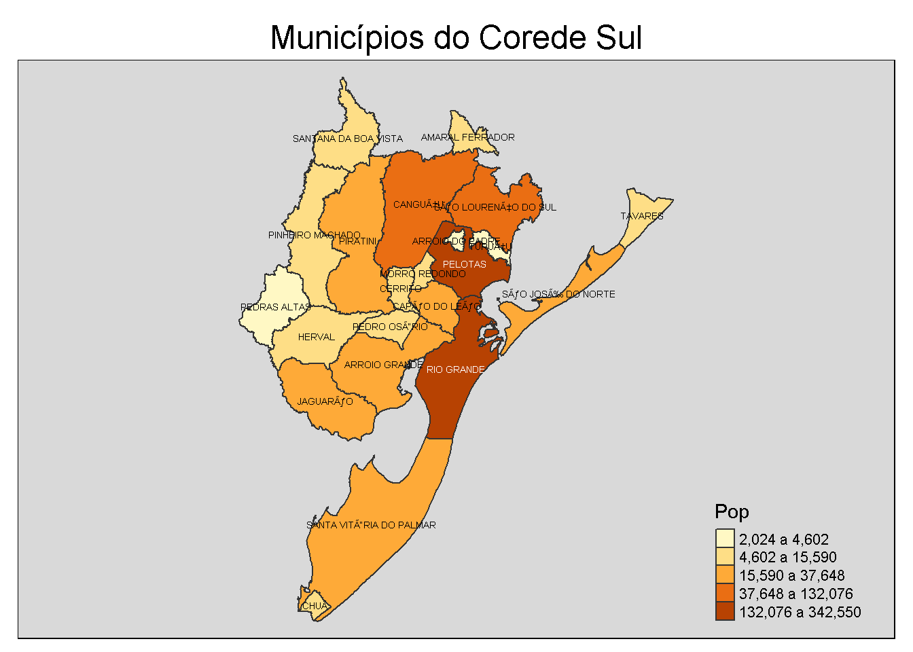


### Utilizando dados de fontes externas: pacote datasus

Encontrar informações de bases de dados que podem ser diretamente utilizadas no R é de extrama importância aos pesquisadores. Neste exemplo são demonstrados alguns comandos para utilizar o pacote datasus [@datasus], que agiliza a utilização de alguns dados do Ministério da Saúde (<http://www2.datasus.gov.br/DATASUS/index.php?area=02>).

Utilizando o pacote `devtools` (`library(devtools)`) é feita ainstalação do pacote `datasus` diretamente do repositório Github pelo comando `install_github("rpradosiqueira/datasus")`.

Após instalado o pacote `datasus`, utiliza-se a função `sinasc_nv_uf` para carregar a quantidade de nascimentos por município:


```r
library(datasus)
nascimentos=sinasc_nv_uf(uf = "rs",
             periodo = c(2014:2016),
             coluna = "Ano do nascimento")
head(nascimentos)
```

```
          Município   2014   2015   2016  Total
1             TOTAL 143315 148359 141411 433085
2     430003 Aceguá     73     55     49    177
3 430005 Água Santa     48     36     43    127
4      430010 Agudo    162    161    165    488
5  430020 Ajuricaba     61     68     78    207
6    430030 Alecrim     59     48     57    164
```

Efetua-se uma limpeza da linha de total, bem como a criação de uma coluna com o código do IBGE ("CD\_GEOCMU"):


```r
nascimentos=nascimentos[-1,]
library(tidyr)
nascimentos <- separate(nascimentos, `Município`, c("CD_GEOCMU", "NM_MUNICIP"), sep = 6)
head(nascimentos)
```

```
  CD_GEOCMU  NM_MUNICIP 2014 2015 2016 Total
2    430003      Aceguá   73   55   49   177
3    430005  Água Santa   48   36   43   127
4    430010       Agudo  162  161  165   488
5    430020   Ajuricaba   61   68   78   207
6    430030     Alecrim   59   48   57   164
7    430040    Alegrete  925  954  858  2737
```

Após é possível criar novo mapa ("RS2013MAPAN"), unindo as informações novas com o mapa anterior:


```r
RS2013MAPAN=merge(RS2013MAPA,nascimentos,by="CD_GEOCMU", all.x=T) 
names(RS2013MAPAN)
```

```
 [1] "CD_GEOCMU"               "NM_MUNICIP.x"           
 [3] "Label_N"                 "COREDE"                 
 [5] "IDESE_2013"              "POUPANCA"               
 [7] "OP_CREDITO"              "OBRIGACOES _RECEBIMENTO"
 [9] "DEP_A_VISTA_PRIV"        "DEP_A_VISTA_GOV"        
[11] "DEP_PRAZO"               "COOP_CRED"              
[13] "CEF"                     "BANCO_COM"              
[15] "N_VINCULOS_EMP"          "DENS_DEM_HABKM2"        
[17] "IMPOSTOS"                "AREA_KM2"               
[19] "PIB_PERC"                "PIB"                    
[21] "POPULACAO"               "NM_MUNICIP.y"           
[23] "2014"                    "2015"                   
[25] "2016"                    "Total"                  
```


Então pode ser criado o mapa com as informações de nascimentos por município. Neste caso, foi utilizado o `style` denomnado `kmeans`, pois utilizamos os quartis para determinar as faixas de cores das quantidades de nascimentos:
<!--

```r
   tm_shape(RS2013MAPAN)+
      tm_fill("2016", auto.palette.mapping=FALSE, title="Nascimentos por município",textNA="NA")+
      tm_legend(position=c("left","bottom"))+
      tm_compass()+
      tm_scale_bar()+
      tm_borders(alpha=.5)+
     tm_legend(legend.format = list(text.separator= "a"))  +
     tm_layout(legend.position = c("LEFT","BOTTOM"),
            legend.frame = FALSE)
```


-->


```r
quantile(RS2013MAPAN$`2016`)
```

```
   0%   25%   50%   75%  100% 
    4    28    55   175 18635 
```


```r
   tm_shape(RS2013MAPAN)+
      tm_fill("2016", auto.palette.mapping=FALSE, 
              title="Nascimentos por município (2016)",
              textNA="NA",
              palette="Greens",
              style = "kmeans",
              breaks = quantile(RS2013MAPAN$`2016`))+
      tm_legend(position=c("left","bottom"))+
      tm_compass()+
      tm_scale_bar()+
      tm_borders(alpha=.5)+
     tm_legend(legend.format = list(text.separator= "a"))  +
     tm_layout(legend.position = c("LEFT","BOTTOM"),
            legend.frame = FALSE)
```

```
Warning: The argument auto.palette.mapping is deprecated. Please use midpoint
for numeric data and stretch.palette for categorical data to control the palette
mapping.
```

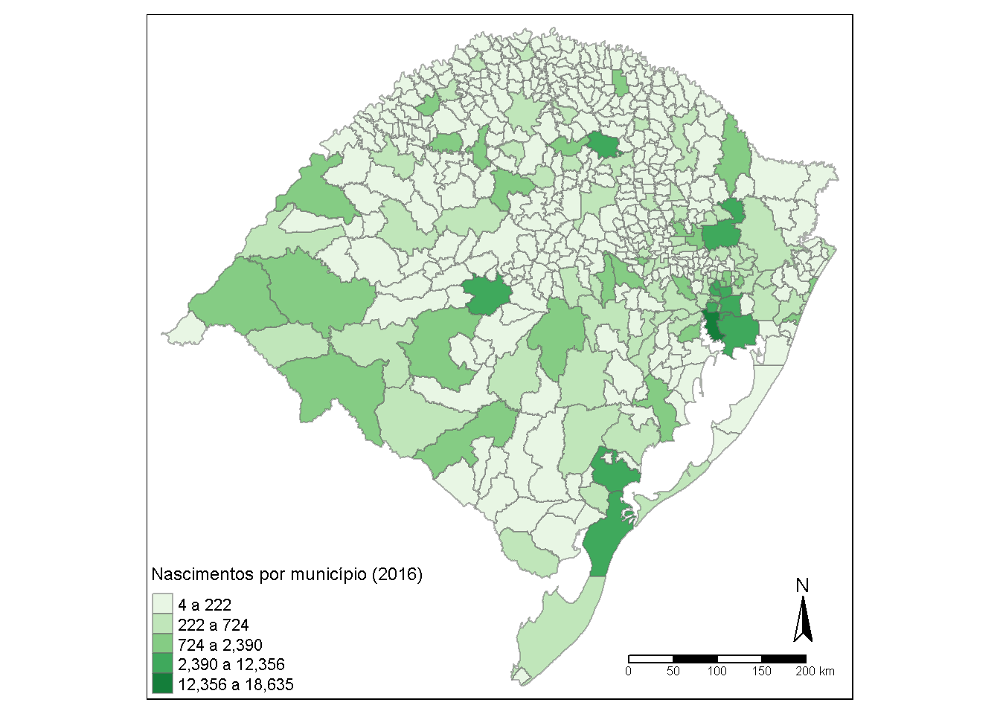


\setlength{\parindent}{0.0cm}

\RaggedRight

\frenchspacing 

# Referências {-}


